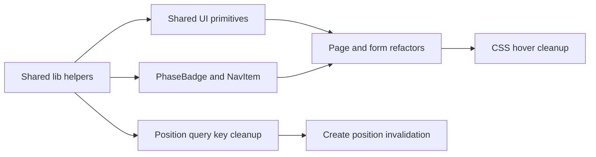

# Frontend performance and reuse implementation

## Overview

This change set implements the `plans/frontend-perf-reuse/plan.md` work under the `wheelbase-ytn` epic. The renderer now reuses shared tokens, formatters, and display primitives instead of repeating the same constants and JSX patterns across pages and forms. It also removes React-driven hover state and mutation side effects that were causing unnecessary rerenders or duplicated logic.

## Scope delivered

- Shared renderer helpers:
  - `src/renderer/src/lib/tokens.ts`
  - `src/renderer/src/lib/format.ts`
  - `src/renderer/src/lib/phase.ts`
- Shared UI primitives:
  - `src/renderer/src/components/ui/LoadingState.tsx`
  - `src/renderer/src/components/ui/ErrorAlert.tsx`
  - `src/renderer/src/components/ui/SectionCard.tsx`
  - `src/renderer/src/components/PhaseBadge.tsx`
  - `src/renderer/src/components/NavItem.tsx`
- Hook consistency cleanup:
  - `src/renderer/src/hooks/positionQueryKeys.ts`
  - `src/renderer/src/hooks/useCreatePosition.ts`
  - `src/renderer/src/hooks/useClosePosition.ts`
  - `src/renderer/src/hooks/useExpirePosition.ts`
  - `src/renderer/src/hooks/usePosition.ts`
  - `src/renderer/src/hooks/usePositions.ts`
- Renderer page/form refactors:
  - `src/renderer/src/App.tsx`
  - `src/renderer/src/pages/PositionDetailPage.tsx`
  - `src/renderer/src/pages/PositionsListPage.tsx`
  - `src/renderer/src/pages/NewWheelPage.tsx`
  - `src/renderer/src/components/NewWheelForm.tsx`
  - `src/renderer/src/components/CloseCspForm.tsx`
  - `src/renderer/src/components/ExpirationSheet.tsx`
  - `src/renderer/src/components/PositionCard.tsx`

## What changed

### Shared display logic

Formatting and phase-label logic now live in `lib/*` modules. Components import `MONO`, `fmtMoney`, `fmtPct`, `fmtDate`, `pnlColor`, `computeDte`, `PHASE_LABEL`, and `PHASE_LABEL_SHORT` instead of redefining them locally.

### Shared UI primitives

Repeated loading, error, phase badge, and section-card markup was extracted into reusable components. This keeps page components smaller and makes styling changes flow through one place.

### Mutation handling

`NewWheelForm` and `CloseCspForm` now use `mutate(..., { onSuccess, onError })` callbacks instead of effects watching mutation state. That keeps success and error behavior closer to submission time and removes effect-only rerender work.

### Query consistency

Position-related hooks now share a `positionQueryKeys` source of truth. `useCreatePosition` invalidates the positions list on success, matching the existing close and expire flows.

### Hover behavior

Hover interactions were moved from React state and event handlers to CSS classes and custom properties. `PositionCard` keeps the phase-colored border behavior while avoiding per-hover state updates.

### File-size cleanup

`App.tsx` was reduced to an extracted `NavItem` component and is now under the 200-line target. Other page components also shed duplicated inline UI blocks through the shared primitives.

## Delivery flow

## Test coverage added or updated

- `src/renderer/src/lib/format.test.ts`
- `src/renderer/src/lib/phase.test.ts`
- `src/renderer/src/components/ui/ErrorAlert.test.tsx`
- `src/renderer/src/components/ui/LoadingState.test.tsx`
- `src/renderer/src/components/ui/SectionCard.test.tsx`
- `src/renderer/src/components/PhaseBadge.test.tsx`
- `src/renderer/src/components/NavItem.test.tsx`
- `src/renderer/src/hooks/useCreatePosition.test.ts`
- Updated form tests for callback-driven success and error handling

## Verification summary

- `pnpm test` passed
- `pnpm lint` completed with warnings only; no lint errors
- `pnpm typecheck` passed

## Follow-up notes

- The lint run still reports existing warnings outside the core feature outcome, including pre-existing formatting warnings and a React Compiler warning around React Hook Form's `watch()` usage.
- The `wheelbase-ytn` epic and all mirrored SQL todos were completed during this run.
