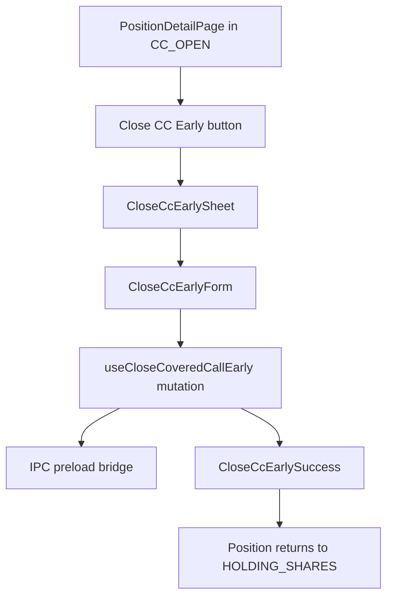

# US-8 Close Covered Call Early Implementation

This document captures the verified implementation completed from `plans/us-8/plan.md` during the Red/Green pass.

## Scope Implemented

The app now exposes a full renderer flow for closing an open covered call early:

- A `Close CC Early →` action appears on position detail pages when the position phase is `CC_OPEN`.
- Clicking the action opens a right-side sheet.
- The sheet shows the position summary, current covered-call premium, unchanged basis, and a live CC leg P&L preview.
- Submitting a valid close transitions the UI to a success state summarizing the `CC_CLOSE` leg and the `CC_OPEN → HOLDING_SHARES` transition.

## Key Files

- `src/renderer/src/components/PositionDetailActions.tsx`
- `src/renderer/src/pages/PositionDetailPage.tsx`
- `src/renderer/src/components/CloseCcEarlySheet.tsx`
- `src/renderer/src/components/CloseCcEarlyForm.tsx`
- `src/renderer/src/components/CloseCcEarlySuccess.tsx`
- `src/preload/index.d.ts`
- `e2e/close-cc-early.spec.ts`

## Flow Diagram

## Notes

- The close sheet reuses the shared renderer primitives (`DatePicker`, `FormButton`, `NumberInput`, `PhaseBadge`, `AlertBox`) to stay consistent with the existing covered-call flow.
- The AC-driven E2E spec exists, but the final GUI-only execution step is still pending outside this shell.
