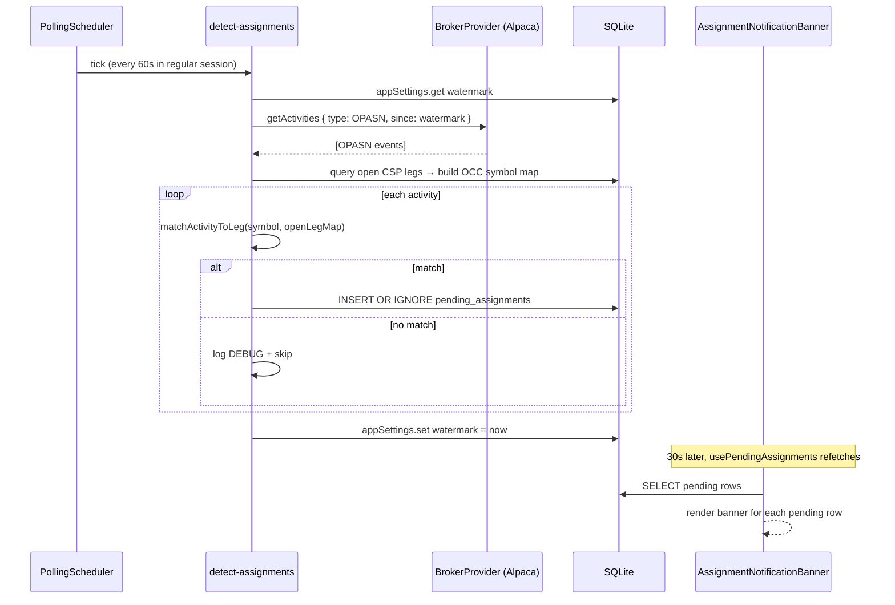
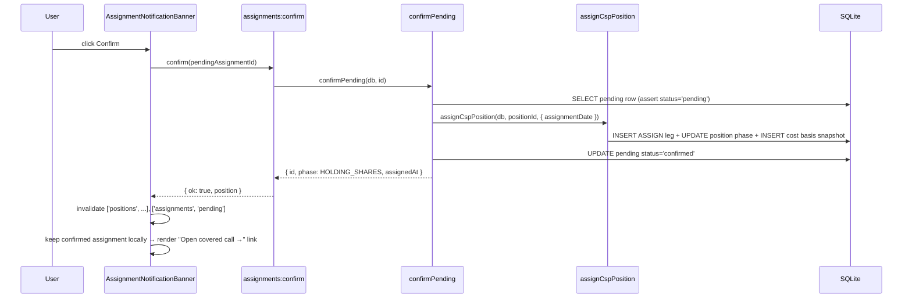
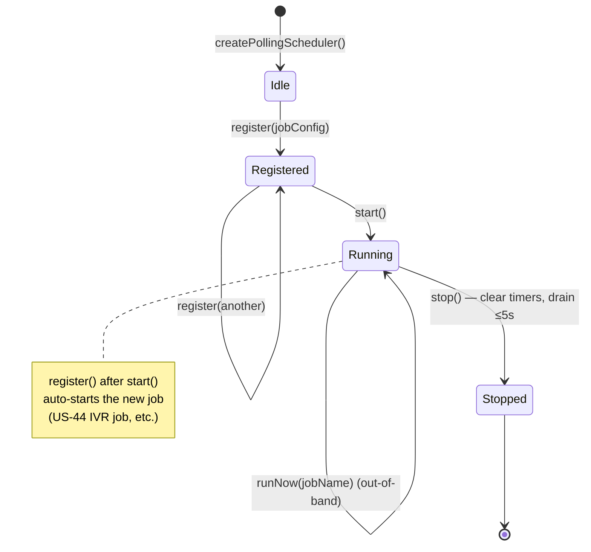

# US-35 / US-46 Implementation Summary

## Feature

Wheelbase polls Alpaca's broker activities feed for `OPASN` assignment events on a
shared `PollingScheduler`, matches each event to an open CSP leg, persists a
`pending_assignments` row, and surfaces a renderer banner so the trader can confirm or
dismiss the assignment. Confirmation reuses the existing `assignCspPosition` service to
transition the position from `CSP_OPEN` to `HOLDING_SHARES`.

Two stories ship together:

- **US-46** — shared `PollingScheduler` service (interval + afterClose cadences,
  market-hours awareness, graceful shutdown).
- **US-35** — `detect-assignments` job built on top of the scheduler, plus
  pending-assignment persistence, IPC, and renderer banner.

## Key Files

### Main process

| Path                                            | Purpose                                                                                                                                         |
| ----------------------------------------------- | ----------------------------------------------------------------------------------------------------------------------------------------------- |
| `src/main/services/polling-scheduler.ts`        | Scheduler engine — registers jobs, ticks them on cadence policies, drains on stop. Now exposes `getRegistry()` and tolerates reschedule errors. |
| `src/main/services/scheduler-instance.ts`       | Process-wide scheduler singleton importable from any module.                                                                                    |
| `src/main/services/detect-assignments.ts`       | The OPASN → pending_assignments job handler. Pure helpers (`matchActivityToLeg`) for unit coverage.                                             |
| `src/main/services/pending-assignments.ts`      | `listPending`, `confirmPending` (delegates to `assignCspPosition`), `dismissPending`.                                                           |
| `src/main/services/app-settings.ts`             | Key/value helper for the `assignments_last_poll_at:{env}` watermark.                                                                            |
| `src/main/ipc/assignments.ts`                   | IPC handlers (`assignments:list-pending`, `:confirm`, `:dismiss`, `:run-detection-now`).                                                        |
| `src/main/ipc/test-scheduler.ts`                | Dev-only `_test:scheduler-*` IPC + `WHEELBASE_TEST_JOBS` env seeding (NODE_ENV=test only).                                                      |
| `migrations/006_create_pending_assignments.sql` | New table with `UNIQUE(activity_id)` for idempotency.                                                                                           |
| `migrations/007_create_app_settings.sql`        | Key/value store table.                                                                                                                          |

### Renderer

| Path                                                           | Purpose                                                                    |
| -------------------------------------------------------------- | -------------------------------------------------------------------------- |
| `src/renderer/src/components/AssignmentNotificationBanner.tsx` | Stacked banner per pending row; success state survives query invalidation. |
| `src/renderer/src/api/assignments.ts`                          | `usePendingAssignments` hook (`refetchInterval: 30_000`).                  |
| `src/preload/index.ts`                                         | Exposes `assignments.*` + dev-only `testScheduler*` namespaces.            |

### Tests

| Path                                                                | Coverage                                                             |
| ------------------------------------------------------------------- | -------------------------------------------------------------------- |
| `src/main/services/polling-scheduler.test.ts`                       | Unit — every scheduler invariant under fake timers.                  |
| `src/main/services/detect-assignments.test.ts`                      | Unit — match/skip/dedup/error paths.                                 |
| `src/main/services/pending-assignments.test.ts`                     | Unit — confirm/dismiss state machine.                                |
| `src/main/ipc/assignments.test.ts`                                  | IPC — Zod validation + error mapping.                                |
| `src/renderer/src/components/AssignmentNotificationBanner.test.tsx` | Component — render, confirm, dismiss, success-state link.            |
| `e2e/polling-scheduler.spec.ts`                                     | E2E — US-46 ACs via dev-only IPC.                                    |
| `e2e/assignment-detection.spec.ts`                                  | E2E — US-35 ACs via FakeBrokerProvider seeding + UI confirm/dismiss. |

## Data Flow — Assignment Detection

## Data Flow — Confirm Click

## Scheduler Lifecycle

## Bootstrap Wiring

The scheduler is a process-wide singleton constructed in
`src/main/services/scheduler-instance.ts`. Bootstrap order in `src/main/index.ts`:

1. Initialise DB and IPC.
2. Create broker provider (best-effort; null if not configured).
3. Register `detect-assignments` job (only if broker exists) with cadence
   `{ marketOpenMs: 60_000, extendedHoursMs: 300_000, marketClosedMs: null }`.
4. If `NODE_ENV === 'test'`: seed `WHEELBASE_TEST_JOBS` and register the
   `_test:scheduler-*` IPC channels.
5. `scheduler.start()` — fires every registered job once immediately.
6. `app.on('before-quit')` → `await scheduler.stop()` (5s drain) before `app.exit(0)`.

Future stories (US-44 IVR collector) call `scheduler.register(...)` against the same
singleton; auto-start ensures their jobs run without restarting the process.
