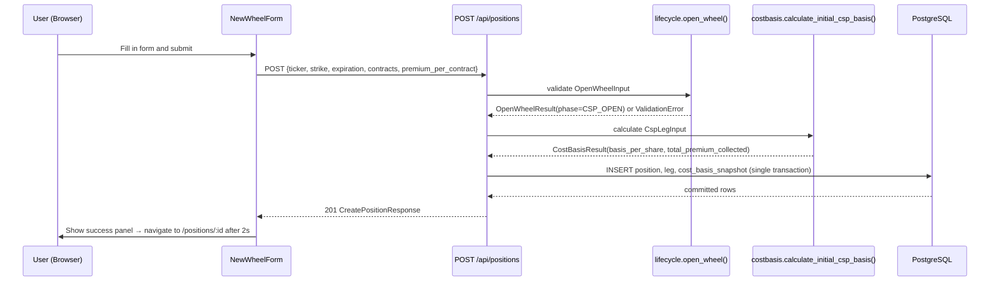

# US-1 Implementation: Open a New Wheel (Sell a CSP)

## Feature Overview

US-1 establishes the complete foundation for Phase 1: the data model, pure business logic engines, REST API, and frontend form for opening a new wheel by selling a cash-secured put (CSP).

**Scope:** Manual trade entry — no broker connection. All data is entered by the user and persisted to PostgreSQL.

---

## Key Files Changed

| Layer     | File                                                            | Role                                                                                 |
| --------- | --------------------------------------------------------------- | ------------------------------------------------------------------------------------ |
| Core      | `backend/app/core/types.py`                                     | Shared enums (StrategyType, WheelPhase, LegRole, LegAction, OptionType, WheelStatus) |
| Core      | `backend/app/core/lifecycle.py`                                 | Validates `OpenWheelInput`; returns `WheelPhase.CSP_OPEN`                            |
| Core      | `backend/app/core/costbasis.py`                                 | Calculates `basis_per_share` and `total_premium_collected`                           |
| Models    | `backend/app/models/__init__.py`                                | Position, Leg, CostBasisSnapshot ORM models                                          |
| Migration | `backend/app/db/migrations/versions/…_create_initial_schema.py` | Creates all three tables with indexes and PostgreSQL enums                           |
| API       | `backend/app/api/schemas.py`                                    | Pydantic v2 request/response schemas                                                 |
| API       | `backend/app/api/routes/positions.py`                           | `POST /api/positions` — orchestrates lifecycle → costbasis → DB write                |
| Frontend  | `frontend/src/api/positions.ts`                                 | `createPosition()` typed fetch client                                                |
| Frontend  | `frontend/src/hooks/useCreatePosition.ts`                       | TanStack Query `useMutation` wrapper                                                 |
| Frontend  | `frontend/src/components/NewWheelForm.tsx`                      | React Hook Form + Zod form with success/error handling                               |
| Frontend  | `frontend/src/pages/NewWheelPage.tsx`                           | Page shell rendering the form                                                        |
| Frontend  | `frontend/src/pages/PositionDetailPage.tsx`                     | Stub page showing position ID from URL params                                        |
| Tests     | `backend/tests/core/test_lifecycle.py`                          | 14 tests covering happy path and all validation rules                                |
| Tests     | `backend/tests/core/test_costbasis.py`                          | 8 tests covering math, rounding, and edge cases                                      |
| Tests     | `backend/tests/api/test_positions.py`                           | 11 API tests covering 201, 400, and 422 responses                                    |
| Tests     | `frontend/src/components/NewWheelForm.test.tsx`                 | 11 component tests covering rendering, validation, and UX states                     |

---

## Architecture



### Pure Engine Rule

`lifecycle.py` and `costbasis.py` have **zero database or broker imports**. They accept plain frozen dataclasses and return results. This makes them testable in isolation without any infrastructure.

```
OpenWheelInput ──→ lifecycle.open_wheel() ──→ OpenWheelResult(phase)
CspLegInput    ──→ costbasis.calculate_initial_csp_basis() ──→ CostBasisResult
```

### Cost Basis Formula

```
basis_per_share          = strike - premium_per_contract
total_premium_collected  = premium_per_contract × contracts × 100
```

All arithmetic uses `decimal.Decimal` with `ROUND_HALF_UP` to 4 decimal places.

---

## Refactor Phase Changes (applied after Green)

| File                    | Change                                                                                                                                                                           |
| ----------------------- | -------------------------------------------------------------------------------------------------------------------------------------------------------------------------------- |
| `lifecycle.py`          | Renamed `input` parameter → `inp` to avoid shadowing Python builtin                                                                                                              |
| `test_lifecycle.py`     | Removed stale "All tests must fail until…" docstring                                                                                                                             |
| `test_costbasis.py`     | Removed stale "All tests must fail until…" docstring                                                                                                                             |
| `test_positions.py`     | Removed stale "All tests must fail until…" docstring                                                                                                                             |
| `models/__init__.py`    | Fixed `Mapped[str]` → `Mapped[Decimal]` for all Numeric columns; replaced deprecated `datetime.utcnow` with `lambda: datetime.now(UTC).replace(tzinfo=None)`                     |
| `positions.py` route    | Removed redundant `Decimal(str(...))` wrapping (body fields are already `Decimal`); fixed return type to `Union[CreatePositionResponse, JSONResponse]`; removed `# type: ignore` |
| `NewWheelForm.tsx`      | Moved `advancedOpen` from module-level `signal()` to component-local `useSignal()`, preventing state leakage across unmounts                                                     |
| `NewWheelForm.test.tsx` | Removed stale "All tests will fail until…" block comment                                                                                                                         |

---

## Test Coverage

| Suite                                           | Tests  | All Pass |
| ----------------------------------------------- | ------ | -------- |
| `backend/tests/core/test_lifecycle.py`          | 14     | ✓        |
| `backend/tests/core/test_costbasis.py`          | 8      | ✓        |
| `backend/tests/api/test_positions.py`           | 11     | ✓        |
| `frontend/src/components/NewWheelForm.test.tsx` | 11     | ✓        |
| **Total**                                       | **44** | **✓**    |
