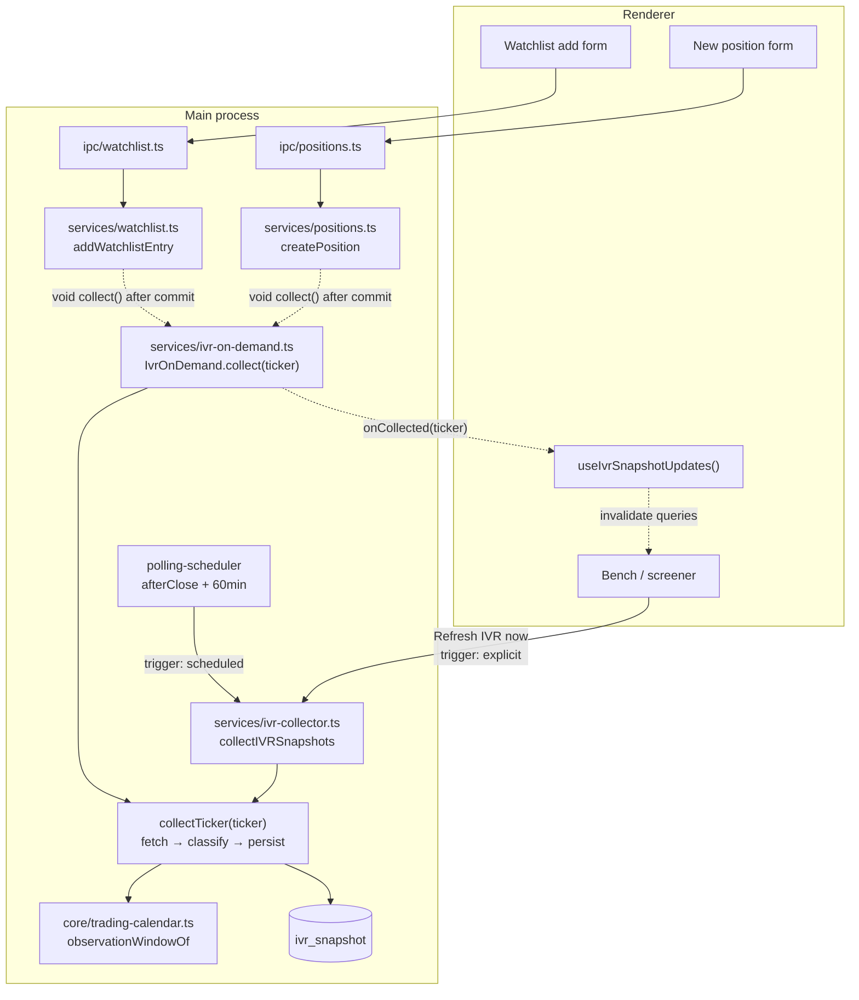

# US-100 — Collect IVR on watchlist add and outside market hours

**Story:** Linear [OPT-6](https://linear.app/optionswheel/issue/OPT-6) · Epic 06 — Live Market Data and IVR Foundation
**Plan:** `plans/us-100/plan.md`

## What shipped

IV rank is now collected the moment a ticker enters the app, and an explicit refresh is
no longer refused because the exchange happens to be shut.

Three changes, and they are separable:

1. **A trigger on the way in.** Adding a ticker to the watchlist, or manually entering a
   position on one, fires a single-ticker collection for that ticker only.
2. **The non-trading-day guard is scoped to the scheduler.** The batch still refuses to
   run itself on a weekend or a holiday; a person asking for it is never refused.
3. **A reading is stamped at the session it reflects, not the instant it was fetched.**

Before this, IV rank existed on exactly one schedule: `afterClose + 60min`, once per
market day. A ticker added at any other time read `n/a` until that window came round —
and research does not happen on the market's schedule, it happens in the evening and at
weekends, which is precisely when the gap was widest. A name added on a Sunday stayed
unscreenable until Monday evening, and "Refresh IVR now" did nothing about it, because
`ivr:collect-now` routes through `scheduler.runNow` into the same handler and inherited
the scheduled behaviour.

### Why the observation stamp changed

Barchart serves the **last close**. Collecting on Saturday and again on Sunday was
therefore two fetches of the same observation, and the old `persistSnapshot` keyed on the
UTC day of the fetch, so it stored both — two rows carrying Friday's numbers under two
different dates.

That is not a cosmetic problem. `ivr_snapshot` is a time series US-98 ages in _completed
exchange sessions_; a Saturday row makes a Friday reading look fresher than it is, and
any future percentile work computed over stored rows would be skewed by duplicated
non-observations. The invariant every reader already assumed — **one row per underlying
per session, and a row means "a trading day's close"** — is now actually enforced, by the
delete window rather than by a constraint (the PK stays `(underlying, observed_at)`, so a
same-session overwrite is still delete-then-insert).

| Fetch instant (ET)                    | `session` resolved | `observed_at` written |
| ------------------------------------- | ------------------ | --------------------- |
| Wed 17:00, Wed is a session           | Wed                | Wed 16:00 ET close    |
| Sun 15:00, Fri the last session       | Fri                | Fri 16:00 ET close    |
| Thanksgiving Thu 18:00 (closure)      | Wed                | Wed 16:00 ET close    |
| Tue 10:00 (session open, not closed)  | Mon                | Mon 16:00 ET close    |
| Black Friday 15:00, 13:00 early close | Fri                | Fri 13:00 ET close    |
| any, calendar never fetched           | `null`             | fetch instant (warn)  |

## Architecture



### The two collection paths share one body, not one entry point

`collectTicker` is the per-ticker body — fetch, classify, persist — extracted out of the
batch loop so the on-add path can reuse it. The on-add path deliberately does **not**
reuse `collectIVRSnapshots`: that resolves its targets from `positions ∪ watchlist`, so
firing it per add would refetch the entire bench every time a ticker was added. AC-2
("Adding a ticker collects only that ticker") is exactly this distinction.

### The add never waits on the network

`watchlist:add` and `positions:create` are user-facing IPC calls; a ~1s Barchart fetch
inside one makes the add feel broken. Both services fire `void ivrOnDemand?.collect(t)`
**after** the write has committed, and `collect` is documented and tested as _never
rejecting_ — its whole body sits in a `try/catch` that logs and swallows. A detached
promise that rejected would surface as an unhandled rejection and make a perfectly good
add look like a failure. This is CLAUDE.md's boundary-I/O degradation rule.

Because the add has already returned by the time the reading lands, the renderer learns
about it out of band: `onCollected` sends `ivr:snapshot-updated`, and
`useIvrSnapshotUpdates` invalidates the bench and screener queries. Without that push the
new card would read `n/a` until a manual reload.

### Trigger, not force

`collectIVRSnapshots` takes `trigger?: 'scheduled' | 'explicit'`, defaulting to
`'scheduled'` so every existing call site keeps its behaviour. The guard is now:

```ts
if (session.status === 'closed') {
  if (trigger === 'scheduled') return { ...skippedReason: 'market_closed' }
  logger.info({ etDate, trigger }, 'IVR collection proceeding on a closed day at explicit request')
}
```

The trigger reaches it through the scheduler: `JobHandler` now takes a
`JobRunContext = { trigger }`, a timer tick passes `'scheduled'`, and `runNow` defaults to
`'explicit'`. A `runNow` that _joins_ an in-flight run keeps the trigger that run started
with — it does not hand its own context to a handler already executing.

This also closes the half of `followup-ivr-trading-day-calendar.md` that complained about
the opposite failure: scheduled runs are now strictly _stricter_ (weekends and holidays),
while explicit runs do not consult the calendar for permission at all.

## Key files

| File                                              | Change                                                                                    |
| ------------------------------------------------- | ----------------------------------------------------------------------------------------- |
| `src/main/core/trading-calendar.ts`               | new `observationWindowOf` + `ObservationWindow` — the half-open session window            |
| `src/main/services/ivr-collector.ts`              | `trigger` split; `collectTicker` extracted; `persistSnapshot` stamps + dedupes by session |
| `src/main/services/ivr-on-demand.ts`              | **new** — `createIvrOnDemand`, the single-ticker port                                     |
| `src/main/services/polling-scheduler.ts`          | `JobTrigger` / `JobRunContext`; `runNow(name, { trigger })`                               |
| `src/main/services/watchlist.ts`, `positions.ts`  | optional `ivrOnDemand` param, fired after commit                                          |
| `src/main/ipc/watchlist.ts`, `positions.ts`       | pass the port through (handlers stay thin)                                                |
| `src/main/index.ts`                               | constructs the port once; wires `onCollected` to the main window                          |
| `src/renderer/src/hooks/useIvrSnapshotUpdates.ts` | **new** — subscribes to the push, invalidates bench + screener                            |
| `src/renderer/src/pages/SettingsPage.tsx`         | dropped the now-unreachable `market_closed` message branch                                |
| `src/main/integrations/fake-ivr.ts`               | fetch log, so e2e can assert a fetch did _not_ happen                                     |
| `src/main/ipc/test-scheduler.ts`                  | `_test:scheduler-run-scheduled`, to drive the scheduled trigger from e2e                  |

No migration. `ivr_snapshot`, `watchlist` and `trading_session` are unchanged in shape —
only the meaning of `ivr_snapshot.observed_at` changed.

## Tests

- `e2e/ivr-on-demand.spec.ts` — 13 scenarios, one per AC, titles verbatim.
- `e2e/ivr-collector.spec.ts` — the three guard tests now drive `collectIvrScheduled`;
  stamp expectations moved onto `sessionCloseOn(...)`, and the pinned `2026-05-29`
  constants were re-anchored to the fixture day so the observations sit inside the
  calendar's 45-day read window and are actually stamped rather than silently falling
  back.
- `e2e/ivr-watchlist-collection.spec.ts` — same re-anchoring.
- Unit: `ivr-on-demand.test.ts` (12), `ivr-collector.test.ts` (35), plus the
  scheduler, calendar, fake-IVR, IPC and composition suites.

### One e2e trap worth remembering

Seeding the Background now _triggers_ collection. A scenario that programmed its outcomes
after seeding would have its background tickers come back `not_available` and land no
rows — so "KO already has a reading", which two ACs turn on, would be quietly false.
`seedBenchAndSettle` also waits for the background fetches to appear in the log before a
scenario resets it, so the reset is meaningful rather than racing.
