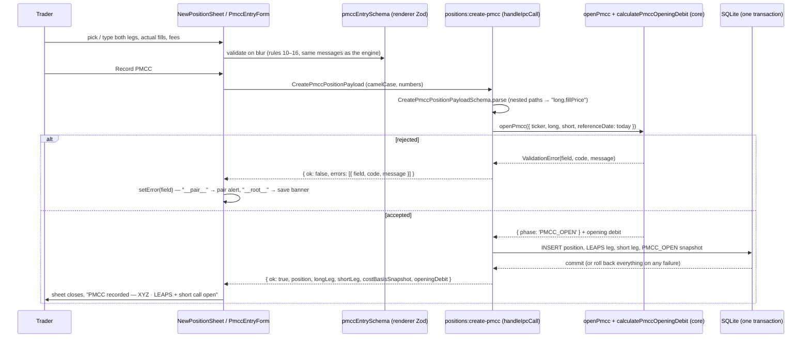
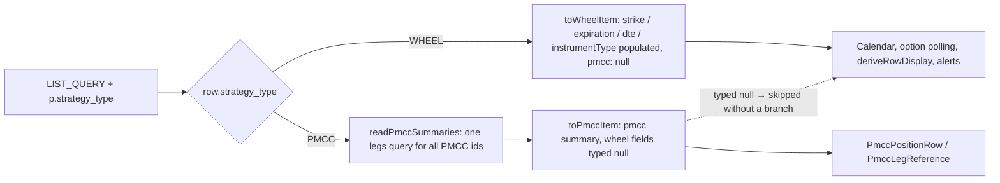

# US-101 — Open a PMCC position with two linked opening legs (implementation)

Story: Linear [OPT-7](https://linear.app/optionswheel/issue/OPT-7/us-101-open-a-pmcc-position-with-two-linked-opening-legs).
Plan: `plans/us-101/plan.md`. Spec pages: `docs/spec/` (see `/update-spec us-101`).

## What shipped

`Open Wheel` now opens a shared **New position** sheet over the positions list with a
`Standard / PMCC` toggle. Standard is the shipped wheel form, unchanged in behaviour. PMCC records
a long LEAPS call and a shorter-dated short call together, chain-picked or typed, with actual
fills, per-leg fees and a live opening cash-flow review, and writes the position, both legs and
the opening cost-basis snapshot in one SQLite transaction. A `PMCC_OPEN` position shows a
minimal, truthful row and detail page; every wheel-only job (alerts, assignment detection,
option polling, the calendar) skips it by construction.

This is journal entry, not order placement: the service imports no broker module and the e2e
suite asserts no `broker:` IPC channel is invoked on the success path.

### Behaviour summary

| Surface       | Behaviour                                                                                                                                                                                                                                                                                                                                                                                                                                                                                                                                                                                                                              |
| ------------- | -------------------------------------------------------------------------------------------------------------------------------------------------------------------------------------------------------------------------------------------------------------------------------------------------------------------------------------------------------------------------------------------------------------------------------------------------------------------------------------------------------------------------------------------------------------------------------------------------------------------------------------- |
| Route         | `#/` and `#/new` render the same `PositionsListPage` (one RegExp route); the sheet is open when the path is `/new`. Closing navigates to `/` with `replace`. All `#/new?ticker=` / promote entry points work unchanged.                                                                                                                                                                                                                                                                                                                                                                                                                |
| Sheet         | `role="dialog"` "New position", 460 px, Escape / × / scrim / Cancel close it (never while a save is pending) and return focus to whichever element opened it. Both forms stay mounted; the inactive one is `hidden`, so drafts survive the toggle and ticker + contracts are copied across. Reopening starts fresh in Standard.                                                                                                                                                                                                                                                                                                        |
| PMCC form     | RHF + Zod (`schemas/pmcc-entry.ts`, mirrors engine rules 10–16 with the same messages/paths). Per leg: contract picker (native `<select>` over the call chain, `Enter manually`), strike, expiration, actual fill, fees (default `0.00`), fill date (default today). Cash-flow block from the shared engine. `Record PMCC` is always enabled; submitting an invalid form surfaces the field (and pair) errors and focuses the first, and the button reads `Recording…` while a save is pending with a re-entry guard against double clicks.                                                                                            |
| Chain picker  | `useCallChain` polls `market-data:option-chain` (`type: 'call'`, DTE window from the preset, strike bounded by a one-shot underlying price snapshot from `useUnderlyingPrice`), filters by absolute delta client-side, keeps greek-less contracts selectable, drops contracts whose OCC root is not the ticker (adjusted contracts are out of scope), keeps the previous page while a refetch for the same ticker is in flight, and never lets a refetch drop the selected contract from the list or the quote strip. One notice slot per leg: loading / unavailable / empty / stale (> 5 min); nothing until a valid ticker is typed. |
| Boundary      | `positions:create-pmcc` = Zod parse + `createPmccPosition`, inside `handleIpcCall`. Nested Zod paths are joined with `.` (`long.fillPrice`). The engine `openPmcc` rejects with dotted fields and the AC's exact messages; `__pair__` for the net-debit rule.                                                                                                                                                                                                                                                                                                                                                                          |
| Persistence   | One `positions` row (`strategy_type 'PMCC'`, `phase 'PMCC_OPEN'`), two `legs` rows (`LEAPS_OPEN`/`BUY`, `SHORT_CALL_OPEN`/`SELL`, both `CALL`, per-leg `fees`), one `cost_basis_snapshots` row (`trigger_event 'PMCC_OPEN'`, `basis_per_share = initialNetDebit / (contracts × 100)`, `total_premium_collected = short credit − short fees`). Migration 017 adds `legs.fees`.                                                                                                                                                                                                                                                          |
| List          | `PositionListItem` is a union discriminated on `strategyType`; the PMCC arm carries `pmcc: { long, short, initialNetDebit }` and typed-`null` wheel fields, so the calendar, option polling and row display skip it without a branch. `PmccPositionRow` shows the `PMCC` badge, `LEAPS + short call open`, both strikes, both labelled expirations/DTEs, the credit and `$2,300.00 net debit` (the debit is recomputed from the two legs' fills and fees, never from the rounded basis).                                                                                                                                               |
| Detail        | `PositionCockpit` renders `PmccLegReference` (two leg cards + initial net debit recomputed from the legs' fills and fees through `calculatePmccOpeningDebit` + "Live P&L unavailable until PMCC valuation ships"); alert overrides and every wheel action are hidden for PMCC.                                                                                                                                                                                                                                                                                                                                                         |
| After success | Sheet closes; the list shows `PMCC recorded — XYZ · LEAPS + short call open` with `View position →`.                                                                                                                                                                                                                                                                                                                                                                                                                                                                                                                                   |
| Failed save   | `Could not record PMCC. Your entries are preserved. Try again.`; the transaction rolls back so neither a partial position nor a lone leg exists; `Record PMCC` is enabled again.                                                                                                                                                                                                                                                                                                                                                                                                                                                       |

## Key files

| Layer         | Files                                                                                                                                                                                                                                                                                                                                                                     |
| ------------- | ------------------------------------------------------------------------------------------------------------------------------------------------------------------------------------------------------------------------------------------------------------------------------------------------------------------------------------------------------------------------- | -------------------------------- |
| Migration     | `migrations/017_add_leg_fees.sql`                                                                                                                                                                                                                                                                                                                                         |
| Core engines  | `src/main/core/costbasis.ts` (`calculatePmccOpeningDebit`), `src/main/core/lifecycle.ts` (`openPmcc`, `PmccField`), `src/main/core/types.ts` (`PMCC_OPEN`, `LEAPS_OPEN`, `SHORT_CALL_OPEN`)                                                                                                                                                                               |
| Schemas       | `src/main/schemas.ts` (`CreatePmccPositionPayloadSchema`, `CreatePmccPositionResult`, `WheelListItem                                                                                                                                                                                                                                                                      | PmccListItem`, `LegRecord.fees`) |
| Services      | `src/main/services/create-pmcc-position.ts`, `src/main/services/position-rows.ts` (shared `insertPosition`), `src/main/services/list-positions.ts` (`readPmccSummaries`, `toWheelItem` / `toPmccItem`), `src/main/services/get-position.ts` (`fees`)                                                                                                                      |
| IPC / preload | `src/main/ipc/positions.ts` (`positions:create-pmcc`), `src/main/ipc/utils.ts` (dotted paths), `src/preload/index.ts` + `index.d.ts`                                                                                                                                                                                                                                      |
| Fake provider | `src/main/integrations/fake-market-data.ts` (`FAKE_OPTION_CHAIN_DELAY_MS`)                                                                                                                                                                                                                                                                                                |
| Renderer data | `src/renderer/src/api/positions.ts`, `api/market-data.ts` (`getOptionChain`), `hooks/useCallChain.ts`, `hooks/useUnderlyingPrice.ts`, `hooks/useCreatePmccPosition.ts`, `lib/pmcc-entry.ts`, `schemas/pmcc-entry.ts`                                                                                                                                                      |
| Renderer UI   | `components/NewPositionSheet.tsx`, `StrategyToggle.tsx`, `NewWheelForm.tsx` (sheet-mode footer, shared-field handle), `PmccEntryForm.tsx`, `PmccLegSection.tsx`, `CallContractPicker.tsx`, `PmccCashFlows.tsx`, `PmccPositionRow.tsx`, `positionRowStyles.ts`, `position-cockpit/PmccLegReference.tsx`, `pages/PositionsListPage.tsx`, `App.tsx` (`NewWheelPage` deleted) |
| E2E           | `e2e/open-pmcc-position.spec.ts` (40 cases, 9 scenarios), `e2e/pmcc-helpers.ts`                                                                                                                                                                                                                                                                                           |

## Record flow

## Why the list item is a discriminated union

The wheel arm keeps every field a consumer read before, so nothing else changed; the PMCC arm
cannot be built without its summary and a wheel arm cannot carry one (`pnpm typecheck` guards
both).

## Decisions worth knowing (details in `plans/us-101/research.md`)

- `#/new` stayed a route so the fourteen existing e2e specs and five entry points kept working;
  the page does not remount across `/` ↔ `/new`, which is what keeps the recorded banner alive
  and the list's scroll position intact. Closing the sheet refetches nothing: the create
  hooks insert the recorded row into the cached list via `setQueryData`, ordered by the shared
  `sortPositionsByDte`.
- The chain picker reads the underlying price through `useUnderlyingPrice` (one snapshot per
  ticker per open, on its own query key), not `useStockQuotes`: the latter owns the main
  process's single stock-quote stream subscription and would have replaced, then cleared, the
  list's live feed underneath the sheet; and a live price in the chain's query key would drop the
  selected contract on every tick.
- Engine rule order puts "unexpired contract" before "expiration after fill date", so an
  already-expired contract entered with today's fill date gets the AC's message.
- Per-leg fees live on `legs.fees`; the opening snapshot is written in US-103's ledger
  convention so the running basis history extends it rather than migrating it.
- The storage-failure e2e uses a `BEFORE INSERT … RAISE(ABORT)` trigger on
  `cost_basis_snapshots` rather than `chmod`: a read-only file does not fail writes on an
  already-open connection, and the trigger fails the transaction's _last_ write, which is the
  only way a pass proves the rollback.

## Follow-ups (not this story)

- US-103 (running PMCC basis and the detail history drawer), US-108 / US-118 (full PMCC row and
  cockpit), US-113 / US-122 (IV block and promote-into-PMCC in this sheet), US-115 / US-119 /
  US-120 / US-111 (the reserved `PMCC_LEAPS_ONLY` / `PMCC_CLOSED` phases and lifecycle roles).
