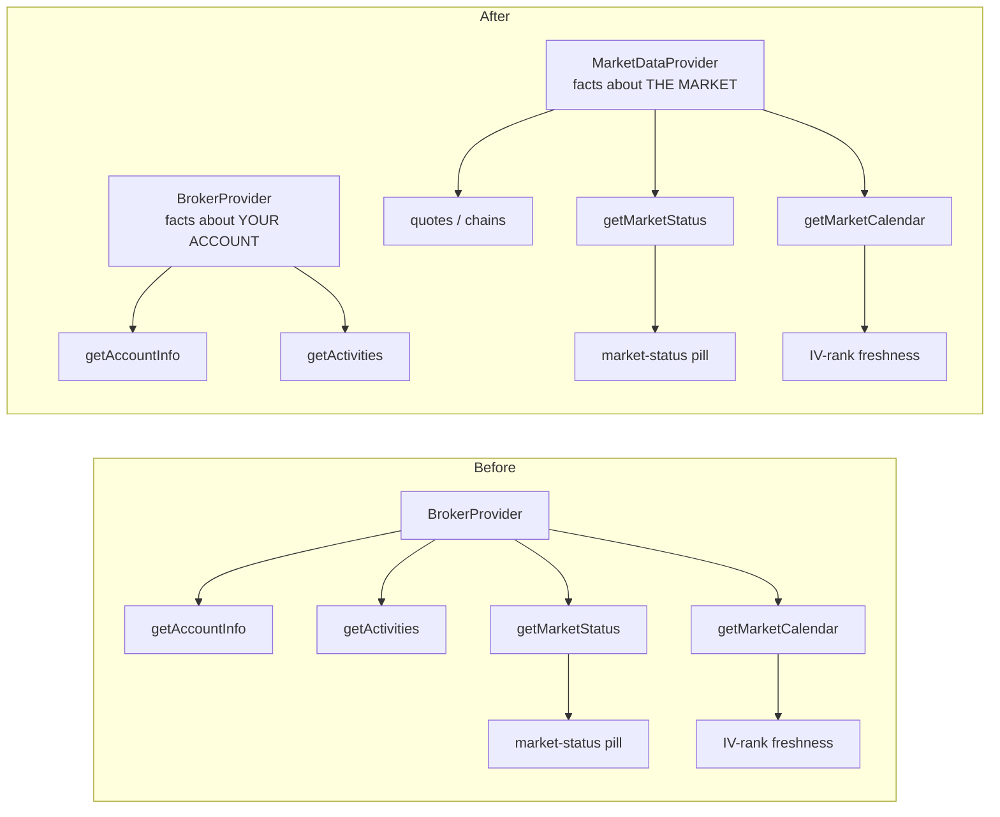
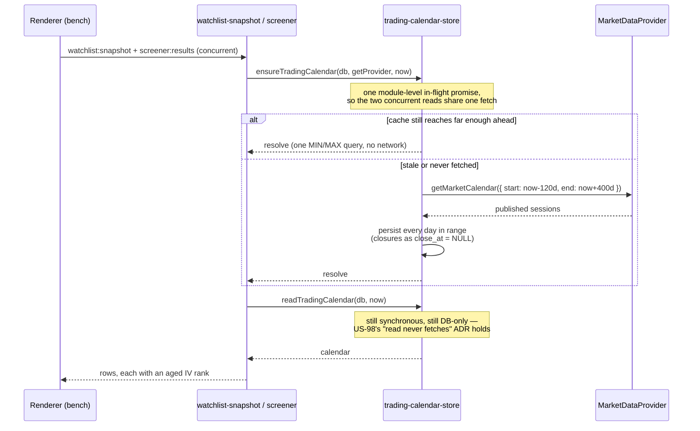

# US-116 — Market facts come from the market-data provider, not the broker

**Story:** Linear [OPT-8](https://linear.app/optionswheel/issue/OPT-8) · Epic 06 — Live Market Data and IVR Foundation
**Plan:** `plans/us-116/plan.md`

## What shipped

Two capabilities moved ports. `getMarketStatus()` and `getMarketCalendar(range)` left
`BrokerProvider` and landed on `MarketDataProvider`, taking the `MarketStatus`,
`MarketCalendarDay` and `MarketCalendarRange` types with them. `BrokerProvider` is now
exactly `getAccountInfo` + `getActivities`.

Neither capability is a fact about the trader's account. "Which days were exchange
sessions" and "is the exchange open right now" are facts about the **market**, and they
only sat behind the broker because Alpaca happens to serve them from its trading host —
the same host, and the same key pair, the market-data provider already authenticates
against for open interest.

That sourcing accident had a real cost: IV rank is scraped from Barchart with no
credentials at all, yet the whole IV column was dead on any install without a broker,
because the calendar that ages a reading could not be fetched. The market-status pill was
dead for the same reason.

Two behavioural changes come with the move:

- **The bench refreshes the calendar it reads.** `refreshTradingCalendar` used to have
  exactly one caller — the nightly IVR collection — so on a fresh install `trading_session`
  stayed empty and every reading was unreadable until that job first ran. A new
  `ensureTradingCalendar` is now awaited by `buildWatchlistSnapshot` and
  `screenWatchlistCandidates` before either reads the calendar.
- **The pill gates on market-data credentials**, not on an attached broker.
  `CredentialStatus.marketData` was already computed for exactly this question.

## Architecture

The adapter hides how many upstreams it takes. `AlpacaMarketDataProvider` now spans four:
`data.alpaca.markets` for quotes and option snapshots, the trading host for option
contracts **and** `/v2/clock` and `/v2/calendar`, and the websocket for streaming. Adding a
fourth behind the same port is the established pattern here, not a new concession.

## The calendar refresh

`ensureTradingCalendar` never throws and never rejects. An unconfigured provider, a
provider error and an up-to-date cache are all "nothing more to do". That guarantee is
load-bearing rather than a courtesy: both callers await it inside a `Promise.all`, so a
rejection would sink the bench — the exact failure AC 5 and AC 6 exist to prevent. It holds
because `refreshTradingCalendar` wraps its whole body in a catch and reports
`{ status: 'failed' }`; only the `getProvider()` call, which sits outside that, is guarded
here. The in-flight promise deliberately caches the _fetch_, not the _result_: a later bench
open is free to retry a refresh that failed.

The consequence the story turns on: **a calendar failure degrades IV freshness only.** It
never becomes the bench's "Market data unavailable" card, which stays reserved for
`pullWatchlistChains` reporting a real outage.

## Key files changed

| Area           | Files                                                                                                                                                                                                                                           |
| -------------- | ----------------------------------------------------------------------------------------------------------------------------------------------------------------------------------------------------------------------------------------------- |
| Ports          | `integrations/market-data-provider.ts` (gains both methods, the three types, `MarketStatusSource`, `MarketCalendarSource`), `integrations/broker-provider.ts` (loses them)                                                                      |
| Alpaca         | `alpaca-market-data-mappers.ts` (`buildClockUrl`, `buildCalendarUrl`, `mapClock`, `mapCalendarDays`, `deriveSession`), `alpaca-market-data.ts`, `alpaca-broker.ts` (sheds both methods)                                                         |
| Fakes          | `fake-market-data.ts` (gains both, plus `FAKE_MARKET_CALENDAR` / `FAKE_MARKET_CALENDAR_ERROR`), `fake-broker.ts` (loses both)                                                                                                                   |
| Calendar store | `services/trading-calendar-store.ts` — retyped to the market-data port; adds `ensureTradingCalendar`                                                                                                                                            |
| Read paths     | `services/watchlist-snapshot.ts`, `services/screener.ts`                                                                                                                                                                                        |
| Jobs           | `services/ivr-collector.ts` (takes a `MarketCalendarSource`), `main/index.ts` (`tryCreateBroker` deleted)                                                                                                                                       |
| Scheduler      | `services/polling-scheduler.ts` (takes a `MarketStatusSource`), `services/scheduler-instance.ts` (`fallbackBroker` / `getSafeBroker` deleted)                                                                                                   |
| IPC            | `ipc/market-data.ts` (`market-data:market-status`), `ipc/broker.ts` (handler deleted), preload + types                                                                                                                                          |
| Renderer       | `api/market-data.ts`, `api/broker.ts`, `hooks/marketDataQueryKeys.ts`, `hooks/brokerQueryKeys.ts`, `hooks/useMarketStatus.ts`, `hooks/useMarketStatusDisplay.ts`, `hooks/useSettings.ts`, `lib/market-status.ts`, `pages/PositionsListPage.tsx` |

No schema change, no migration, no new dependency, no new credential.

## Behavioural notes worth knowing

- **`broker:market-status` is gone**, replaced by `market-data:market-status`. The payload
  and response shape are unchanged; only the channel, the service behind it and the preload
  path moved. The renderer key moved from `brokerQueryKeys.marketStatus` to
  `marketDataQueryKeys.marketStatus = ['market', 'status']`, so `useSettings`'
  invalidation predicate widened from `'broker'` to `'broker' | 'market'` — without that,
  saving credentials would have silently stopped refreshing the pill.
- **The pill no longer fires a speculative status call while settings are loading.** The old
  gate read `data?.activeBrokerEnv !== 'none'`, which is `true` when `data` is still
  `undefined`; that fired one request whose result TanStack Query then cached indefinitely.
  The new gate, `data?.marketData === 'configured'`, is correctly `false` until credentials
  are known. An install with no credentials now falls back to the local NYSE calendar, which
  is what `deriveMarketStatusDisplay` was always written to do.
- **`FAKE_BROKER_ERROR` can no longer break a market fact.** The e2e seam moved with the
  capability: `FAKE_BROKER_CALENDAR` became `FAKE_MARKET_CALENDAR`, and a dedicated
  `FAKE_MARKET_CALENDAR_ERROR` fails only the calendar, which is what lets a spec express
  "the calendar failed while quotes and chains served normally".
- **Collection is unchanged in timing.** The `session.status === 'closed'` skip still
  governs _when_ IVR is collected — that is US-100's story.

## Tests

`e2e/market-facts-without-broker.spec.ts` carries one test per acceptance scenario, named
in the scenario's own language. The Background — "market-data credentials saved, no broker
credentials saved" — is expressed by a new `marketDataWithoutBroker` launch option: no
activated broker rows, but a usable env-fallback key pair, so `activeBrokerEnv` reads
`'none'` while `CredentialStatus.marketData` reads `'configured'`.

Two scenarios need a recorded IV reading _and_ an unfetched calendar. Only the collector
can write a reading, and it refreshes the calendar on the same run — so those specs launch
with the calendar seam failing, let the collector persist the reading against an empty
`trading_session`, then clear the fault and open the bench. What the bench does next is
exactly what the scenario is about.
