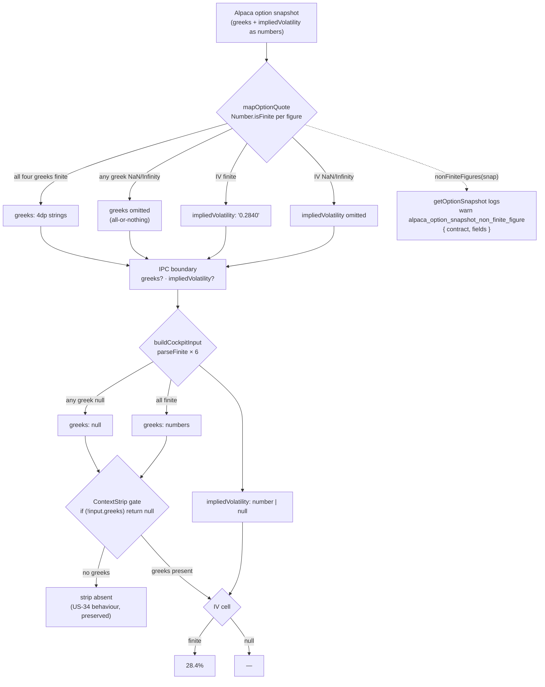
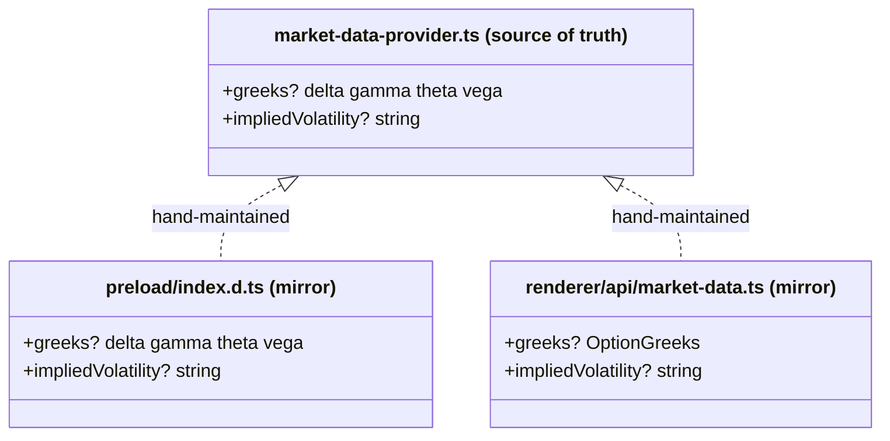

# US-117 — A position's implied volatility is a real number or an honest dash, never NaN

**Story:** [OPT-10](https://linear.app/optionswheel/issue/OPT-10/us-117-a-positions-implied-volatility-is-a-real-number-or-an-honest) ·
**Kind:** bugfix · 3 points · **Epic:** 06 — Live Market Data and IVR Foundation

## What was broken

The position cockpit's Context strip rendered `NaN%` for IV. Not a missing-data state — a field
the app promised, never filled, and then formatted anyway.

The IPC type mirrors declared a **required** `greeks.iv: string` that no producer has ever
written. The real figure — `impliedVolatility` — was already correct in the main process and
already crossing the IPC at runtime, but invisible to the renderer because no type declared it.
The renderer then did `parseFloat(snapshot.greeks.iv)` → `parseFloat(undefined)` → `NaN`, and
the display guard `iv != null` let it through, because `NaN != null` is `true`.

`typecheck` passed throughout: nothing in the type system can catch a producer that never
writes a required field, so the defect was invisible until it reached a screen.

## What changed

Implied volatility is now a **sibling** of `greeks`, never a member of it — matching the
main-process shape, which is the source of truth. `greeks.iv` is deleted from all three
declarations. A non-finite figure is dropped at the producer rather than stringified as
`"NaN"`, and every renderer parse routes through one finite-guard helper.

The three type declarations that had drifted apart are now exact mirrors of one another:

## Key files changed

| File                                                  | Change                                                                                                   |
| ----------------------------------------------------- | -------------------------------------------------------------------------------------------------------- |
| `src/main/integrations/alpaca-market-data-mappers.ts` | `typeof x === 'number'` → `Number.isFinite`; new pure `nonFiniteFigures`, `isFiniteNumber`, `isUnusable` |
| `src/main/integrations/alpaca-market-data.ts`         | `getOptionSnapshot` warns `alpaca_option_snapshot_non_finite_figure` when a figure was dropped           |
| `src/preload/index.d.ts`                              | `IpcOptionSnapshot`: `greeks` optional, `greeks.iv` deleted, `impliedVolatility?` added                  |
| `src/renderer/src/api/market-data.ts`                 | same three edits on `OptionGreeks` / `OptionSnapshot`                                                    |
| `src/renderer/src/lib/format.ts`                      | new `parseFinite(value): number \| null` — never returns `NaN`, never nulls a legitimate `0`             |
| `src/renderer/src/lib/verdict.ts`                     | `CockpitInput.greeks` loses `iv`; `impliedVolatility` becomes **required-and-nullable**                  |
| `.../position-cockpit/PositionCockpit.tsx`            | new `parseAllOrNothing`; `buildCockpitInput` routes six figures through `parseFinite`                    |
| `.../position-cockpit/ContextStrip.tsx`               | IV cell reads `input.impliedVolatility` directly and dashes; the `greeks.iv` fallback is gone            |

## Decisions worth remembering

- **IV is a sibling of `greeks`, not a member.** Alpaca supplies the two independently, so
  nesting IV would force a contract with IV but no Greeks to discard its IV.
- **`CockpitInput.impliedVolatility` is required-and-nullable on purpose.** That makes
  `buildCockpitInput` fail to compile until it decides — the original bug (a required field no
  producer filled), inverted so the compiler catches it.
- **Greeks stay all-or-nothing.** One non-finite figure nulls the whole block, because
  `computeVerdict`, `computeDistance` and `RiskSnapshot` all read `input.greeks.delta` as a
  plain number.
- **The Context strip's render gate did not change.** US-34's shipped behaviour — a Greek-less
  contract shows no strip — is preserved. Only the IV cell learned to dash. Consequence: the
  ACs naming a dashed cell in a Greek-less state are satisfied as _nothing broken is shown_
  (strip absent, no `NaN` anywhere, cockpit confirmed rendered).
- **Drop at the producer, log at the adapter.** The mappers file promises "No I/O — every
  function here is total and side-effect free", so `nonFiniteFigures` is pure and the adapter
  decides to log. The chain path stays silent: 161 contracts per underlying would be noise.

## Verification

- `pnpm test` — 3134 passing
- `pnpm test:e2e` — 365 passing; 9 US-117 cases, one per AC row
- `pnpm lint`, `pnpm typecheck` — clean
- Changed-code coverage — 7/7 production files ≥95% lines and branches
- `grep -rn "greeks\.iv" src/ e2e/` — no production hits (comments only)

## Known follow-ups (not done here)

- The two IPC type mirrors are still hand-maintained copies with no structural link — the
  direct cause of this defect. Each now carries a comment naming the source of truth, but a
  comment is a convention, not a mechanism.
- `PositionCockpit.tsx:177-178` still uses bare `parseFloat` for the HOLDING_SHARES card, so
  an unparseable basis or spot price renders `+$NaN` — the same defect class, one panel up.
- `fmtMoney`, `pnlColor` and `pnlClass` in `format.ts` call bare `parseFloat` on strings from
  the same IPC boundary. Converting them is a behaviour change (`fmtMoney(undefined)` yields
  `"$NaN"` today) and belongs to its own story.
