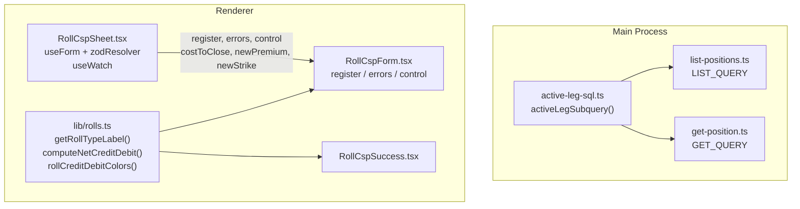

# US-12 Refactor: Active Leg, Roll Helpers, RHF Migration

## Overview

Three independent refactoring improvements to the Roll CSP feature:

1. **Active leg SQL bug fix** — rolled CSP positions now show correct strike/expiration/DTE in the positions list
2. **Shared roll domain helpers** — deduplicated roll type label and credit/debit logic into `lib/rolls.ts`
3. **RHF + Zod migration** — `RollCspSheet` now uses react-hook-form, matching the project standard

## Key Files Changed

| File | Change |
|---|---|
| `src/main/services/active-leg-sql.ts` | **New** — shared SQL subquery for current active leg |
| `src/main/services/list-positions.ts` | Bug fix — uses `activeLegSubquery()` to include `ROLL_TO` legs |
| `src/main/services/get-position.ts` | Deduplication — replaced inline subquery with shared helper |
| `src/renderer/src/lib/rolls.ts` | **New** — `getRollTypeLabel`, `computeNetCreditDebit`, `rollCreditDebitColors` |
| `src/renderer/src/lib/rolls.test.ts` | **New** — 7 unit tests for roll helpers |
| `src/renderer/src/components/RollCspSheet.tsx` | RHF + Zod migration; `makeRollCspSchema` factory |
| `src/renderer/src/components/RollCspForm.tsx` | Updated props — RHF `register`/`errors`/`control` |
| `src/renderer/src/components/RollCspSuccess.tsx` | Uses `rollCreditDebitColors` from `lib/rolls` |

## Architecture



## Active Leg SQL Bug

**Root cause**: `list-positions.ts` joined legs with `leg_role IN ('CSP_OPEN', 'CC_OPEN')`, which missed `ROLL_TO` legs. After rolling a CSP, the active leg has `leg_role = 'ROLL_TO'`, so the join returned null for strike/expiration.

**Fix**: The correct phase-aware logic was already in `get-position.ts`. Extracted into a shared `activeLegSubquery()` function and used in both query files.

```sql
-- Before (list-positions.ts): missed ROLL_TO
AND leg_role IN ('CSP_OPEN', 'CC_OPEN')

-- After: phase-aware, includes ROLL_TO
AND (
  (p.phase = 'CSP_OPEN' AND leg_role IN ('CSP_OPEN', 'ROLL_TO'))
  OR (p.phase = 'CC_OPEN' AND leg_role IN ('CC_OPEN', 'ROLL_TO'))
)
ORDER BY fill_date DESC, created_at DESC
LIMIT 1
```

## RHF Schema

```typescript
function makeRollCspSchema(currentExpiration: string): z.ZodObject<...> {
  return z.object({
    cost_to_close: z.string().refine(v => parseFloat(v) > 0, 'Cost to close must be greater than zero'),
    new_premium:   z.string().refine(v => parseFloat(v) > 0, 'New premium must be greater than zero'),
    new_expiration: z.string().min(1).refine(v => v > currentExpiration, 'New expiration must be after the current expiration'),
    new_strike:    z.string().refine(v => parseFloat(v) > 0, 'Strike must be greater than zero'),
    fill_date:     z.string().optional()
  })
}
```
