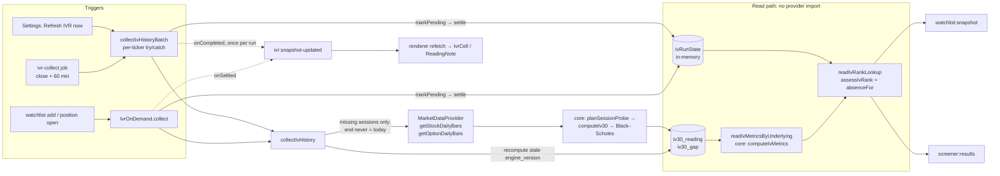

# US-121 — IV rank computed from the app's own IV history

Story: Linear [OPT-27](https://linear.app/optionswheel/issue/OPT-27/us-121-compute-iv-rank-from-our-own-iv-history-instead-of-scraping) ·
Plan: `plans/us-121/plan.md` · Refactor and review log: `plans/us-121/refactor-phase-results.md`

## What changed and why

Barchart put its site behind an AWS WAF challenge, so the scraped IV rank died. IV rank is now
computed from data the app is already entitled to:

- **Input:** Alpaca **daily option-bar VWAP**, inverted with European Black–Scholes against the
  underlying's **SIP daily VWAP**.
- **Contract selection:** strikes are walked nearest-first with a trade-count gate of ≥ 1 per
  leg. The weekly Friday pair bracketing 30 DTE is tried first, then the 3rd-Friday monthly
  pair. Expirations under 7 DTE are excluded.
- **IV30:** the call/put mean at each expiration, interpolated to 30 days in total variance.
- **Storage:** one row per (underlying, session, method) holding IV30 **and every input that
  produced it**, in `iv30_reading`. Sessions that could not be read go in `iv30_gap`.
- **Metrics:** rank, percentile and the 52-week low/high are derived on read over the 252
  sessions before the newest reading. They are published only when at least 200 of those
  sessions have a reading.
- **Recompute:** a later engine fix is a recompute from stored inputs, never a refetch.
- **Barchart removed:** the scraper, its fake, its e2e seam and the `ivr_snapshot` table are
  deleted (migration 016).

An absent rank now says why. Each bench row and ranked candidate carries exactly one of `ivRank` or
`ivRankAbsence`:

| Reason                 | Card shows                                          |
| ---------------------- | --------------------------------------------------- |
| `pending`              | `…`, "Computing IV history"                         |
| `insufficient_history` | "covers N of the last 252 sessions; rank needs 200" |
| `no_market_data`       | "IV rank needs Alpaca market-data credentials"      |
| `failed`               | "Last IV history run failed"                        |
| `not_collected`        | "No IV rank collected"                              |

The reason is display-only. The verdict engine and the screener floor treat every absence as
`unknown`.

## Data flow

## When a session counts, and how gaps work

- **Required sessions:** a ticker needs the 253 most recent sessions (the window plus its
  anchor) whose bars have _settled_.
- **Settling:** today's session counts only 45 minutes after its close (`BAR_SETTLE_MINUTES`).
  SPY-style options trade until 16:15 and free-plan SIP bars lag. A stored reading is never
  re-probed, so reading forming bars would freeze a partial VWAP.
- **The `end` date:** `end` is omitted when the newest settled session is today. Otherwise it
  names that session. It never names the current calendar day, because Alpaca 403s on that.
- **Gaps:** a session whose bars fail every gate is recorded as a gap and counts against
  coverage. The newest session is never gapped; it is retried on the next run.
- **Gap-only tickers:** a ticker with only gaps reads `insufficient_history` with coverage 0,
  not `not_collected`.

**Verified live (2026-09-27, `scripts/check-bars-end-inclusive.mjs`):**

- A date-only `end` is **inclusive** on both `/v2/stocks/bars` (SIP) and `/v1beta1/options/bars`.
  With `end=2026-09-24` the last bar is stamped `2026-09-24T04:00:00Z`; with `end=2026-09-25` it
  is `2026-09-25T04:00:00Z`.
- So a run that names a completed session as `end` (daytime or weekend) does not drop that
  session's bar.

## Key files

| Layer         | Files                                                                                                                                                                                                                                                                                          |
| ------------- | ---------------------------------------------------------------------------------------------------------------------------------------------------------------------------------------------------------------------------------------------------------------------------------------------- |
| Core (pure)   | `src/main/core/black-scholes.ts`, `iv30-selection.ts`, `iv30.ts`, `iv-metrics.ts`; `ivr-freshness.ts` / `watchlist-signal.ts` (nullable rank)                                                                                                                                                  |
| Schema        | `migrations/016_create_iv30_history.sql`                                                                                                                                                                                                                                                       |
| Market data   | `src/main/integrations/market-data-provider.ts` (daily-bar port), `alpaca-market-data*.ts` (100-symbol batches, shared `fetchPages`), `fake-market-data.ts` (bars priced from a programmed IV series), `fake-clock.ts`                                                                         |
| Services      | `iv-history.ts` (collect + recompute), `iv-history-store.ts` (SQL), `iv-history-read.ts` (metrics read), `iv-run-state.ts`, `ivr-collector.ts`, `ivr-on-demand.ts`, `iv-rank-lookup.ts` (`readIvRankLookup`, `absenceFor`, `lookupOf`), `trading-calendar-store.ts` (400 days back / 70 ahead) |
| IPC / preload | `ipc/test-iv-history.ts` (dev-only `_test:iv-*` channels), `IpcIvRankPair` in `preload/index.d.ts`                                                                                                                                                                                             |
| Renderer      | `IvrCell.tsx`, `ReadingNote.tsx`, `lib/ivr-tooltip.ts`, `SettingsPage.tsx`                                                                                                                                                                                                                     |
| E2E           | `e2e/iv-history.spec.ts` (all 28 AC rows), `e2e/ivr-helpers.ts` (series builders), existing IVR specs migrated to the series seam                                                                                                                                                              |

## Bugs found and fixed during implementation

1. **The card stuck on "Computing IV history".** Only a `collected` outcome pushed a refresh.
   Every on-demand settle now pushes, and the batch pushes once per run.
2. **No credentials read as a failed run.** With no credentials, the calendar fetch is the first
   market-data call, and it swallowed `auth_failed`. The calendar refresh now reports
   `no_market_data`.
3. **A batch push storm** (from code review). A per-ticker push re-ran the screener N times.
   There is now one push per batch run.
4. **Today frozen from forming bars** (from code review). Fixed by the 45-minute settle margin.
   The e2e "after close" clock is now close + 60 min in ET, so it works on both sides of DST.
5. **A gap-only ticker mislabelled "never collected"** (from code review).
