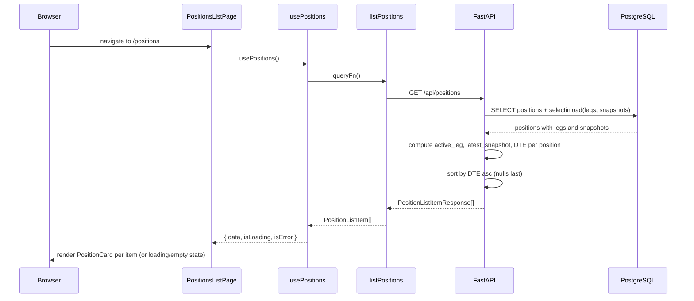

# US-2: List All Positions — Implementation

## Feature

Implements a positions list view end-to-end: a `GET /api/positions` endpoint that returns all positions with DTE computed server-side and sorted by nearest expiration, plus a `/positions` page in the frontend with `PositionCard` components and empty/loading states.

## Scope

| Layer              | What was added                                                                          |
| ------------------ | --------------------------------------------------------------------------------------- |
| Backend schema     | `PositionListItemResponse` Pydantic model                                               |
| Backend route      | `GET /positions` handler with `selectinload`, DTE computation, sort, structured logging |
| Frontend API       | `PositionListItem` type + `listPositions()` function                                    |
| Frontend hook      | `usePositions()` TanStack Query hook                                                    |
| Frontend component | `PositionCard` component                                                                |
| Frontend page      | `PositionsListPage` + `/positions` route in `app.tsx`                                   |
| Test infra         | Per-test DB truncation fixture (`truncate_tables` autouse) added to `conftest.py`       |

## Key Files Changed

- `backend/app/api/schemas.py` — added `PositionListItemResponse`
- `backend/app/api/routes/positions.py` — added `list_positions` handler, `_active_leg`, `_latest_snapshot` helpers
- `backend/tests/conftest.py` — added `truncate_tables` autouse fixture for test isolation
- `frontend/src/api/positions.ts` — added `PositionListItem` type and `listPositions` function
- `frontend/src/hooks/usePositions.ts` — new file
- `frontend/src/components/PositionCard.tsx` — new file
- `frontend/src/pages/PositionsListPage.tsx` — new file
- `frontend/src/app.tsx` — added `/positions` route

## Data Flow



## Sort Logic

Positions are sorted by DTE ascending, with positions that have no active leg (DTE = null) sorted last. This is implemented in Python:

```python
items.sort(key=lambda x: (x.dte is None, x.dte if x.dte is not None else 0))
```

## Active Leg Selection

The `_active_leg` helper picks the `open` leg with the latest `fill_date`. For positions with no open legs (e.g., `WHEEL_COMPLETE`), it returns `None`, causing `strike`, `expiration`, and `dte` to serialize as `null`.

## Test Isolation Fix

The test suite uses a session-scoped PostgreSQL container. Prior to this story, tests accumulated data across each run in the session. A `truncate_tables` autouse fixture was added to truncate all data tables before each test, ensuring full isolation.
