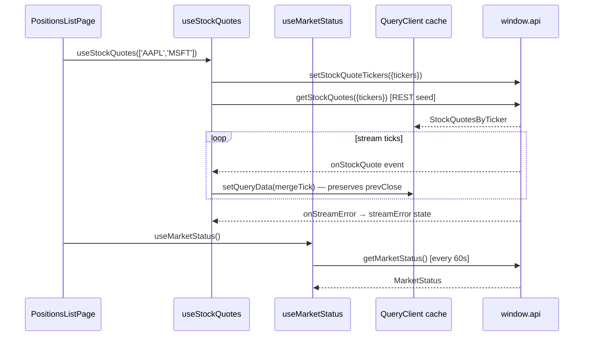

# Layer 5 Implementation: US-32 — Market Data Hooks

## Feature Scope

Two TanStack Query hooks that expose market data to the renderer:

- **`useMarketStatus`** — polls `window.api.getMarketStatus` every 60 seconds; returns `UseQueryResult<MarketStatus>`.
- **`useStockQuotes`** — seeds from `window.api.getStockQuotes` (REST), then merges live stream ticks via `window.api.onStockQuote`; exposes `streamError` alongside the query result.

## Key Files Changed

| File                                             | Role                                                                   |
| ------------------------------------------------ | ---------------------------------------------------------------------- |
| `src/renderer/src/hooks/marketDataQueryKeys.ts`  | Shared stable query key factory for both hooks                         |
| `src/renderer/src/hooks/useMarketStatus.ts`      | Market status polling hook                                             |
| `src/renderer/src/hooks/useStockQuotes.ts`       | Quote cache + WebSocket stream bridge                                  |
| `src/renderer/src/hooks/useMarketStatus.test.ts` | 3 unit tests                                                           |
| `src/renderer/src/hooks/useStockQuotes.test.ts`  | 9 unit tests                                                           |
| `src/preload/index.d.ts`                         | Moved `IpcStockQuoteEvent`/`IpcStreamErrorEvent` into `declare global` |

## Architecture

## Design Decisions

- `staleTime: Infinity` on `useStockQuotes` — stream ticks are the live update mechanism; `refetchOnWindowFocus: true` re-seeds `prevClose` after window blur.
- `mergeTick` preserves `prevClose` from the existing cache entry when a stream tick sends `prevClose: null` — this keeps the signed-change display intact.
- `sortedTickers.join(',')` is the stable effect dependency key (avoids referential instability from parent re-renders creating new arrays).
- Effect cleanup calls `setStockQuoteTickers([])` to tear down the stream subscription in main process on unmount or ticker change.
