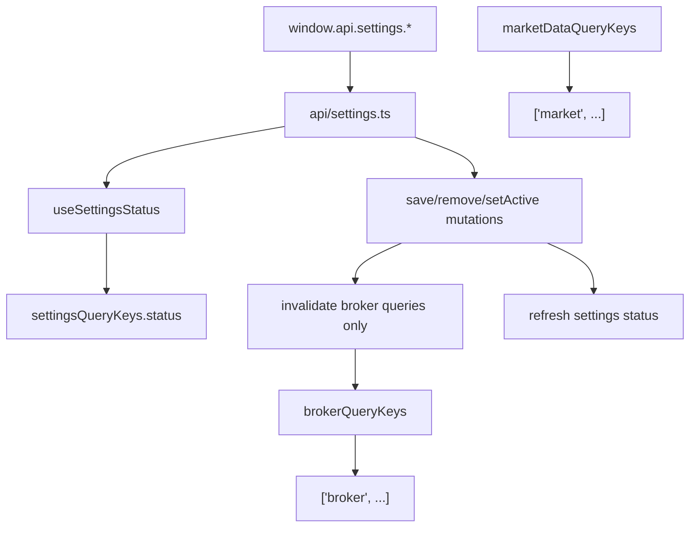

# US-37 Implementation: Layer 3 Renderer Settings Plumbing

## Scope

This pass implements the US-37 Layer 3 renderer plumbing that sits between the new settings IPC contract and the later settings UI work. The renderer now has a dedicated settings adapter, explicit broker-vs-market query key namespaces, and broker-scoped invalidation for Alpaca settings mutations.

## Key Changes

| File                                                 | Change                                                                                                              |
| ---------------------------------------------------- | ------------------------------------------------------------------------------------------------------------------- |
| `src/renderer/src/api/settings.ts`                   | Added typed renderer adapter for settings status, Alpaca save/remove, active broker env switch, and test connection |
| `src/renderer/src/hooks/useSettings.ts`              | Added settings status query plus broker-scoped mutations that refresh settings status                               |
| `src/renderer/src/hooks/settingsQueryKeys.ts`        | Added stable settings query key module                                                                              |
| `src/renderer/src/hooks/brokerQueryKeys.ts`          | Added broker-prefixed account, activities, and market-status query keys                                             |
| `src/renderer/src/hooks/marketDataQueryKeys.ts`      | Normalized market data keys to `['market', ...]`                                                                    |
| `src/renderer/src/hooks/useMarketStatus.ts`          | Moved market status onto broker query keys                                                                          |
| `src/renderer/src/api/settings.test.ts`              | Added adapter coverage for settings IPC unwrapping                                                                  |
| `src/renderer/src/hooks/useSettings.test.ts`         | Added hook coverage for broker-only invalidation and settings refresh                                               |
| `src/renderer/src/hooks/brokerQueryKeys.test.ts`     | Added broker query key prefix coverage                                                                              |
| `src/renderer/src/hooks/marketDataQueryKeys.test.ts` | Added market query key prefix coverage                                                                              |

## Behavior

- `useSettingsStatus()` reads `window.api.settings.status()` through a typed adapter.
- Alpaca save/remove/switch mutations invalidate only queries whose first key segment is `broker`.
- The same mutations also refresh `['settings', 'status']`.
- Market quote and option snapshot keys now live under `['market', ...]`, which keeps them outside broker environment invalidation.

## Architecture

## Verification

- `pnpm test`
- `pnpm lint`
- `pnpm typecheck`
- `pnpm format` was attempted repo-wide, but Prettier hit an unrelated permission error writing `.agents/skills/code-simplifier/SKILL.md`; targeted formatting for the touched renderer files succeeded with `pnpm exec prettier --write ...`
