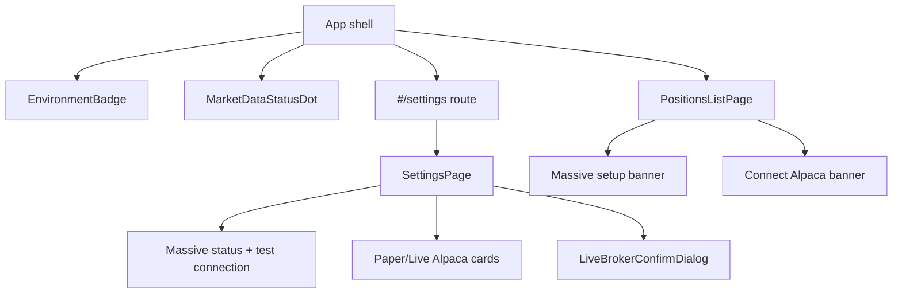

# US-37 Layer 4 — Renderer UI Implementation

## Scope

This implementation covers Layer 4 of `plans/us-37/tasks.md` for the Paper/Live broker environment story. The renderer now exposes:

- An always-visible broker environment badge plus a separate Massive market-data status dot in the app shell.
- A new `#/settings` route with a real settings page for shared Massive status, paired Alpaca paper/live credentials, and a LIVE confirmation dialog.
- Broker-degraded messaging on the positions list so market-data and broker state stay visually separate.

## Key Files

- `src/renderer/src/App.tsx`
- `src/renderer/src/components/EnvironmentBadge.tsx`
- `src/renderer/src/components/MarketDataStatusDot.tsx`
- `src/renderer/src/components/LiveBrokerConfirmDialog.tsx`
- `src/renderer/src/pages/SettingsPage.tsx`
- `src/renderer/src/pages/PositionsListPage.tsx`
- `src/renderer/src/pages/SettingsPage.test.tsx`
- `src/renderer/src/components/LiveBrokerConfirmDialog.test.tsx`

## Behavior Notes

- The broker badge is now shell-level UI and reads only broker environment state.
- Massive status is represented by a separate `MD` dot so market-data health does not restyle the broker badge.
- Settings keep Massive read-only from the user perspective in this layer, reflecting the product clarification that Massive is shared app configuration rather than per-user credentials.
- When Alpaca is not configured, the positions list keeps market-data rendering intact and adds broker-specific guidance instead of collapsing all live-data surfaces together.

## Flow

## Verification

- `pnpm test`
- `pnpm lint`
- `pnpm typecheck`
- `pnpm prettier --write <changed files>`
