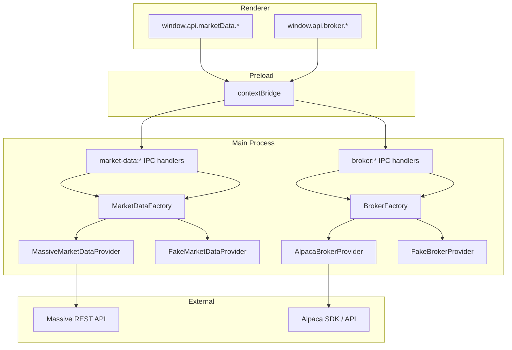

# US-39 / US-40 / US-31 Implementation: Provider Split + Massive + Alpaca Broker

## Purpose and Scope

This implementation splits the original single `MarketDataProvider` interface into two independent adapters:

- **`MarketDataProvider`** — market data (stock quotes, option snapshots, streaming) implemented by `MassiveMarketDataProvider`
- **`BrokerProvider`** — broker operations (account, activities, market status) implemented by `AlpacaBrokerProvider`

No IPC consumer imports both providers; routing is determined by the channel namespace (`market-data:*` vs `broker:*`).

## Key Files Changed

| File | Change |
|------|--------|
| `src/main/integrations/market-data-provider.ts` | `MarketDataProvider` interface — stock quotes, option snapshots, streaming |
| `src/main/integrations/broker-provider.ts` | `BrokerProvider` interface — account, activities, market status |
| `src/main/integrations/massive-market-data.ts` | Concrete `MassiveMarketDataProvider` backed by Massive REST API |
| `src/main/integrations/alpaca-broker.ts` | Concrete `AlpacaBrokerProvider` backed by Alpaca SDK |
| `src/main/integrations/fake-market-data.ts` | In-process fake for e2e — reads fixtures from env vars |
| `src/main/integrations/fake-broker.ts` | In-process fake for e2e — reads fixtures from env vars |
| `src/main/integrations/market-data-factory.ts` | Selects fake vs Massive via `FAKE_MARKET_DATA` env var |
| `src/main/integrations/broker-factory.ts` | Selects fake vs Alpaca via `FAKE_BROKER` env var |
| `src/main/ipc/market-data.ts` | IPC handlers for `market-data:*` channels |
| `src/main/ipc/broker.ts` | IPC handlers for `broker:*` channels |
| `src/main/index.ts` | Wires both factories and registers both handler sets |
| `src/preload/index.ts` | Exposes `window.api.marketData.*` and `window.api.broker.*` |
| `e2e/provider-split.spec.ts` | E2E test coverage for all ACs across US-31, US-39, US-40 |

## Architecture

## IPC Channels

| Channel | Direction | Handler file | Provider |
|---------|-----------|-------------|---------|
| `market-data:stock-quotes` | renderer → main | `ipc/market-data.ts` | `MarketDataProvider` |
| `market-data:option-snapshot` | renderer → main | `ipc/market-data.ts` | `MarketDataProvider` |
| `market-data:option-chain` | renderer → main | `ipc/market-data.ts` | `MarketDataProvider` |
| `market-data:set-tickers` | renderer → main | `ipc/market-data.ts` | `MarketDataProvider` (stream) |
| `market-data:tick` | main → renderer | `ipc/market-data.ts` | push from provider stream |
| `broker:account` | renderer → main | `ipc/broker.ts` | `BrokerProvider` |
| `broker:activities` | renderer → main | `ipc/broker.ts` | `BrokerProvider` |
| `broker:market-status` | renderer → main | `ipc/broker.ts` | `BrokerProvider` |

## Error Injection (E2E Testing)

Fake providers support error injection via env vars:

| Env var | Effect |
|---------|--------|
| `FAKE_MARKET_DATA_ERROR=<code>` | All `MarketDataProvider` methods throw `MarketDataError` with that code |
| `FAKE_BROKER_ERROR=<code>` | All `BrokerProvider` methods throw `BrokerError` with that code |

Valid error codes for `MarketDataErrorCode`: `auth_failed | network_error | rate_limited | streaming_unsupported | unknown`
Valid error codes for `BrokerErrorCode`: `auth_failed | network_error | rate_limited | environment_mismatch | unknown`

## E2E Test Strategy

Tests use `launchWithFakeProviders()` / `launchWithProviderError()` to boot the full Electron app with in-process fakes. No real API keys or network calls are needed.

The `relaunchWithError()` helper handles the close/cleanup/relaunch cycle for error-injection tests.
