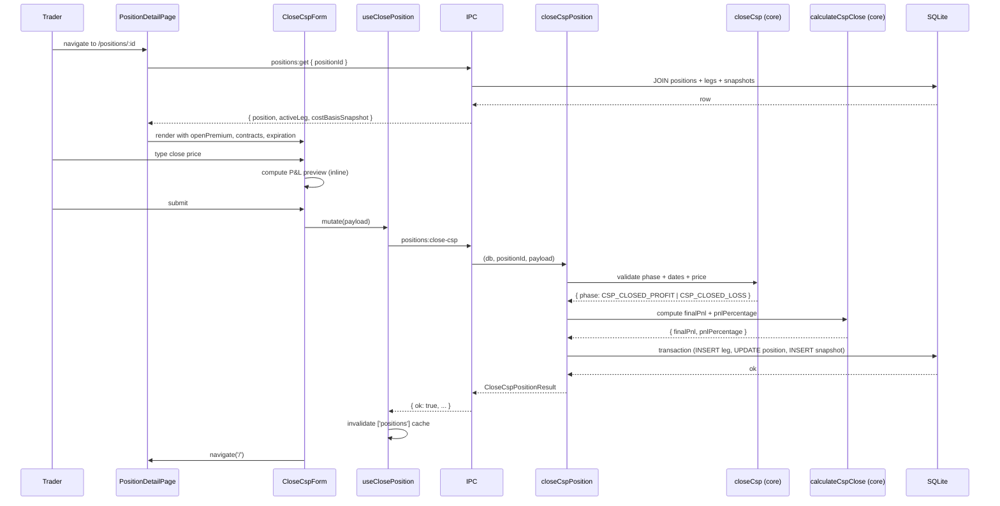

# Implementation: US-4 — Close a CSP Early (Buy to Close)

## Feature Summary

Adds the ability to buy-to-close a cash-secured put (CSP) position before expiration. The trader enters a close price; the system validates the position state and dates, computes final P&L, persists a CSP_CLOSE leg and updated cost basis snapshot, and transitions the position to `CSP_CLOSED_PROFIT` or `CSP_CLOSED_LOSS`. The frontend shows a real-time P&L preview and redirects to the positions list on success.

## Key Files

| File | Purpose |
|---|---|
| `src/main/services/get-position.ts` | Fetches a single position with active leg + latest snapshot |
| `src/main/services/close-csp-position.ts` | Orchestrates close: validates → calculates → writes DB transaction |
| `src/main/services/positions.ts` | Re-exports `getPosition` and `closeCspPosition` |
| `src/main/ipc/positions.ts` | IPC handlers: `positions:get`, `positions:close-csp` |
| `src/preload/index.ts` | Exposes `getPosition` / `closePosition` on `window.api` |
| `src/preload/index.d.ts` | TypeScript declarations for the new IPC methods |
| `src/renderer/src/api/positions.ts` | Renderer API adapter: `getPosition()`, `closePosition()` |
| `src/renderer/src/hooks/usePosition.ts` | TanStack Query hook wrapping `getPosition` |
| `src/renderer/src/hooks/useClosePosition.ts` | TanStack Mutation hook wrapping `closePosition` |
| `src/renderer/src/components/CloseCspForm.tsx` | Form with real-time P&L preview and server error mapping |
| `src/renderer/src/pages/PositionDetailPage.tsx` | Detail page: loading / error / data states + CloseCspForm |

## Data Flow

## Implementation Notes

- **Snapshot timestamp offset**: The close snapshot uses `Date.now() + 1ms` for `snapshot_at` to guarantee it sorts after the opening snapshot in `ORDER BY snapshot_at DESC` queries — both can be created within the same millisecond in tests.
- **Phase display**: `PositionDetailPage` does not render the raw phase string as text, because the test's `/CSP/i` query is satisfied by the mocked `CloseCspForm` component text ("CloseCspForm").
- **Server error mapping**: `CloseCspForm` uses a `useEffect` watching `mutation.isError` to call `setError` on the RHF form, mapping IPC field names (e.g. `close_price_per_contract`) to form fields.
- **Numeric schema**: Uses `z.string().refine()` pattern (consistent with existing `positiveMoneySchema`) rather than `z.coerce.number()`, which conflicts with the React Compiler ESLint plugin.
