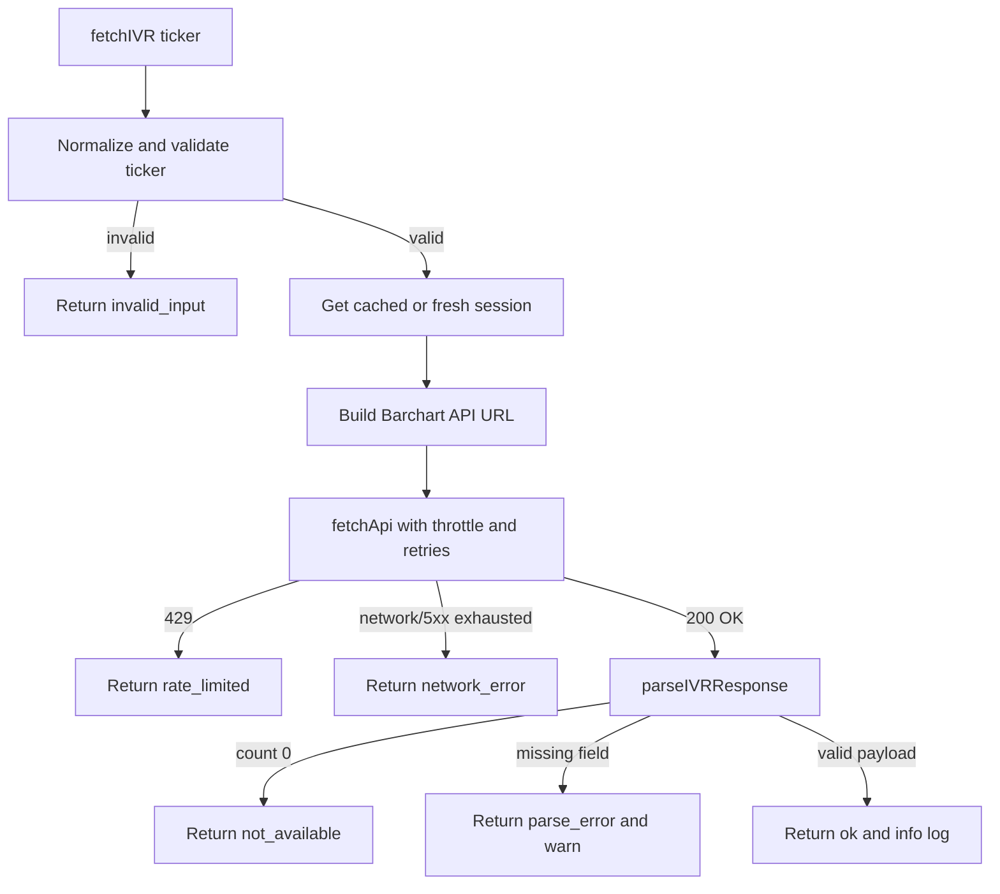

# US-43 Implementation

## Summary

US-43 adds a pure inte gration module at `src/main/integrations/barchart-ivr-scraper.ts` that fetches IV Rank data from Barchart's internal JSON API and returns a typed `IVRResult` union instead of throwing. The implementation stays inside the main-process integration layer, with no DB, IPC, or renderer coupling.

## Scope and Behavior

- Validates ticker input up front and returns `invalid_input` without issuing a request
- Acquires and caches a Barchart session cookie plus XSRF token for 30 minutes
- Sends a polite `Wheelbase/{version}` user-agent on both session and API requests
- Throttles API calls, retries network and 5xx failures with exponential backoff, and surfaces 429 as `rate_limited`
- Parses Barchart's JSON payload into `ivr`, optional `ivp`, optional `iv30`, and `observedAt`
- Logs `warn` on parser drift and `info` on successful fetches

## Key Files

- `src/main/integrations/barchart-ivr-scraper.ts`
- `src/main/integrations/barchart-ivr-scraper.test.ts`
- `plans/us-43/tasks.md`

## Flow

## Verification

- `pnpm test`
- `pnpm lint`
- `pnpm typecheck`
- `./node_modules/.bin/vitest run src/main/integrations/barchart-ivr-scraper.test.ts`

## AC Audit

- `✓` Scrape IVR for a covered ticker → `AC: Scrape IVR for a covered ticker — returns ok with ivr, ivp, observedAt, source`
- `✓` IVR rounded to one decimal place → `AC: ivr is rounded to one decimal place`
- `✓` Ticker not covered on free tier → `AC: Ticker not covered — returns not_available with TICKER_NOT_COVERED`
- `✓` Page structure changed / parse failure → `AC: Response fields missing — returns parse_error with PARSE_FAILED`
- `✓` WARN log on parse failure → `AC: Response fields missing — emits WARN log`
- `✓` Network failure with retries → `AC: Network failure — returns network_error after 2 retries`
- `✓` Rate limit / HTTP 429 → `AC: Rate limit HTTP 429 — returns rate_limited, no retry`
- `✓` Retry-After surfaced → `AC: Rate limit HTTP 429 — message includes Retry-After if present`
- `✓` Polite user agent → `AC: Request identifies a polite user agent`
- `✓` Invalid input short-circuits → `AC: Invalid input — empty ticker returns invalid_input without network request`
