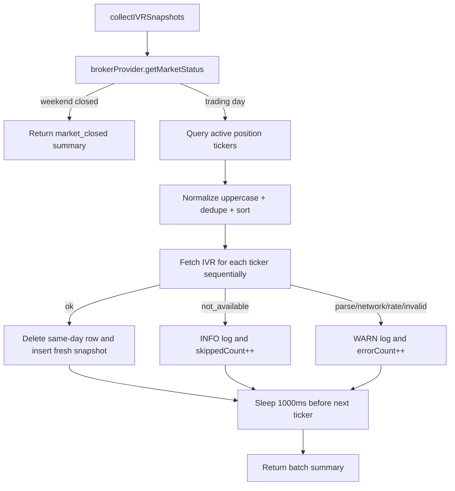

# US-44 Implementation

This document captures the verified US-44 implementation from `plans/us-44/plan.md`: the `ivr_snapshot` persistence layer, the scheduled/manual collector path, and the Settings-page trigger used to run the batch on demand.

## Scope Implemented

- Added `migrations/007_create_ivr_snapshot.sql` with the `ivr_snapshot` table, `(underlying, observed_at)` primary key, `source = 'barchart'` default, and the latest-first lookup index.
- Extended `src/main/db/migrate.test.ts` to assert the new table, applied migration record, and descending index definition.
- Added `src/main/services/ivr-collector.ts` with:
  - market-status guard before any network work
  - distinct active-underlying selection from `positions`
  - collector-owned 1 second spacing between requests
  - same-day delete-then-insert overwrite semantics
  - per-result handling for `ok`, `not_available`, and recoverable error statuses
- Added `src/main/services/ivr-collector.test.ts` covering the Area A acceptance slices.
- Registered the `ivr-collect` scheduler job and manual `ivr:collect-now` path so the same collector batch can run after close or on demand from the renderer.
- Updated `src/renderer/src/pages/SettingsPage.tsx` to expose a secondary `Refresh IVR now` action in the Market Data section with inline success, skipped, and error feedback.
- Extended `src/renderer/src/pages/SettingsPage.test.tsx` to cover the new Settings-page IVR trigger states.
- Added `e2e/ivr-collector.spec.ts` (one `it()` per acceptance criterion) plus `e2e/ivr-helpers.ts`, driving the real `ivr-collect` job end-to-end through the production manual-trigger IPC while keeping the suite fully offline.

## E2E Test Seam (Area E)

The production `ivr-collect` handler calls the live Barchart scraper, which would make e2e runs slow and non-deterministic. To exercise the real handler offline, the main process injects fake collector collaborators **only** when `WHEELBASE_FAKE_IVR` is present:

- `src/main/integrations/fake-ivr.ts` — `createFakeIvrCollaborators()` returns `{}` in production (real scraper unchanged) or `{ fetchIvr, clock }` when the env var is set. The fake `fetchIvr` returns per-ticker outcomes from a mutable in-memory map, and the clock returns `WHEELBASE_FAKE_NOW` (so the trading-day guard can be tested on any calendar day) with an instant `sleep` (skips the 1 s spacing).
- `src/main/ipc/test-ivr.ts` — dev-only `_test:ivr-set-outcomes` (program per-ticker results at runtime) and `_test:ivr-snapshots` (read persisted rows back), registered only under `NODE_ENV === 'test'`, mirroring the existing `_test:scheduler-*` channels.
- `src/main/index.ts` spreads the collaborators into the collector call; `src/preload/index.ts` exposes the two test channels.

Each test seeds active positions via `createPosition`, programs outcomes, triggers the batch through `window.api.ivr.collectNow()` (the same path the Settings button uses), and asserts on the persisted `ivr_snapshot` rows and the returned batch summary.

## Key Files

- `migrations/007_create_ivr_snapshot.sql`
- `src/main/db/migrate.test.ts`
- `src/main/services/ivr-collector.ts`
- `src/main/services/ivr-collector.test.ts`
- `src/main/index.ts`
- `src/main/ipc/ivr.ts`
- `src/preload/index.ts`
- `src/renderer/src/api/ivr.ts`
- `src/renderer/src/hooks/useCollectIvrNow.ts`
- `src/renderer/src/pages/SettingsPage.tsx`
- `src/renderer/src/pages/SettingsPage.test.tsx`
- `src/main/integrations/fake-ivr.ts`
- `src/main/ipc/test-ivr.ts`
- `e2e/ivr-collector.spec.ts`
- `e2e/ivr-helpers.ts`
- `plans/us-44/tasks.md`

## Flow

## Verification

- `pnpm test`
- `pnpm lint`
- `pnpm typecheck`
- `pnpm format`
- `pnpm test src/main/db/migrate.test.ts src/main/services/ivr-collector.test.ts`
- `pnpm test src/renderer/src/pages/SettingsPage.test.tsx`
- `pnpm exec vitest run --config vitest.e2e.config.ts e2e/ivr-collector.spec.ts` (8/8 passing)

## Notes

- The non-trading-day guard currently uses the broker `session` plus a UTC weekend check. This does **not** detect weekday market holidays (a manual trigger on a holiday would still scrape); tracked as a follow-up in `docs/epics/06-stories/followup-ivr-trading-day-calendar.md`.
- The `ivr:collect-now` IPC handler validates the scheduler's result with `CollectIvrNowBatchSchema`, so a job-handler error (which the scheduler swallows to `undefined`) becomes a proper `{ ok: false }` envelope instead of a silent `{ ok: true, batch: undefined }`.
- Scheduler wiring, typed IPC exposure, the Settings-page manual trigger, and full e2e coverage are all implemented — US-44 is complete.
