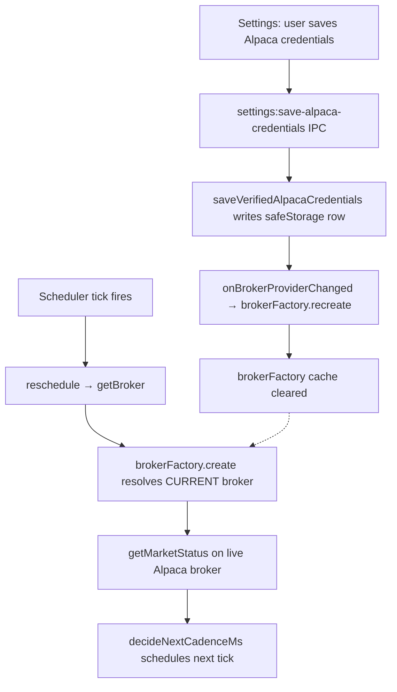

# US-48 Code-Review Remediation Implementation

This document captures the verified implementation completed from `plans/us-48/plan.md`.

## Scope Implemented

Three correctness fixes closing post-merge code-review gaps on `us-35` / `us-46`:

- The polling scheduler resolves its broker through a getter on every reschedule, so credential changes made via the Settings page propagate to the next tick without restarting the app.
- `stop()` cleans up its 5-second drain-fallback timeout in a `.finally` so it never leaks a live timer when the drain wins.
- The Settings page's Massive and Alpaca `Test connection` handlers wrap their `mutateAsync` calls in try/catch and surface IPC-level rejections through the existing error-tone message line.

## Key Files

- `src/main/services/polling-scheduler.ts` — `createPollingScheduler` now accepts `getBroker: () => BrokerProvider`; both `reschedule()` and `startAfterClose()` resolve the broker freshly each call. `stop()` clears the drain-fallback timeout in `.finally`.
- `src/main/services/scheduler-instance.ts` — passes the `getSafeBroker` function (not its result) into the scheduler.
- `src/renderer/src/pages/SettingsPage.tsx` — `handleMassiveTestConnection`, `handleTestConnection`, and `handleStoredConnectionTest` wrap awaits in try/catch and call `getApiErrorMessage(error)` on rejection.
- `src/main/services/polling-scheduler.test.ts` — adds 4 tests (getter freshness for interval and afterClose, drain-timeout cleanup, drain timeout fallback); updates existing call sites for new signature.
- `src/renderer/src/pages/SettingsPage.test.tsx` — adds 3 tests covering the three rejecting handlers.

## Verification

- `pnpm test` — 1304/1304 passing
- `pnpm lint` — clean
- `pnpm typecheck` — clean
- `pnpm format` — clean

## Flow Diagram

Before this change, `getBroker` was a single broker instance captured at module-import time. `D` updated the factory cache but never reached `H`; the closure kept the stale fallback. With the getter wired through, every reschedule pulls fresh from the factory.

## Notes

- Out of scope (reiterated): assignment banner query-key mismatch, Alpaca `since` watermark `date` vs `after`, `before-quit` Promise.all hang risk, `assignments:confirm/dismiss` envelope shape, timezone-naive assignment date, PAPER pill `!== 'live'`, derived-state-from-props in `AlpacaCredentialCard`, `start()` non-idempotency, `stop()` irreversibility, `runNow` ignoring `stopped`, `_test:*` preload surface, asymmetric environment-mismatch check, swallowed non-auth broker errors. Each is tracked in the original review JSON for future stories.
- The scheduler getter approach mirrors the existing `registerBrokerHandlers(() => brokerFactory.create())` pattern at `src/main/index.ts:143`. No new event bus or callback registry was introduced.
- The e2e suite (`pnpm test:e2e`) was not run as part of this implementation. The change surface is unit-test-tight (signature + try/catch); the existing e2e specs for US-35 / US-46 / US-37 do not depend on the changed behavior. Run before opening a PR if desired.
