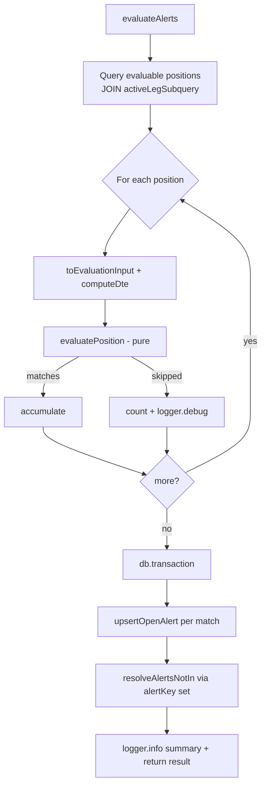

# US-50 Implementation — Alert Engine Scheduled Evaluation

> **Status:** Layers 1–3 complete (foundation + persistence service +
> evaluation orchestration). Layers 4–5 (scheduler registration, AC e2e tests)
> are not yet implemented.

## Purpose & Scope

US-50 builds the backbone of Epic 07: evaluate built-in alert rules against all
active CSP/CC positions on the existing US-46 polling cadence, maintaining a
deduplicated, restart-safe alert set.

**Layer 1 (this milestone)** delivers the three independent foundation pieces:

1. A shared, timezone-stable DTE calculation.
2. The `alerts` persistence table (schema + indexes).
3. The pure rule-evaluation engine.

## Layer 1 — What was built

### 1. Shared DTE helper — `src/main/core/dte.ts`

`computeDte(expiration: string | null, now = new Date()): number | null` returns
calendar days to expiration via date-fns `differenceInCalendarDays(parseISO(...))`,
or `null` when expiration is absent. It is a pure core module (no DB/broker
imports). `src/main/services/list-positions.ts` now imports it instead of carrying
a private copy, removing the duplicated `Date.UTC` math.

### 2. `alerts` table — `migrations/009_create_alerts.sql`

Stores one row per fired (and historical) alert. Key invariants:

- `idx_alerts_open_unique` — **partial** unique index on `(position_id, rule_code)
WHERE status = 'open'`: at most one open alert per position+rule, while resolved
  / dismissed history for the same pair is retained.
- `idx_alerts_status_urgency` — read path for the future open management queue
  (US-51).
- Rows are never deleted; resolution / dismissal are status changes only.

### 3. Pure alert engine — `src/main/core/alerts.ts`

`evaluatePosition(input): PositionEvaluation` returns `{ matches, skipped }` for a
single position. Rules live in an ordered `RULES` registry so later stories
(US-54/55/56/62) append without editing the evaluation loop:

| Rule                  | Urgency | Condition                                      | Summary                                          |
| --------------------- | ------- | ---------------------------------------------- | ------------------------------------------------ |
| `EXPIRATION_IMMINENT` | high    | `dte <= 5`                                     | `Expires in {dte} days at ${strike} strike`      |
| `MANAGEMENT_WINDOW`   | medium  | `6 <= dte <= managementWindowDte` (default 21) | `{dte} DTE remaining — review for roll or close` |

- Ranges are mutually exclusive, so EXPIRATION_IMMINENT naturally takes
  precedence over MANAGEMENT_WINDOW (no ordering-dependent logic).
- `dte === null` → both DTE-dependent rules go to `skipped` with
  `reason: 'missing_dte'`; no matches.
- Strike is formatted to 2dp via `decimal.js`.

## Evaluation flow (Layer 1 building blocks)

```mermaid
flowchart TD
  A[Active CSP/CC position] -->|leg.expiration| B[computeDte<br/>core/dte.ts]
  B -->|dte: number \| null| C[evaluatePosition<br/>core/alerts.ts]
  C --> D{For each rule in RULES}
  D -->|requiresDte && dte === null| E[skipped:<br/>missing_dte]
  D -->|test passes| F[match:<br/>ruleCode, urgency, summary, quickAction]
  D -->|no match| G[ignored]
  F -.->|Layer 2: persisted to| H[(alerts table<br/>migration 009)]
  E -.->|Layer 3: logged at DEBUG| I[evaluate job summary]
```

> Dotted edges (persistence + orchestration) land in Layers 2–4 and are not yet
> wired.

## Key files

| File                                  | Role                                  |
| ------------------------------------- | ------------------------------------- |
| `src/main/core/dte.ts`                | Shared pure DTE calculation (new)     |
| `src/main/core/alerts.ts`             | Pure rule engine + engine types (new) |
| `migrations/009_create_alerts.sql`    | `alerts` table + indexes (new)        |
| `src/main/services/list-positions.ts` | Now consumes shared `computeDte`      |

## Layer 2 — Persistence service (`src/main/services/alerts.ts`)

Three primitives the orchestrator (Layer 3) will compose, plus `AlertRecord` /
`EvaluateAlertsResult` types in `schemas.ts`:

- `upsertOpenAlert(db, match, positionId, now)` — inserts a new `open` alert, or
  updates the existing open one **in place**: `triggered_at` is preserved while
  `last_evaluated_at`, `summary`, `urgency`, and `quick_action` are refreshed.
  Returns `'inserted' | 'updated'` so the job can count created vs updated.
- `resolveAlertsNotIn(db, matchedKeys, now)` — marks every open alert whose
  `(positionId, ruleCode)` key is **absent** from `matchedKeys` as `resolved`
  (sets `resolved_at`); matched and already-resolved rows are untouched. Returns
  the resolved count.
- `listOpenAlerts(db)` — returns only `open` rows mapped to camelCase
  `AlertRecord`, excluding resolved/dismissed.
- `alertKey(positionId, ruleCode)` — the single `${positionId}::${ruleCode}`
  identity builder, shared with the Layer 3 orchestrator.

## Layer 3 — Evaluation orchestration (`src/main/services/evaluate-alerts.ts`)

`evaluateAlerts({ db, now?, managementWindowDte?, logger? }): EvaluateAlertsResult`
is the service the scheduler handler (Layer 4) will call. It composes the Layer 1
engine and Layer 2 primitives into one restart-safe pass:

1. **Load** evaluable positions — `status = 'ACTIVE'`, `phase IN ('CSP_OPEN',
   'CC_OPEN')` — inner-`JOIN`ed to their active option leg via
   `activeLegSubquery()`. The inner join drops positions with no open option leg
   (e.g. `HOLDING_SHARES` without a covered call), satisfying AC-4 by selection.
2. **Compute** (pure): map each row to an `AlertEvaluationInput`
   (`toEvaluationInput` + `computeDte`) and run `evaluatePosition` inside a
   per-position `try/catch`. Matches are accumulated; each skipped rule is counted
   and logged at DEBUG (`{ positionId, ruleCode, reason }`) — AC-5.
3. **Persist** (single `db.transaction`): `upsertOpenAlert` per match (counting
   `inserted` vs `updated`), build the matched-key set via the shared `alertKey`,
   then `resolveAlertsNotIn` to resolve cleared conditions. One transaction means
   a compute error cannot leave partial rows.

Exports `ALERT_EVAL_JOB_NAME = 'alert-evaluation'` for Layer 4 registration.
Returns `{ createdCount, updatedCount, resolvedCount, skippedRuleCount }` and logs
a one-line INFO summary, mirroring `collectIVRSnapshots`.



## Remaining work (later layers)

- **Layer 4 (Area 6):** scheduler registration in `src/main/index.ts`
  (`ALERT_EVAL_JOB_NAME` on the US-46 interval cadence, not broker-gated).
- **Layer 5 (Area 7):** AC-driven integration tests.
