# US-51 — Management Queue Dashboard — Implementation

## Feature

Surfaces US-50's persisted open alerts as a prioritized **management queue** at the
top of the dashboard. A new enriched, sorted read path joins `alerts` to
`positions`, is exposed over a new `alerts:list` IPC channel and a TanStack Query
hook, and renders as a `SectionCard`-wrapped queue above the positions grid.

Each row shows the ticker, urgency pill, phase badge, the trigger summary (verbatim
from the alert), and a "Review position" action that navigates to the position
detail page. When no alerts are open, a calm empty state renders with no action
buttons.

US-51 added **no migrations and no engine work** — it is a read/IPC/UI slice over
the existing US-50 alert backend.

## Behaviour

- Queue items are ordered by urgency tier (`high` → `medium` → `low`), then by
  `triggered_at` ascending (oldest-outstanding first within a tier).
- Only `status = 'open'` alerts appear; resolved/dismissed are excluded.
- One row per open alert (no grouping by position in this slice).
- Empty result set drives the empty state — it is not an error.

## Key files changed

| Layer    | File                                                 | Change                                              |
| -------- | ---------------------------------------------------- | --------------------------------------------------- |
| Service  | `src/main/schemas.ts`                                | New `ManagementQueueItem` interface                 |
| Service  | `src/main/services/alerts.ts`                        | New `listManagementQueue(db)` + joined-row mapper   |
| IPC      | `src/main/ipc/alerts.ts`                             | New `registerAlertsHandlers`, channel `alerts:list` |
| IPC      | `src/main/index.ts`                                  | Wired `registerAlertsHandlers({ db })`              |
| Preload  | `src/preload/index.ts`                               | `api.alerts.list()` bridge                          |
| Preload  | `src/preload/index.d.ts`                             | `ManagementQueueItem` + `api.alerts.list` typing    |
| Renderer | `src/renderer/src/api/alerts.ts`                     | `listManagementQueue()` adapter                     |
| Renderer | `src/renderer/src/hooks/useManagementQueue.ts`       | TanStack Query hook (30s refetch)                   |
| Renderer | `src/renderer/src/components/UrgencyPill.tsx`        | HIGH/MED/LOW pill (`wb-*` tokens)                   |
| Renderer | `src/renderer/src/components/ManagementQueueRow.tsx` | Row: ticker, pill, phase badge, summary, action     |
| Renderer | `src/renderer/src/components/ManagementQueue.tsx`    | `SectionCard` queue + header + empty state          |
| Renderer | `src/renderer/src/pages/PositionsListPage.tsx`       | Mounts `<ManagementQueue />` above the grid         |
| E2E      | `e2e/management-queue.spec.ts`                       | One test per AC                                     |

## Data flow

```mermaid
flowchart LR
  A[alerts table] -- JOIN positions --> B[listManagementQueue]
  B -- ManagementQueueItem[] --> C["alerts:list IPC<br/>(handleIpcCall)"]
  C -- envelope --> D[preload api.alerts.list]
  D --> E["api/alerts.ts<br/>listManagementQueue()"]
  E --> F["useManagementQueue()<br/>TanStack Query"]
  F --> G[ManagementQueue]
  G --> H[ManagementQueueRow + UrgencyPill + PhaseBadge]
  H -- click Review position --> I["#/positions/:id"]
```

## AC coverage (E2E)

| AC scenario                                    | E2E test                                                                              |
| ---------------------------------------------- | ------------------------------------------------------------------------------------- |
| Queue above grid, ordered by urgency then time | `queue appears above the positions grid ordered by urgency then time`                 |
| Queue item shows key fields                    | `queue item shows ticker, phase badge, trigger summary, and a Review position action` |
| Quick action opens the position                | `quick action opens the related position detail page`                                 |
| Empty state, no buttons                        | `empty state renders when there are no open alerts`                                   |

## Notable deviation from the story AC

The story AC-1 lists three urgency tiers via the rules `EXPIRATION_IMMINENT`
(high), `STRIKE_PROXIMITY` (medium), and `PROFIT_TARGET` (low). **US-50 only
shipped two urgency-producing rules** — `EXPIRATION_IMMINENT` (high, DTE 0–5) and
`MANAGEMENT_WINDOW` (medium, DTE 6–21). No rule produces `low` urgency yet
(`PROFIT_TARGET`/`STRIKE_PROXIMITY` are future work).

The queue code itself fully supports `low` (ordering rank + blue `UrgencyPill`),
verified by unit tests. The E2E ordering test proves the real "urgency tier then
`triggered_at`" contract using one `high` alert followed by two `medium` alerts
created in separate evaluation runs (deterministic time tie-break), since `low`
cannot be produced by the shipped engine. When a `low`-urgency rule lands, the
E2E can be tightened to assert a true three-tier ordering with no other change to
US-51 code.
