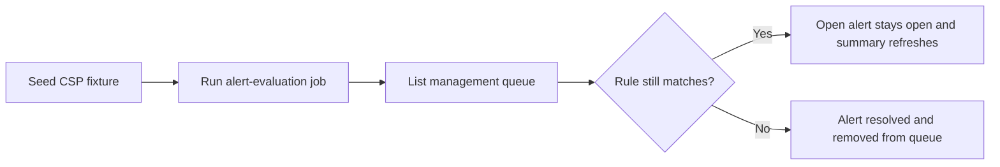

# US-52 Implementation

US-52 closes the loop on the expiration-imminent alert by adding explicit end-to-end coverage for all four acceptance criteria through the existing management queue surface. The production alert engine and service lifecycle already satisfied the story; the main implementation work here was wiring story-specific E2E coverage that drives the real Electron app, runs the real `alert-evaluation` scheduler job, and verifies both queue behavior and persisted alert lifecycle.

## What Changed

- Added `e2e/expiration-imminent-alert.spec.ts` with one `it()` per acceptance criterion
- Added `e2e/alert-helpers.ts` to share alert-evaluation helpers and queue fixture builders
- Updated `e2e/management-queue.spec.ts` to reuse the shared alert helpers instead of duplicating them

## Coverage

- 5 DTE creates a high-urgency `EXPIRATION_IMMINENT` queue row with the story summary and `Review position`
- Re-evaluation inside the final window keeps the same alert open and refreshes the summary from 5 DTE to 3 DTE
- 6 DTE does not show an expiration-imminent summary; it remains a `MANAGEMENT_WINDOW` alert
- Closing the CSP before the next evaluation removes the row from the open queue and resolves the persisted alert

## Flow

