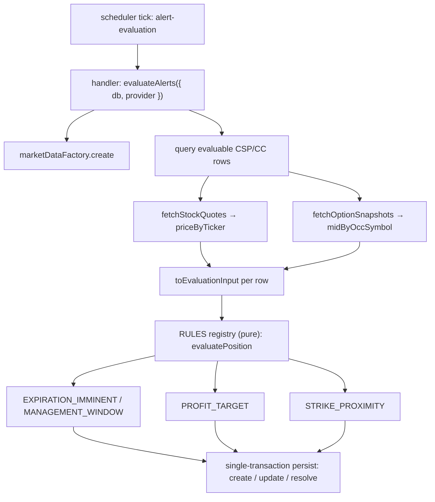

# US-53 / US-54 / US-55 — Classic Wheel alert rules (implementation)

## Purpose & scope

Adds three Classic Wheel management rules to the Epic 07 alert engine:

- **US-53 `MANAGEMENT_WINDOW`** — position inside the 21-DTE window (pre-existing rule).
- **US-54 `PROFIT_TARGET`** — captured percent of max profit reaches the target.
- **US-55 `STRIKE_PROXIMITY`** — CSP underlying within 1% of the strike.

US-54 and US-55 need live market data, so `evaluateAlerts` is async and pre-fetches
option mids and underlying prices at the service boundary before handing plain values to
the pure `RULES` registry in `core/alerts.ts`.

## Layers

| Layer | Area                                                                    | Files                                           | Status |
| ----- | ----------------------------------------------------------------------- | ----------------------------------------------- | ------ |
| 1     | Engine — new inputs, generalized `missingData` skip, two new predicates | `src/main/core/alerts.ts`                       | ✅     |
| 2     | Service — async pre-fetch, query enrichment, input mapping              | `src/main/services/evaluate-alerts.ts`          | ✅     |
| 3     | Scheduler wiring — handler passes `provider` and awaits                 | `src/main/index.ts`                             | ✅     |
| 4     | AC-driven e2e tests                                                     | `src/main/services/evaluate-alerts.e2e.test.ts` | ✅     |

## Layer 3 — scheduler wiring (this change)

The `alert-evaluation` scheduler job handler now resolves the market-data provider from the
shared `marketDataFactory` — the same factory the market-data IPC uses — and passes it into the
now-async `evaluateAlerts`:

```ts
handler: async () => evaluateAlerts({ db, provider: marketDataFactory.create() })
```

Cadence is unchanged: `{ kind: 'interval', marketOpenMs: 60_000, extendedHoursMs: 300_000, marketClosedMs: null }`.
The handler stays a thin delegate — no orchestration in `index.ts`.

## Evaluation flow



## Layer 4 — AC-driven e2e tests (this change)

`src/main/services/evaluate-alerts.e2e.test.ts` gains one test per acceptance scenario across
the three stories, each invoking `evaluateAlerts` the way the scheduler does (injected `now` +
stub `MarketDataProvider`) and asserting the persisted alert (rule code, urgency, exact summary):

| Story | Rule                | Scenarios | Coverage                                                                                                     |
| ----- | ------------------- | --------- | ------------------------------------------------------------------------------------------------------------ |
| US-53 | `MANAGEMENT_WINDOW` | 4         | fires @ 21 DTE; stays open @ 12 DTE (triggered_at preserved); silent @ 22 DTE; EI precedes @ 4 DTE           |
| US-54 | `PROFIT_TARGET`     | 5         | fires on CSP + CC at target; silent below target; skips + DEBUG log on missing mark; excludes HOLDING_SHARES |
| US-55 | `STRIKE_PROXIMITY`  | 4         | fires within 1% above and below strike; silent when safely away; not applied to CC_OPEN                      |

Shared fixtures: `seedShortOptionAtPremium` (entry premium / contract count), `seedAaplCsp`
(the standard AAPL $180 CSP used by six US-54/US-55 scenarios, returning its OCC symbol), and
`stubProvider({ midBySymbol, priceByTicker })` (resolves quotes/snapshots from maps; throws
`MarketDataError('not_found')` for absent symbols to exercise the missing-mark path).

## Notes

- Awaited fetches happen in the compute phase **before** `db.transaction`, preserving the US-50
  single-transaction write atomicity.
- Missing-data skips (`missing_option_mark`, `missing_underlying_price`) flow through the existing
  DEBUG `alert_rule_skipped` logging path.
