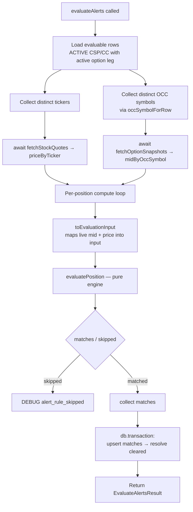

# US-53 / US-54 / US-55 — Layer 2 (Service) Implementation

Scope: **Layer 2 — Service** of `plans/us-53-54-55/plan.md`. Layers 1 (engine) is
already complete; Layers 3 (scheduler wiring) and 4 (AC-driven e2e) are not part
of this run.

## What changed

`evaluateAlerts` (`src/main/services/evaluate-alerts.ts`) became **async** so it
can pre-fetch live market data before running the pure rule engine. This is the
wiring that lets the Layer-1 `PROFIT_TARGET` (US-54) and `STRIKE_PROXIMITY`
(US-55) rules actually fire on real positions.

### Behaviour

- **Signature**: `evaluateAlerts(...) → Promise<EvaluateAlertsResult>`, now
  accepting an optional `provider: MarketDataProvider` (defaults to
  `marketDataFactory.create()`). The result shape is unchanged.
- **Query enrichment**: `EVALUABLE_QUERY` / `EvaluableRow` now also select
  `p.ticker`, `p.profit_target_percent`, `l.premium_per_contract`, and
  `l.contracts`.
- **Batched pre-fetch** (compute phase, before the persist transaction):
  - distinct tickers → `fetchStockQuotes(provider, tickers)` → `priceByTicker`
  - distinct OCC symbols (via `occSymbolForRow`) →
    `fetchOptionSnapshots(provider, symbols)` → `midByOccSymbol`
- **Input mapping**: `toEvaluationInput` populates the new engine fields —
  `currentUnderlyingPrice`, `currentOptionMid`, `entryPremiumPerContract`,
  `contracts`, `profitTargetPercentOverride`. A symbol with no snapshot yields
  `currentOptionMid = null`, which the engine treats as a `missing_option_mark`
  skip (logged at DEBUG through the existing `skipped.forEach` path).
- **Atomicity preserved**: both awaits happen in the compute phase, so the
  single `db.transaction` persist (upsert matches → resolve cleared) is untouched
  from US-50.

### Key files

| File                                            | Change                                                                                                             |
| ----------------------------------------------- | ------------------------------------------------------------------------------------------------------------------ |
| `src/main/services/evaluate-alerts.ts`          | async signature, provider injection, query + input-mapping enrichment, `occSymbolForRow` helper, batched pre-fetch |
| `src/main/services/evaluate-alerts.test.ts`     | new market-data enrichment tests + US-50 tests migrated to `async`/`await` with an inert provider                  |
| `src/main/services/evaluate-alerts.e2e.test.ts` | US-50 acceptance tests migrated to `async`/`await` with an inert provider                                          |

## Flow

## Verification

`pnpm test` (1465 passed), `pnpm lint`, and `pnpm typecheck` all clean.

The Layer-2 service tests cover: distinct-ticker quote fetch, OCC snapshot fetch,
live mid/price mapping producing `PROFIT_TARGET`/`STRIKE_PROXIMITY`, the
`missing_option_mark` DEBUG skip, resolution on reversal, and the `Promise`
return type. All prior US-50 DTE scenarios remain green.

## Remaining work (not in this run)

- **Layer 3** — `src/main/index.ts` handler must resolve the provider and
  `await evaluateAlerts({ db, provider })`.
- **Layer 4** — AC-driven e2e tests (`evaluate-alerts.e2e.test.ts`), one per AC
  across US-53/54/55; consolidate the duplicated `inertProvider`/quote-builder
  test helpers there.
