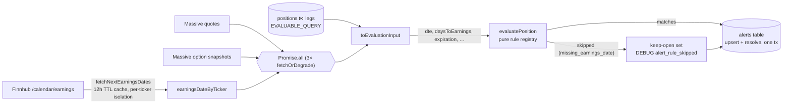

# US-56 — Earnings-Proximity Alert: Implementation

## Feature

Adds the `EARNINGS_PROXIMITY` rule to the pure alert registry and the earnings-date feed it depends on. The rule fires a **medium-urgency** alert (quick action `Review position`, summary `Earnings {today|in 1 day|in {N} days} before your {YYYY-MM-DD} expiration`) when a position's next earnings event is:

- within **10 calendar days** of now (inclusive, `daysToEarnings >= 0`), **and**
- on or before the active leg's expiration (`daysToEarnings <= dte`).

It applies to any evaluable position (`CSP_OPEN` or `CC_OPEN`) and co-fires independently of the DTE/profit/proximity rules. Missing earnings data skips the rule (`missing_earnings_date`, DEBUG `alert_rule_skipped`) without failing the run; missing DTE skips with `missing_dte`; a null expiration skips with `missing_expiration` (the summary interpolates it). A malformed earnings date flattens to null the same way — `computeDte` returns null, never NaN, so bad feed data skips instead of silently resolving an open alert. A lookback event (negative `daysToEarnings`) evaluates to false, so a stale open alert resolves on the first post-earnings run.

No schema, IPC, or renderer change — `rule_code` is plain TEXT and the US-51 management queue displays the new code transparently.

## Earnings feed (Finnhub, free tier)

`fetchNextEarningsDates(tickers, { now?, logger? })` in `src/main/integrations/finnhub-earnings.ts`:

- One `GET https://finnhub.io/api/v1/calendar/earnings` per ticker, window `now − 7d … now + 30d` (the lookback exists purely so post-earnings runs see a negative day count and resolve the alert).
- Selection: rows without a valid `YYYY-MM-DD` date string are dropped, then earliest event with `date >= today`, else the most recent past event.
- Module-level 12 h TTL cache (negative "no event" results cached too; failures cached 5 min via `EARNINGS_FAILURE_TTL_MS` so a rate-limited ticker backs off), `clearEarningsCache()` exported for tests.
- Per-ticker failure isolation: WARN `earnings_fetch_failed` with code `auth_failed` / `rate_limited` / `network_error` / `unknown`; ticker omitted, never throws.
- Missing API key (`loadFinnhubApiKey()` in `finnhub-credentials.ts`: `MAIN_VITE_FINNHUB_API_KEY` → `FINNHUB_API_KEY` → `''`) short-circuits to `{}` with one WARN `earnings_fetch_no_api_key` per process.

## Service wiring

`evaluateAlerts` gains an injectable `fetchEarnings` (default: the real Finnhub batch) run as a **third concurrent `fetchOrDegrade`** (WARN `alert_evaluation_earnings_unavailable`, degrade to `{}`) alongside stock quotes and option snapshots. `toEvaluationInput` maps `daysToEarnings: computeDte(earningsDateByTicker[ticker] ?? null, now)` and passes `expiration` through for the summary.

## Key files

| File                                              | Change                                                                                                                                                                                  |
| ------------------------------------------------- | --------------------------------------------------------------------------------------------------------------------------------------------------------------------------------------- |
| `src/main/core/alerts.ts`                         | `EARNINGS_PROXIMITY` in `RuleCode`; `daysToEarnings`/`expiration` on `AlertEvaluationInput`; `EarningsProximityInput` slice; summary helper; registry entry (reuses `missingDteReason`) |
| `src/main/integrations/finnhub-earnings.ts`       | New — batch fetcher, event selection, TTL cache, failure isolation                                                                                                                      |
| `src/main/integrations/finnhub-credentials.ts`    | New — `loadFinnhubApiKey()` (mirrors `massive-credentials.ts`)                                                                                                                          |
| `src/main/services/evaluate-alerts.ts`            | Injectable `fetchEarnings` seam (exported `FetchEarnings` type), third boundary fetch, input mapping                                                                                    |
| `src/main/logger.ts`                              | Shared `LoggerLike` type (hoisted from duplicate local definitions)                                                                                                                     |
| `src/main/services/evaluate-alerts-test-utils.ts` | `stubEarnings(map)` / `inertEarnings()` fixtures                                                                                                                                        |
| `src/main/env.d.ts`                               | `MAIN_VITE_FINNHUB_API_KEY` on `ImportMetaEnv`                                                                                                                                          |

## Test coverage

- `src/main/core/alerts.test.ts` — 14 rule-level tests (AC values, boundaries, skips incl. `missing_expiration`, singular/today copy, co-fire, phase-agnostic).
- `src/main/integrations/finnhub-earnings.test.ts` — 20 tests (URL shape, selection incl. invalid-row filtering, cache/TTL incl. failure TTL, isolation, HTTP mapping, missing key).
- `src/main/services/evaluate-alerts.test.ts` — 7 wiring tests (row + summary, skip path, throw degrade, keep-open on gap, malformed-date skip, resolve on passed earnings, single deduped batch call with forwarded logger). Both service test files `vi.mock` the Finnhub module so un-injected calls can never reach the network.
- `src/main/services/evaluate-alerts.e2e.test.ts` — `describe('US-56 acceptance — EARNINGS_PROXIMITY')`, one named `it()` per AC.

## Manual verification (optional)

Set `MAIN_VITE_FINNHUB_API_KEY` in `.env` (free key from finnhub.io) and run `pnpm dev`; without a key the app runs normally and the rule skips (one WARN).
