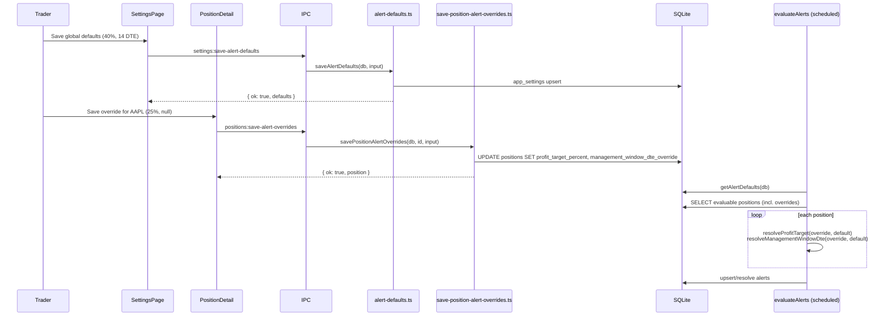

# US-57 & US-58 Implementation: Global Alert Thresholds + Per-Position Overrides

## Purpose & Scope

Traders previously had two alert thresholds hardcoded into the alert engine: a 50%
profit-target and a 21-day management window. This feature makes both configurable:

- **US-57 (global defaults):** a Settings-page section lets the trader edit the two
  defaults, persisted in `app_settings` and read by the scheduled `evaluateAlerts`
  job on every tick.
- **US-58 (per-position overrides):** each position can override either threshold
  independently, stored on `positions.profit_target_percent` (already existed from
  US-33) and the new `positions.management_window_dte_override` column. An override
  wins over the global default; clearing it (`null`) reverts the position to the
  global default.

Both stories share one resolution rule — implemented as two pure functions,
`resolveProfitTarget` and `resolveManagementWindowDte` — used identically by the
alert engine, the positions-list `TARGET` badge, and both new forms, so the
resolved values never drift between what the engine evaluates and what the UI shows.

## Behavior

- **Precedence:** per-position override (non-null) wins; otherwise the saved
  global default applies; otherwise the hardcoded constant (`DEFAULT_PROFIT_TARGET_PERCENT`
  = 50, `DEFAULT_MANAGEMENT_WINDOW_DTE` = 21) applies as the last resort.
- **Validation (identical on both stories):** profit target `1–99`, management
  window `6–45` DTE — enforced server-side (`ValidationError`, no partial writes)
  and client-side (Zod, disables Save on invalid input).
- **Isolation:** saving global defaults never touches `positions` rows; saving a
  per-position override never touches `app_settings`.
- **Scheduler wiring:** `src/main/index.ts`'s alert-evaluation job reads
  `getAlertDefaults(db)` fresh on every tick before calling `evaluateAlerts`, so a
  saved default takes effect on the next scheduled run without a restart.

## Key Files

| Layer     | File                                                               | Role                                                                                 |
| --------- | ------------------------------------------------------------------ | ------------------------------------------------------------------------------------ |
| Migration | `migrations/010_add_management_window_dte_override.sql`            | Adds the nullable override column                                                    |
| Core      | `src/main/core/profit-target.ts`                                   | `resolveProfitTarget(override, default)`                                             |
| Core      | `src/main/core/alerts.ts`                                          | `resolveManagementWindowDte`, `ResolvedThresholds`, rule bodies read resolved values |
| Service   | `src/main/services/alert-defaults.ts`                              | `getAlertDefaults`/`saveAlertDefaults` (US-57 backend)                               |
| Service   | `src/main/services/save-position-alert-overrides.ts`               | `savePositionAlertOverrides` (US-58 backend)                                         |
| Service   | `src/main/services/evaluate-alerts.ts`                             | Threads resolved defaults + per-row override into each evaluation                    |
| Service   | `src/main/index.ts`                                                | Scheduler reads `getAlertDefaults(db)` every tick                                    |
| IPC       | `src/main/ipc/settings.ts`, `src/main/ipc/positions.ts`            | `settings:get/save-alert-defaults`, `positions:save-alert-overrides`                 |
| Renderer  | `src/renderer/src/pages/SettingsPage.tsx` (`AlertDefaultsSection`) | Global defaults form                                                                 |
| Renderer  | `src/renderer/src/components/PositionAlertOverridesForm.tsx`       | Per-position override form + Effective Alert Logic panel                             |
| Renderer  | `src/renderer/src/components/PositionCard.tsx`                     | `TARGET` badge reads the resolved default, not the hardcoded constant                |
| Tests     | `src/main/services/evaluate-alerts.e2e.test.ts`                    | `US-57 acceptance` / `US-58 acceptance` — one test per Gherkin scenario              |

## Diagram

## Notes

All eight Gherkin scenarios (four per story) are covered one-to-one by named
`it()` blocks in `evaluate-alerts.e2e.test.ts`'s `US-57 acceptance` / `US-58
acceptance` describes — see the AC Audit table in `plans/us-57-58/plan.md`.
