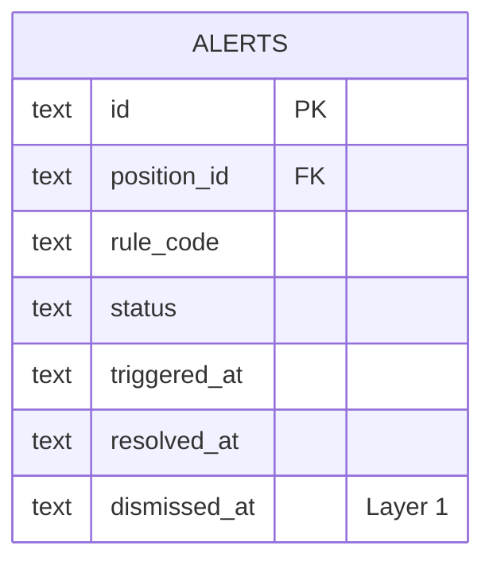
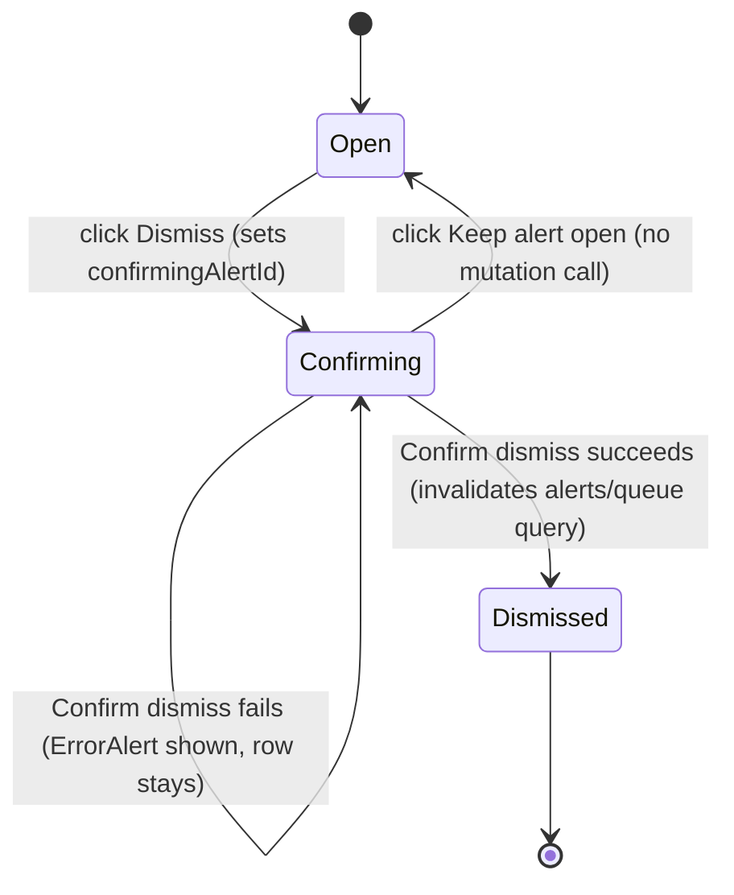

# US-59 Implementation — Dismiss an Alert with a Record of the Dismissal

> **Status:** Complete. All 6 layers (schema, service layer, evaluation
> wiring, IPC, preload/API adapter, renderer UI, e2e) implemented and
> verified end to end against every acceptance scenario.

## Purpose & Scope

US-59 lets a trader dismiss an open alert from the management queue. The
dismissal is recorded (not deleted), hides the alert from the open queue while
the underlying condition is unchanged, and lets a fresh alert re-fire if the
condition clears and later returns.

## Layer 1 — Schema

- `migrations/011_add_alerts_dismissal.sql`: `alerts.dismissed_at TEXT`
  (nullable) + `idx_alerts_dismissed_unique`, a partial unique index on
  `(position_id, rule_code) WHERE status = 'dismissed'` — at most one
  _currently_ dismissed alert per position+rule, mirroring
  `idx_alerts_open_unique`'s shape for `status = 'open'`.
- `AlertRecord.dismissedAt: string | null` in `src/main/schemas.ts`, next to
  `resolvedAt`; `DismissAlertPayloadSchema = z.object({ alertId: z.string().min(1) })`.
- `AlertRow`/`mapAlertRow` in `src/main/services/alerts.ts` gain
  `dismissed_at`/`dismissedAt`.

## Layer 2 — Service layer

`src/main/services/alerts.ts`:

- `AlertError` (`NOT_FOUND` | `NOT_OPEN`), mirroring `PendingAssignmentError`.
- `dismissAlert(db, alertId, now)`: transitions an `open` alert to
  `dismissed` with a `dismissed_at` timestamp; throws `NOT_FOUND` if the
  alert doesn't exist, `NOT_OPEN` (`Only open alerts can be dismissed`) if
  it's already `resolved` or `dismissed`.
- `upsertOpenAlert`: gained a dismissed-row check ahead of the existing open
  lookup — a still-true condition with a currently-dismissed row for the same
  `(position_id, rule_code)` returns `'suppressed'` and leaves the row
  untouched, instead of silently re-opening it.
- `clearStaleDismissals(db, keepOpenKeys, now)`: retires a dismissed row to
  `resolved` once its key drops out of `keepOpenKeys` — the same "genuinely
  evaluated and didn't match" signal `resolveAlertsNotIn` uses for open rows —
  freeing the key for a fresh, later `triggered_at` if the condition returns.

## Layer 3 — Evaluation job wiring + IPC

- `evaluateAlerts` (`src/main/services/evaluate-alerts.ts`) calls
  `clearStaleDismissals(db, keepOpenKeys, nowIso)` right after
  `resolveAlertsNotIn` inside the same persist transaction, using the same
  `keepOpenKeys` set — no separate computation. `'suppressed'` upsert outcomes
  are excluded from `updatedCount`.
- `ipcMain.handle('alerts:dismiss', ...)` (`src/main/ipc/alerts.ts`):
  Zod-parses `{ alertId }`, calls `dismissAlert`, returns `{ alert }` via
  `handleIpcCall`. `handleIpcCall` (`src/main/ipc/utils.ts`) gained an
  `AlertError` branch mapping `NOT_FOUND`/`NOT_OPEN` to the standard
  `{ ok: false, code, errors }` envelope, mirroring `PendingAssignmentError`.

## Layer 4 — Preload + renderer API adapter

- `window.api.alerts.dismiss` (`src/preload/index.ts`) invokes
  `alerts:dismiss`.
- `dismissAlert(alertId): Promise<AlertRecord>` (`src/renderer/src/api/alerts.ts`)
  unwraps the envelope, throwing a mapped `ApiError` via the now-shared
  `throwMappedIpcErrors` (promoted from `api/positions.ts` into `api/error.ts`
  during that layer's refactor).

## Layer 5 — Renderer UI

Two stacked panels per the mockup (`mockups/us-59-dismiss-alert.mdx`) — not a
modal:

- `ManagementQueueRow.tsx`: a `Dismiss` button (danger-styled with `wb-red`
  tokens, distinct from the gold `quickAction` button) sits next to the
  existing action. Clicking it only calls `onDismissClick(item.alertId)` — no
  direct mutation from the row.
- `ManagementQueue.tsx`: owns `confirmingAlertId` state and the
  `useDismissAlert()` mutation; renders `DismissConfirmPanel` below the queue
  list when a row is in confirm state; clears the mutation's stale error via
  `mutation.reset()` whenever a new row enters confirm state.
- `DismissConfirmPanel.tsx` (new): generic condition-clears copy
  (`{ticker} will disappear from the open queue...`), `Confirm dismiss`
  (solid `wb-red`) / `Keep alert open` (ghost) buttons, and an inline
  `ErrorAlert` for the rejection case (e.g. a race where the alert resolved
  before the trader confirmed).
- `useDismissAlert.ts` (new): `useMutation` wrapping `dismissAlert`;
  `onSuccess` invalidates `['alerts', 'queue']`, the exact key
  `useManagementQueue` reads, so the row disappears once the mutation
  succeeds — no dismissed-state UI needed, the existing empty state takes
  over unchanged.

## Layer 6 — E2E tests

`e2e/dismiss-alert.spec.ts` — one test per Gherkin scenario in
`docs/epics/07-stories/US-59-dismiss-alert.md`, driving the real Electron app
end to end (real evaluation job, real SQLite, real renderer):

- **Trader dismisses an alert from the queue** — click `Dismiss` → `Confirm
dismiss`; asserts the row disappears from the queue and the DB row is
  `status: 'dismissed'` with a non-null `dismissed_at`.
- **Dismissed alert does not immediately reappear while the condition is
  unchanged** — re-runs evaluation with the leg untouched; asserts no
  duplicate row and the dismissed row stays dismissed.
- **Dismissed alert can reappear after the condition clears and later
  returns** — moves the leg to 30 DTE (dismissed row → `resolved`), then back
  to 14 DTE; asserts a new open row with a strictly later `triggered_at`.
- **Dismissing an already resolved alert is rejected** — closes the leg to
  resolve the alert, then calls `window.api.alerts.dismiss` directly; asserts
  the `NOT_OPEN` envelope.

All 4 tests passed immediately (no new production code needed — Layers 1–5
already satisfied every AC). `e2e/alert-helpers.ts` gained `dismissed_at` on
`AlertRow`, a `dismissAlertViaQueue(page, ticker)` UI-driving helper, and a
`seedAndResolveAlert(page, dbPath, fixture)` arrange-helper shared with
`expiration-imminent-alert.spec.ts` to remove duplicated seed→evaluate→close
setup between the two spec files.

## Data model

## Renderer dismiss flow (Layer 5)

## Key files

| File                                                  | Role                                                                                    |
| ----------------------------------------------------- | --------------------------------------------------------------------------------------- |
| `migrations/011_add_alerts_dismissal.sql`             | `dismissed_at` column + partial unique index                                            |
| `src/main/schemas.ts`                                 | `AlertRecord.dismissedAt`, `DismissAlertPayloadSchema`                                  |
| `src/main/services/alerts.ts`                         | `AlertError`, `dismissAlert`, dismissal-aware `upsertOpenAlert`, `clearStaleDismissals` |
| `src/main/services/evaluate-alerts.ts`                | Wires `clearStaleDismissals` into the persist transaction                               |
| `src/main/ipc/alerts.ts`, `src/main/ipc/utils.ts`     | `alerts:dismiss` handler + `AlertError` envelope mapping                                |
| `src/preload/index.ts`                                | `window.api.alerts.dismiss`                                                             |
| `src/renderer/src/api/alerts.ts`, `api/error.ts`      | `dismissAlert` adapter, shared `throwMappedIpcErrors`                                   |
| `src/renderer/src/components/ManagementQueueRow.tsx`  | `Dismiss` button, `onDismissClick` prop                                                 |
| `src/renderer/src/components/ManagementQueue.tsx`     | Confirm-state wiring, mutation ownership                                                |
| `src/renderer/src/components/DismissConfirmPanel.tsx` | Confirm/cancel panel (new)                                                              |
| `src/renderer/src/hooks/useDismissAlert.ts`           | Mutation hook, invalidates the management queue query (new)                             |
| `e2e/dismiss-alert.spec.ts`                           | One e2e test per AC scenario (new)                                                      |
| `e2e/alert-helpers.ts`                                | `dismissed_at` on `AlertRow`; `dismissAlertViaQueue`, `seedAndResolveAlert` helpers     |
