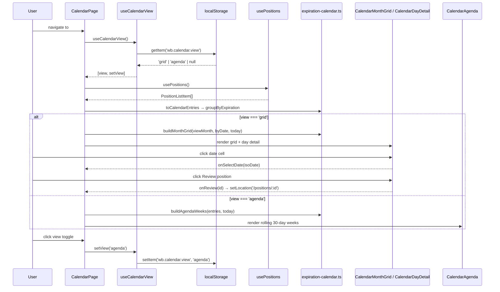

# Layer 4 Implementation: US-60 — CalendarPage + Persisted View + Routing/Nav Wiring

## Feature Scope

Wires the previously-built calendar pieces (Layers 1–3) into a reachable page:

- **`useCalendarView`** — persists the selected layout (`'grid' | 'agenda'`) in `localStorage`, defaulting to `'grid'` and falling back to `'grid'` on any invalid stored value.
- **`CalendarPage`** — composes `PageLayout`/`PageHeader`, the view toggle, `MarketStatusPill`, a view-dependent sub-header (month nav + legend for grid; a static "Next 30 Days" horizon label + legend for agenda), and either `CalendarMonthGrid` + `CalendarDayDetail` (grid) or `CalendarAgenda` (agenda). Derives everything client-side from the existing `usePositions()` cache — no new IPC.
- **Routing/nav** — adds the `/calendar` route, sidebar nav entry, and header title case in `App.tsx`.

## Key Files Changed

| File                                             | Role                                                                 |
| ------------------------------------------------ | -------------------------------------------------------------------- |
| `src/renderer/src/hooks/useCalendarView.ts`      | Persisted view-preference hook (`localStorage['wb.calendar.view']`)  |
| `src/renderer/src/hooks/useCalendarView.test.ts` | 4 unit tests                                                         |
| `src/renderer/src/pages/CalendarPage.tsx`        | Page: state + derivation + layout switch                             |
| `src/renderer/src/pages/CalendarPage.test.tsx`   | 7 component tests                                                    |
| `src/renderer/src/App.tsx`                       | Added `/calendar` route, sidebar `NavItem`, `ShellHeader` title case |

## Architecture

## Design Decisions

- **No new IPC/query key.** `CalendarPage` reuses `usePositions()` directly — the calendar and positions list share one TanStack Query cache entry.
- **`today` frozen with `useMemo(() => new Date(), [])`** — a bare `new Date()` would change identity every render and defeat the `grid`/`weeks` memoization; freezing it once per mount keeps `viewMonth`/`entries` as the only real recompute triggers, with no `eslint-disable` needed.
- **`emptyMonth` derived from the built grid**, not a second date-range scan — the grid's cells already carry `entries`, so checking `grid.flat().every(cell => cell.entries.length === 0)` avoids a duplicate filter over the raw data.
- **Agenda hides `CalendarMonthNav` and ignores `viewMonth`** — the agenda is a rolling 30-day horizon anchored at "today", not month-scoped, per the research ADR; switching views never mutates `viewMonth`.
- **`MarketStatusPill` wiring mirrors `PositionsListPage`** (`useSettingsStatus()` → `hasBroker` → `useMarketStatus(hasBroker)` → `deriveMarketStatusDisplay()`), with `stale` hardcoded `false` since this page has no stock-quote staleness signal to plumb through.
- **Persistence isolated in `useCalendarView`** — `CalendarPage` never touches `localStorage` directly, keeping the ADR's "one place for read/write" property testable in isolation.
