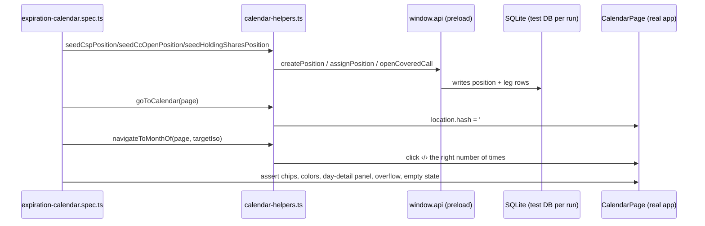

# Layer 5 Implementation: US-60 — E2E Tests

## Feature Scope

One Playwright/`_electron` end-to-end test per acceptance-criterion scenario in `docs/epics/07-stories/US-60-expiration-calendar-view.md`, confirming Layers 1–4 satisfy every AC in the fully packaged app — no production code was needed for this layer.

- **AC-1** — `'calendar shows expirations on the correct dates with phase colors'`
- **AC-2** — `"selecting a populated date shows that day's positions in a side panel"`
- **AC-3** — `'overflow indicator appears when a date has more expirations than fit'`
- **AC-4** — `'empty month state renders cleanly'`

## Key Files Changed

| File                              | Role                                                                                                                                                                         |
| --------------------------------- | ---------------------------------------------------------------------------------------------------------------------------------------------------------------------------- |
| `e2e/expiration-calendar.spec.ts` | One test per AC scenario                                                                                                                                                     |
| `e2e/calendar-helpers.ts`         | Shared IPC-based seeding (`seedCspPosition`, `seedCcOpenPosition`, `seedHoldingSharesPosition`) + navigation (`goToCalendar`, `navigateToMonthOf`) + `hexToRgb`/`futureDate` |

## Architecture

## Design Decisions

- **Seeding bypasses the UI entirely** via `window.api.createPosition`/`assignPosition`/`openCoveredCall`, matching the pattern already established in `e2e/option-pnl.spec.ts` — the calendar is pure-renderer, so these tests only need real rows in the DB, not a walkthrough of every entry form.
- **Dates are relative offsets** (`futureDate(20)`, etc.), never hardcoded calendar dates, so the suite doesn't rot. `navigateToMonthOf` computes the month delta with `date-fns` `differenceInCalendarMonths` and clicks the month-nav buttons that many times, rather than parsing rendered label text.
- **Phase color assertions** compare `getComputedStyle(el).color` against the browser-normalized `rgb()` form of the same hex constants `CalendarChip` uses, via a small `hexToRgb` helper — avoids brittle string-matching of a serialized inline `style` attribute.
- **The one real bug this layer caught was in the test itself**: an initial assertion assumed the month grid always renders exactly 42 cells (6×7). `buildMonthGrid`'s row count actually varies by month shape (5 or 6 calendar weeks) — the fix asserts `cellCount % 7 === 0 && cellCount >= 28` instead of a hardcoded `42`.
- **`bail: 1`** in `vitest.e2e.config.ts` means one flaky/timeout failure anywhere in the 24-file suite halts the whole run. Two full-suite runs during this layer stopped early on timeouts in unrelated, untouched specs (`close-cc-early.spec.ts`, `settings-environment.spec.ts`); both passed cleanly when re-run in isolation, confirming environment flakiness under repeated back-to-back Electron launches rather than a regression from this change.

## Plan Completion

This closes out `plans/us-60/tasks.md` — all 6 areas across Layers 1–5 (Red/Green/Refactor each) are checked off, and all four Completion Checklist items are satisfied.
