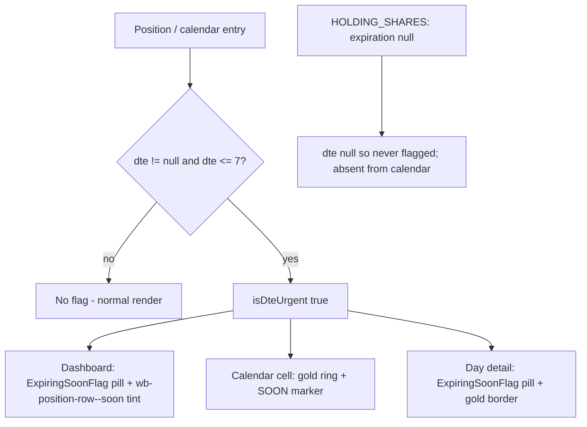

# US-61 — Expiring-soon flags — Implementation

## Feature

Positions with an active option expiring within 7 days (DTE ≤ 7) now carry a
persistent gold **"Expiring soon"** flag on both the dashboard positions table
and the expiration calendar. It is a display rule on the server-computed DTE —
no persisted alert, no dismissal, no configuration. Positions at 8+ DTE and
`HOLDING_SHARES` positions (no active option / `dte = null`) are never flagged.

Scope: pure renderer. No IPC, service, engine, migration, or schema change. The
flag reuses the existing `isDteUrgent` / `DTE_URGENT_THRESHOLD = 7` predicate
(`src/renderer/src/lib/dte.ts`) that already golds DTE text.

## Behaviour

| Surface                  | Treatment when DTE ≤ 7                                                              |
| ------------------------ | ----------------------------------------------------------------------------------- |
| Dashboard row            | `ExpiringSoonFlag` pill beside the ticker + gold row tint/left rail                 |
| Calendar month-grid cell | gold ring + `bg-wb-gold-subtle` + a `SOON` marker (`TODAY` takes the slot on today) |
| Calendar day-detail card | `ExpiringSoonFlag` pill + gold card border (DTE text already gold)                  |

Calendar chips and the agenda view are unchanged (highlight is cell-level).

## Key files changed

- `src/renderer/src/components/ExpiringSoonFlag.tsx` **(new)** — shared gold pill
  (`data-testid="expiring-soon-flag"`), `compact` size variant, modeled on
  `TargetBadge`. Tailwind tokens only.
- `src/renderer/src/components/PositionCard.tsx` — renders `ExpiringSoonFlag`
  (compact) in the ticker cell and toggles the `wb-position-row--soon` modifier
  on the `<tr>` when `dteUrgent`.
- `src/renderer/src/index.css` — new `.wb-position-row--soon` rule (gold-subtle
  background + gold left border).
- `src/renderer/src/components/CalendarMonthGrid.tsx` — `isSoon` per cell
  (`entries.some(isDteUrgent)`) drives the gold ring and the `SOON` marker.
- `src/renderer/src/components/CalendarDayDetail.tsx` — `ExpiringSoonFlag` + gold
  card border for urgent entries; `soon` reused for the existing gold DTE text.
- Tests: `ExpiringSoonFlag.test.tsx` (new), and added cases in
  `PositionCard.test.tsx`, `CalendarMonthGrid.test.tsx`,
  `CalendarDayDetail.test.tsx`.
- `e2e/expiring-soon-flags.spec.ts` **(new)** — one test per AC, seeding via the
  IPC bridge with relative `futureDate(N)` offsets.

## Deviation from the plan

The plan proposed painting the dashboard row tint with Tailwind
`bg-wb-gold-subtle` / `border-l-wb-gold` utilities. In Tailwind v4 the unlayered
`.wb-position-row` rule (background via `--wb-row-bg`, `border-left` shorthand)
outranks layered utilities, so those classes would not actually paint. Replaced
with a dedicated unlayered `.wb-position-row--soon` modifier that reliably wins
the cascade — still token-based, no inline `style`. Unit assertions check for the
`wb-position-row--soon` class accordingly.

## Flag decision flow

## Verification

- `pnpm test` — 1712 unit/integration tests pass (incl. new component cases).
- `pnpm lint`, `pnpm typecheck` — clean.
- `pnpm test:e2e expiring-soon-flags` — 4/4 AC scenarios pass.
