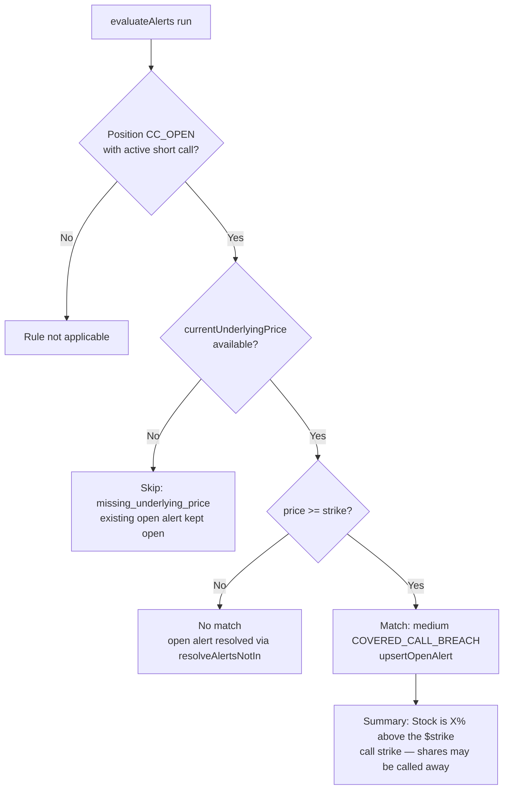

# US-62 — Covered-call breach alert (implementation)

## Feature

Adds a `COVERED_CALL_BREACH` rule to the pure alert engine. When a `CC_OPEN`
position's underlying trades **at or above** its short-call strike, the rule
fires a **medium**-urgency alert reporting the percent above the strike:

> `Stock is 1.8% above the $420.00 call strike — shares may be called away`

The alert flows through the existing US-51 alert queue and US-50 evaluation
machinery. It auto-resolves when the stock falls back below the strike, and
skips (keeping any open alert open) when the underlying price is unavailable.

### Scope

- **CC_OPEN only.** CSP positions use US-55's `STRIKE_PROXIMITY`; holding-shares
  positions have no active short-option leg and are excluded by the evaluable
  query.
- **Independent rule.** Co-fires with the DTE rules (`EXPIRATION_IMMINENT`,
  `MANAGEMENT_WINDOW`) per US-50 — each keeps its own queue row.
- **No new schema, IPC, or renderer changes.** The `alerts` table's
  unconstrained `rule_code TEXT` and partial-unique open-alert index already
  accommodate the new code.

## Key files changed

| File                                            | Change                                                                                                                                                                                                                                                     |
| ----------------------------------------------- | ---------------------------------------------------------------------------------------------------------------------------------------------------------------------------------------------------------------------------------------------------------- |
| `src/main/core/alerts.ts`                       | Added `COVERED_CALL_BREACH` to the `RuleCode` union; added shared `PriceVsStrikeInput` type + `CoveredCallBreachInput` alias; added `coveredCallBreachSummary`; appended the rule to the `RULES` registry; retyped `proximityPercent` to the shared input. |
| `src/main/core/alerts.test.ts`                  | New `COVERED_CALL_BREACH (US-62)` unit describe block (6 cases).                                                                                                                                                                                           |
| `src/main/services/evaluate-alerts.e2e.test.ts` | New `US-62 acceptance` e2e block (5 scenarios, one per AC).                                                                                                                                                                                                |

No production changes were needed in the service, IPC, or renderer layers — the
rule plugs into the existing registry-driven evaluation loop.

## Rule definition

| Property      | Value                                                                                         |
| ------------- | --------------------------------------------------------------------------------------------- |
| `code`        | `COVERED_CALL_BREACH`                                                                         |
| `urgency`     | `medium`                                                                                      |
| Applies to    | `CC_OPEN` only                                                                                |
| `test`        | `phase === 'CC_OPEN' && strike !== null && currentUnderlyingPrice !== null && price ≥ strike` |
| `missingData` | `CC_OPEN` with `currentUnderlyingPrice === null` → `missing_underlying_price`, else `null`    |
| Percent-above | `(price − strike) / strike × 100` via existing `proximityPercent`                             |
| `quickAction` | `Review position`                                                                             |

## Evaluation flow

## Resolution / state transitions

Handled entirely by the existing service mechanism:

- **Fires → open:** first evaluation with `price ≥ strike` inserts an open row.
- **Open → resolved:** later evaluation with `price < strike` yields no match and
  no skip, so `resolveAlertsNotIn` marks the row resolved.
- **Skip keeps open:** a later evaluation with a missing price adds the key to
  `skippedKeys`, so the open alert is kept, not resolved.

## Tests

- **Unit** (`src/main/core/alerts.test.ts`): fires at/above strike with exact
  summary; fires exactly at strike (0.0% boundary); does not fire below strike;
  does not apply to `CSP_OPEN` (no match, no skip); skips with
  `missing_underlying_price`; co-fires with DTE rules.
- **E2E** (`src/main/services/evaluate-alerts.e2e.test.ts`): one scenario per
  acceptance criterion — fires, does-not-fire-below, resolves-on-fallback,
  CSP-excluded, holding-shares-excluded.
