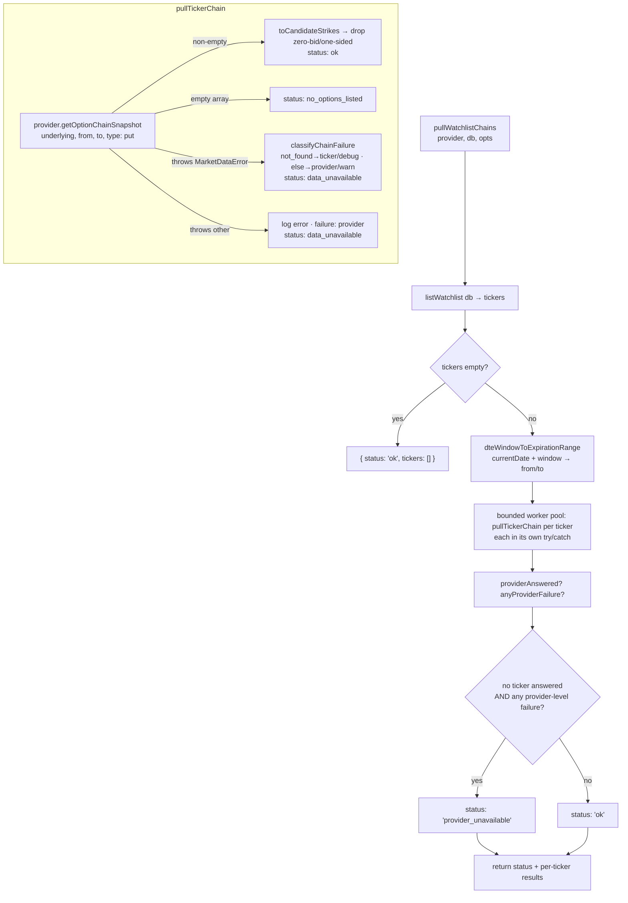

# US-64 — Pull option chains from Massive for watchlist tickers (implementation)

## Feature

For every watchlist ticker, `pullWatchlistChains` fetches the **put** side of the
option chain within a DTE window through the `MarketDataProvider` adapter and returns
per-strike `bid / ask / mark / delta / openInterest / volume` plus the quote timestamp.
It is a failure-isolated batch job: one bad ticker never suppresses the others, and a
whole-provider outage is reported distinctly from a legitimately empty result.

Backend-only — no IPC handler and no renderer surface (US-65 consumes this service;
US-66 displays it). Market data is transient, so nothing is persisted.

### Behaviour / states

Per ticker, evaluated in its own `try/catch`:

| Provider outcome                       | `TickerChainResult.status` | Log level |
| -------------------------------------- | -------------------------- | --------- |
| non-empty `OptionChainQuote[]`         | `ok` (+ filtered strikes)  | debug     |
| empty `[]`                             | `no_options_listed`        | debug     |
| throws `MarketDataError('not_found')`  | `data_unavailable`         | debug     |
| throws `MarketDataError` (other codes) | `data_unavailable`         | warn      |
| throws non-`MarketDataError`           | `data_unavailable`         | error     |

Overall status is `provider_unavailable` **iff** no ticker answered (none `ok`, none
`no_options_listed`) **and** at least one failure was provider-level
(`classifyChainFailure === 'provider'`). Any ticker the provider actually answered for
proves it is reachable and keeps the overall status `ok`; a delisted ticker's 404 is a
ticker-level failure and must not mask a real outage behind it. Zero-bid / one-sided
strikes are dropped (no reliable mark).

## Key files changed

| File                                            | Change                                                                                                                                                                       |
| ----------------------------------------------- | ---------------------------------------------------------------------------------------------------------------------------------------------------------------------------- |
| `src/main/integrations/market-data-provider.ts` | Added `OptionChainQuote` (= `OptionSnapshot` + `contractId`/`strike`/`expiration`/`contractType`); `getOptionChainSnapshot` now returns `Promise<OptionChainQuote[]>`.       |
| `src/main/integrations/massive-market-data.ts`  | Added `ChainSnapResult` + `mapChainResult` (reuses `mapSnapResult`/`computeMid`, adds identity + real OI/volume); chain path maps through it. `getOptionSnapshot` untouched. |
| `src/main/integrations/fake-market-data.ts`     | `getOptionChainSnapshot` returns `OptionChainQuote[]`, filtering mock entries by underlying / type / expiration window.                                                      |
| `src/main/core/candidate-chain.ts` (new)        | Pure helpers: `dteWindowToExpirationRange` (local-day basis), `isTradeableStrike`, `toCandidateStrikes`, `classifyChainFailure`, `DEFAULT_DTE_WINDOW`.                       |
| `src/main/services/candidate-chains.ts` (new)   | `pullWatchlistChains` orchestration + `TickerChainResult` / `WatchlistChainsResult`.                                                                                         |

Tests: `massive-market-data.test.ts`, `fake-market-data.test.ts`,
`candidate-chain.test.ts`, `candidate-chains.test.ts`,
`candidate-chains.integration.test.ts` (one `it()` per AC).

## Flow

## Notes / decisions

- **Single local-timezone basis.** `dteWindowToExpirationRange` does both the day
  arithmetic (`addDays`) and the `yyyy-MM-dd` formatting (`format`) in the local
  timezone — the same basis as the shared helpers in `src/main/dates.ts`. DTE counts
  from the trader's own calendar day; mixing bases (local `addDays`, UTC formatting)
  shifts the whole window by a day whenever the run falls outside UTC's calendar day.
- **Bounded fan-out.** Each ticker's chain is a fully-paginated walk, so the pull runs
  through a worker pool capped at `CHAIN_FETCH_CONCURRENCY`. An unbounded burst over a
  large watchlist earns a 429, which classifies as provider-level and would surface as
  a fake outage on every retry.
- **Optional provider payload blocks are tolerated.** Never-traded or thinly-quoted
  strikes omit `last_trade` / `last_quote` / `greeks`, and a zero-match response omits
  `results` entirely; these degrade to a zeroed quote and an empty chain rather than
  discarding the whole underlying's chain.
- **Adapter reuse.** `mapChainResult` spreads `mapSnapResult` so all money/greeks
  rounding logic (`computeMid`, HALF_UP 2dp) lives in one place; the chain method only
  layers on identity + OI/volume. The single-contract `getOptionSnapshot` is unchanged.
- **Failure isolation** follows the alert-evaluation-failure-isolation ADR: each
  ticker is fetched in its own `try/catch`; the batch never rejects.
