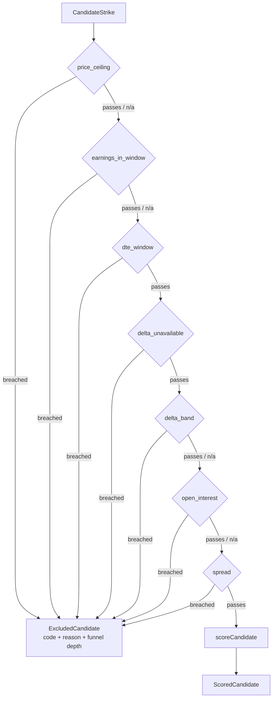
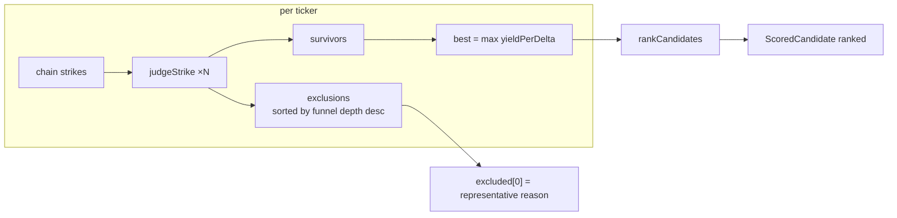

# US-65 — Score wheel candidates: implementation notes

> **Status:** Layer 1 (foundation) complete. Layer 2 (the screener service) landed
> too — see [`us-65-layer2-implementation.md`](./us-65-layer2-implementation.md).
> Layers 3–4 — the `screener:results` IPC channel and the AC integration tests — are
> still open in `plans/us-65/tasks.md`.

## What landed

Two independent foundations that the rest of the story composes:

1. **`src/main/core/screener.ts`** — a pure engine that turns US-64's raw put chains
   into a ranked, explainable candidate list.
2. **`src/main/services/ivr-snapshots.ts`** — the first **read** path over the
   `ivr_snapshot` table US-44 has been writing to.

## The engine

`screener.ts` runs each strike through three stages. Nothing in it imports a DB,
a provider, or the logger — plain values in, plain results out.

### 1. The hard-filter funnel

`FILTERS` is an ordered registry of `{ code, applies, test, reason }` objects, the
same shape `core/alerts.ts` uses for its `RULES`. `applies` returning `false` means
the filter _cannot be evaluated_ — the criterion is switched off, or its input is
unknown — and the strike passes it untouched. That is the "never exclude on a
missing input" rule: an absent open interest is not a reason to drop a strike, but
an open interest of `0` is.

The order is load-bearing, not cosmetic. It runs whole-ticker disqualifiers before
per-strike ones, and how far a strike travels down the list becomes its exclusion
`index` — which is what orders the `excluded` array and therefore decides the one
representative reason US-66 will show per ticker.



First failure wins: a strike breaching both the delta band and the OI floor reports
only `delta_band`.

The spread filter is the one gate with two thresholds that must **both** be
breached. A $0.07 spread on a $0.12 option is 58% of mark but trivial to cross, so
the $0.10 absolute floor rescues it.

### 2. Scoring the survivors

Every derived field comes off a single unrounded `Decimal` chain and is rounded
only on the way out:

```
spreadAbsolute  = ask − bid                    → 2dp
spreadPercent   = (ask − bid) / mark × 100     → 2dp
capitalSecured  = strike × 100                 → 2dp
periodYield     = mark / strike                → 4dp
annualizedYield = periodYield × 365 / dte      → 4dp
yieldPerDelta   = annualizedYield / |delta|    → 4dp   ← the rank score
```

`yieldPerDelta` divides the _exact_ annualized yield, not its 4dp rendering. On the
AC-1 strike that is the difference between `0.5285` (correct) and `0.5286` (what
re-parsing the rounded string would give). Annualization is calendar 365, never the
252 trading days used elsewhere. Delta is absolute everywhere in the engine; the
adapter keeps the signed value.

The `mark` used for yield is the chain's own 2dp mark — the engine never re-derives
it from bid/ask.

### 3. Picking and ranking

`screenTicker` reduces a ticker's whole chain to one representative strike:
`best` is the highest `yieldPerDelta` survivor, ties going to the lower strike. A
high score never rescues an excluded candidate — scoring only ever runs on
survivors. `rankCandidates` then sorts every non-null `best` across tickers by the
same comparator, tie-broken by ticker; the array order _is_ the rank.



## The IVR read path

`getLatestIvrByUnderlying(db, underlyings)` prepares one statement and executes it
per upper-cased ticker, returning a `Map`. A ticker with no snapshot is simply
**absent** from the map — never `null`, never `'0'` — so a missing IV rank surfaces
as unknown rather than as a fabricated zero. The module is write-free; collection
stays in `ivr-collector.ts`.

## Key files

| File                                      | Purpose                                            |
| ----------------------------------------- | -------------------------------------------------- |
| `src/main/core/screener.ts`               | Criteria, filter registry, scoring, ranking (pure) |
| `src/main/core/screener.test.ts`          | 38 unit tests across the three cycles              |
| `src/main/services/ivr-snapshots.ts`      | Latest-IVR-per-underlying read path                |
| `src/main/services/ivr-snapshots.test.ts` | 4 tests over an in-memory DB                       |

## Notes for the next layer

- `screenTicker` takes `earningsDate` per ticker; the service passes `null` until
  US-70 supplies an earnings calendar. The filter is already wired and tested.
- `underlyingPrice` is only needed when `criteria.maxUnderlyingPrice !== null` —
  the service should skip the quote fetch entirely otherwise.
- `evaluateFilters` is exported for direct testing; `screenTicker` uses an internal
  context-taking variant so each strike's delta and spread are derived exactly once.
