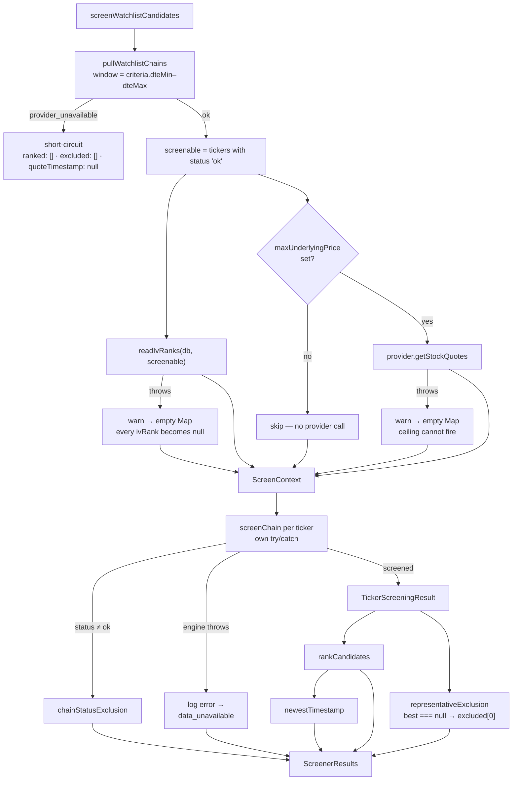

# US-65 — Layer 2: the screener service

> **Status:** Layer 2 complete. Layer 1 is documented in
> [`us-65-implementation.md`](./us-65-implementation.md). Layers 3–4 — the
> `screener:results` IPC channel and the AC integration tests — are still open in
> `plans/us-65/tasks.md`.

## What landed

One file: **`src/main/services/screener.ts`**. It is the seam where US-64's raw put
chains, US-44's IVR snapshots, and US-65's pure engine become a single ranked answer.
Nothing else changed — `candidate-chains.ts`, `ivr-snapshots.ts`, and
`core/screener.ts` are consumed exactly as Layer 1 left them.

```typescript
export async function screenWatchlistCandidates(
  provider: MarketDataProvider,
  db: Database.Database,
  opts?: { criteria?: ScreeningCriteria; currentDate?: Date }
): Promise<ScreenerResults>
```

`ScreenerResults` carries `{ status, ranked, excluded, quoteTimestamp }`. The two
lists are deliberately parallel: `ranked` answers _what should I sell?_ and
`excluded` answers _why isn't my ticker in there?_ — one row per non-ranking ticker,
in watchlist order.

## The orchestration



## Three isolation boundaries, three different answers

The `alert-evaluation-failure-isolation` ADR says a batch job must never let one
failure suppress everyone else's results. This service has three places that could
fail, and each degrades differently because each _means_ something different:

| Boundary                    | On failure                                        | Why                                                                                                       |
| --------------------------- | ------------------------------------------------- | --------------------------------------------------------------------------------------------------------- |
| Chain pull (whole)          | short-circuit, **empty** `excluded`               | An outage says nothing about any individual ticker. Emitting per-ticker exclusions would invent verdicts. |
| IVR read                    | `warn`, empty map → every `ivRank: null`          | IVR is display-only and never a hard filter. Losing it must not cost the trader the screen.               |
| Quote fetch                 | `warn`, empty map → the price ceiling never fires | Never exclude on a missing input — an unknown price is not evidence the underlying is too expensive.      |
| `screenTicker` (per ticker) | `error`, that ticker drops to `data_unavailable`  | One malformed quote is one ticker's problem. The other tickers still rank.                                |

The quote fetch is also **conditional**: with `maxUnderlyingPrice === null` (the
default) nothing reads the prices, so the provider is never called at all.

## Ticker-status → exclusion mapping

| `TickerChainResult.status` | `code`                  | `reason`                  |
| -------------------------- | ----------------------- | ------------------------- |
| `no_options_listed`        | `no_options_listed`     | `no options listed`       |
| `data_unavailable`         | `data_unavailable`      | `market data unavailable` |
| `ok`, engine threw         | `data_unavailable`      | `market data unavailable` |
| `ok`, zero survivors       | `excluded[0].code`      | `excluded[0].reason`      |
| `ok`, ≥1 survivor          | — (appears in `ranked`) |                           |

The zero-survivor row is the engine's **closest miss** — the strike that travelled
furthest down the filter funnel. That is what makes the excluded list actionable:
"delta 0.42 outside 0.20–0.30" tells the trader to widen the band, where a reason
picked at random would not.

## Two seams the next layers use

- **`earningsDate` is `null` for every ticker.** The engine's `earnings_in_window`
  filter is fully wired and tested; US-70 supplies the calendar that switches it on.
- **`IvrSnapshot { ivr, observedAt }` → `IvRank { value, observedAt }`.** The read
  path and the engine name the number differently; this service does the rename. The
  `observedAt` travels with the value on purpose — IV can re-rate overnight, so a bare
  rank gives the display surface no way to judge whether it is still worth acting on.

## Key files

| File                                 | Purpose                                                 |
| ------------------------------------ | ------------------------------------------------------- |
| `src/main/services/screener.ts`      | Orchestration, boundary isolation, ticker → row mapping |
| `src/main/services/screener.test.ts` | 18 tests: plumbing, degradation, failure isolation      |

## Notes for Layer 3

`ScreenerResults` is the shape `screener:results` wraps. The channel takes no payload,
so the handler needs no Zod request schema — just
`handleIpcCall('screener_results_error', () => screenWatchlistCandidates(getProvider(), db))`.
