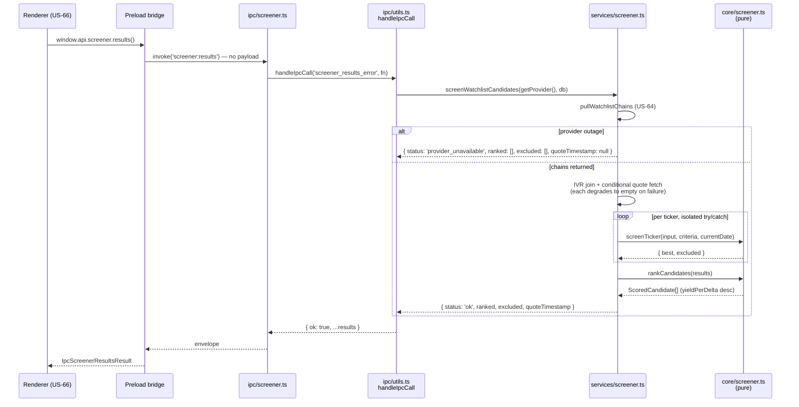
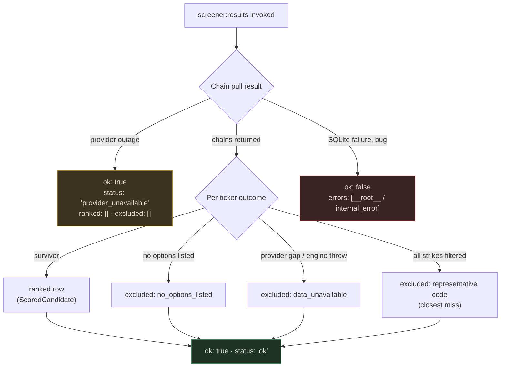

# US-65 Layer 3 — `screener:results` IPC + Preload

## What this layer delivers

Layer 3 is the **delivery surface** for the screening work built in Layers 1–2. It exposes
the ranked candidate list over a single new IPC channel, `screener:results`, and bridges it
onto `window.api` so US-66's results table can call it. There is no renderer work here and
no acceptance criterion lands on this layer — it is the seam US-66 consumes.

The design constraint that shapes every decision below: **the handler is thin**. Zod parse
plus one service call, wrapped in `handleIpcCall`. No branching, no orchestration, no
business logic. Because the channel takes no payload, there is not even a Zod schema — the
handler is a single expression.

## Scope

| In                                      | Out                                  |
| --------------------------------------- | ------------------------------------ |
| `screener:results` channel + handler    | The results table (US-66)            |
| Main-process registration               | Persisted criteria overrides (US-67) |
| Preload bridge + ambient renderer types | Earnings calendar data (US-70)       |
|                                         | AC integration coverage (Layer 4)    |

## Files changed

| File                            | Change                                                                                                         |
| ------------------------------- | -------------------------------------------------------------------------------------------------------------- |
| `src/main/ipc/screener.ts`      | **New.** `registerScreenerIpc({ db, getProvider })` registering the channel.                                   |
| `src/main/ipc/screener.test.ts` | **New.** 4 handler tests with `ipcMain` and the service both mocked.                                           |
| `src/main/index.ts`             | Registers `registerScreenerIpc` alongside `registerWatchlistIpc`, passing the market-data factory accessor.    |
| `src/preload/index.ts`          | Adds the `screener: { results }` namespace to the bridged API.                                                 |
| `src/preload/index.d.ts`        | Adds `IpcIvRank`, `IpcScoredCandidate`, `IpcScreenerExclusion`, `IpcScreenerResultsResult`, and the namespace. |

## Call path



## Envelope contract

Success always carries the four service fields spread into the envelope unchanged:

```typescript
type Success = { ok: true } & Pick<
  ScreenerResults,
  'status' | 'ranked' | 'excluded' | 'quoteTimestamp'
>
```

Every **expected** failure is modelled inside that success payload rather than thrown, so
the error row only ever carries something genuinely unexpected:



`status: 'provider_unavailable'` is deliberately **not** an error envelope: US-66 renders a
market-data outage distinctly from an empty-but-successful screen (`status: 'ok'` with
`ranked: []`). The handler never branches on `status` — it only forwards.

## Design decisions

**No Zod request schema.** The channel takes no payload, so there is nothing to parse. A
`z.void()` schema would be ceremony without a guard. A comment in the handler points at
`plans/us-65/contracts/screener-results.md` so the omission reads as deliberate rather than
forgotten.

**`getProvider` is invoked per call, not captured at registration.** This matches
`registerMarketDataHandlers`. The market-data factory can be recreated at runtime when
credentials change, so resolving the provider on each invocation is what lets a newly saved
API key take effect without an app restart.

**The service result is spread, not remapped.** `screenWatchlistCandidates` already returns
exactly the four success fields. Projecting them field-by-field in the handler would be
business logic in a handler file and a second place for the contract to drift.

**Preload types mirror the engine field-for-field.** `IpcScoredCandidate` restates
`ScoredCandidate` in the same order with the same nullability rather than widening to
`unknown`, so US-66 gets real completions and a rename in `core/screener.ts` surfaces as a
typecheck failure. The preload `.d.ts` is ambient and cannot import from `src/main`, so this
duplication is inherent to the existing pattern — every other namespace does the same.

## Verification

- `pnpm test` — 1905 tests across 172 files, all passing (4 new)
- `pnpm lint` — clean
- `pnpm typecheck` — clean (node + web projects)
- `pnpm format` — clean

The preload wiring has no unit test of its own: it is guarded by `pnpm typecheck` and will
be exercised end-to-end when US-66 calls `window.api.screener.results()`.

## Follow-ups

- **Layer 4** — headless AC integration suite (`src/main/services/screener.integration.test.ts`),
  covering all eight acceptance criteria against the real service.
- **US-66** — the results table that consumes this channel.
- **US-67** — persisted criteria overrides; the service already accepts a `criteria` option
  as the seam, but the channel does not yet pass one.
