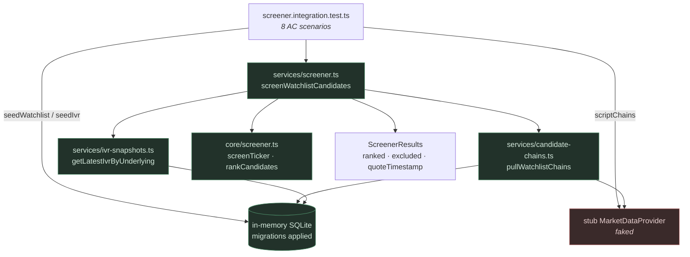

# US-65 Layer 4 — AC Integration Coverage

## What this layer delivers

Layer 4 adds **no production code**. It is the acceptance-criteria audit for US-65: eight
headless integration tests that drive the real `screenWatchlistCandidates` — real chain
pull, real IVR read, real pure engine — against an in-memory SQLite database and a
scripted `MarketDataProvider`. One `it()` per AC bullet, each name mirroring the story's
Gherkin scenario title.

US-65 has no renderer surface (the ranked table is US-66), so Playwright `_electron` does
not apply — the same rationale as US-64's Area 4. Everything the trader is promised by
the story is provable at the service boundary.

## Scope

| In                                               | Out                                  |
| ------------------------------------------------ | ------------------------------------ |
| One integration test per acceptance criterion    | Any new production behaviour         |
| Seed + scripting harness (watchlist, IVR, chain) | The results table (US-66)            |
| Shared test-helper extraction                    | Persisted criteria overrides (US-67) |
|                                                  | Earnings calendar data (US-70)       |

## Files changed

| File                                                     | Change                                                                            |
| -------------------------------------------------------- | --------------------------------------------------------------------------------- |
| `src/main/services/screener.integration.test.ts`         | **New.** 8 AC tests plus the `chainStrike` / `scriptChains` harness.              |
| `src/main/test-utils.ts`                                 | Adds shared `seedWatchlist`, `seedIvr`, and the labelled `IvrSeedRow` tuple type. |
| `src/main/services/candidate-chains.test.ts`             | Drops its local `seedWatchlist` copy in favour of the shared one.                 |
| `src/main/services/candidate-chains.integration.test.ts` | Same.                                                                             |
| `src/main/services/screener.test.ts`                     | Drops its local `seedIvr` copy in favour of the shared one.                       |

No file under `src/main/core/`, `src/main/services/*.ts` (non-test), `src/main/ipc/`, or
`src/preload/` was touched.

## What is real and what is stubbed

Only two seams are faked: the market-data provider (so the tests are deterministic and
offline) and the logger (so assertions don't depend on log I/O). Everything between the
service entry point and the scored output is the shipping code.



## AC coverage

| AC  | Test name                                                    | Scenario driven                                                        |
| --- | ------------------------------------------------------------ | ---------------------------------------------------------------------- |
| 1   | `premium yield is computed on capital secured`               | AAPL 37-DTE $180 put @ 2.70 → `0.0150` / `0.1480` / `18000.00`         |
| 2   | `rank is annualized yield per unit of delta`                 | TSLA 0.30Δ 30.0% vs MSFT 0.20Δ 24.0% → MSFT first, `1.2000` / `1.0000` |
| 3   | `a strike outside the delta band is excluded`                | AMD 0.42Δ with a fat yield → `delta 0.42 outside 0.20–0.30`            |
| 4   | `an illiquid strike is excluded`                             | KO OI 120 vs the 500 floor → `open interest 120 below 500`             |
| 5   | `a wide-spread strike is excluded`                           | AAPL 2.40 / 3.00 on a 2.70 mark → `spread 22% exceeds 10%`             |
| 6   | `a narrow absolute spread on a cheap option is not excluded` | XYZ 0.08 / 0.15 → ranks, `spreadAbsolute '0.07'`, no exclusion         |
| 7   | `missing IV rank does not exclude a candidate`               | IVR seeded for KO + AAPL, none for MSFT → MSFT ranks, `ivRank: null`   |
| 8   | `the best strike per ticker is selected`                     | AAPL 175 / 180 / 185 survivors → one row, the 175 at `0.5893`          |

## Fixture design notes

- **`CURRENT_DATE = 2026-07-23`.** The default 30–45 DTE window resolves to expirations in
  `[2026-08-22, 2026-09-06]`; `2026-08-29` is 37 DTE and `2026-08-28` is 36 DTE.
- **AC-2's numbers are exact by construction.** At strike `365.0000` and 36 DTE the
  annualized yield collapses to `mark / 36`, so a `10.80` mark is precisely 30.0% and an
  `8.64` mark precisely 24.0% — the `1.2000` / `1.0000` scores carry no rounding slack.
  Both quotes stay internally consistent: `mid` equals `(bid + ask) / 2`.
- **AC-6's mark is `0.12`,** the 2dp HALF_UP rounding of the story's `0.115` mid — the
  adapter surfaces `mid` verbatim as `mark`, and `CandidateStrike.mark` is 2dp.
- **`chainStrike` takes `delta` as a top-level override.** `toCandidateStrikes` reads only
  `greeks.delta`; gamma/theta/vega never reach the engine, so varying them per scenario
  would have implied a relevance they don't have.

## Why these tests were green on arrival

The plan states Layer 4 adds no production code — Layers 1–3 already ship the behaviour —
so the usual red-then-green gate was unavailable. Each test was instead **falsified
against deliberate engine mutations** to prove it is not vacuous. Every mutation was
reverted; `git diff src/main/core/screener.ts` is empty.

| Mutation to `src/main/core/screener.ts`                | Tests that failed      |
| ------------------------------------------------------ | ---------------------- |
| `DAYS_PER_YEAR` 365 → 360                              | AC-1, AC-2, AC-7, AC-8 |
| en dash → hyphen; OI floor → `< 0`; spread filter off  | AC-3, AC-4, AC-5       |
| spread `&&` → `\|\|` (kills the absolute escape hatch) | AC-6                   |

All eight ACs fail under a mutation of exactly the behaviour they assert. The probe was
run twice — once at Red, and again after the refactor changed assertion style in two
tests — with an identical result.

## Verification

```bash
pnpm test        # 173 files, 1913 tests passed
pnpm lint        # clean
pnpm typecheck   # clean (node + web)
pnpm format      # no files rewritten
```
