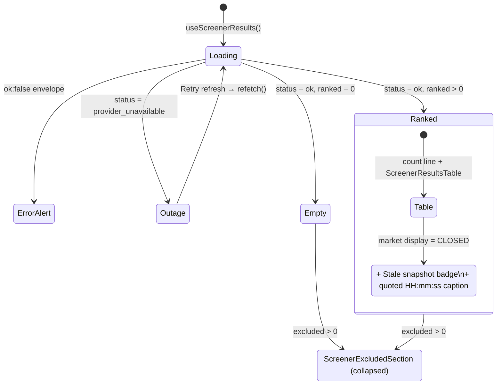
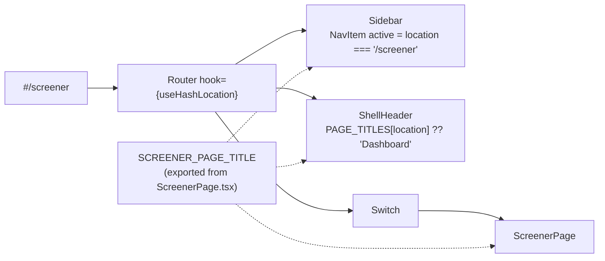
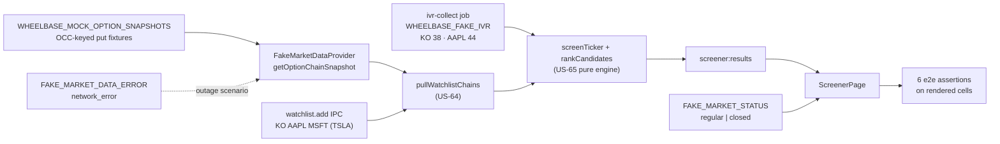
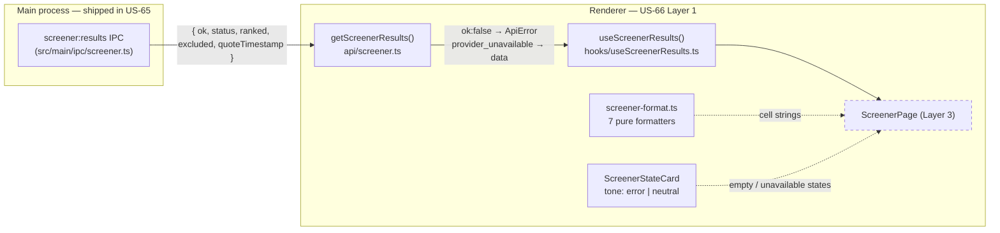
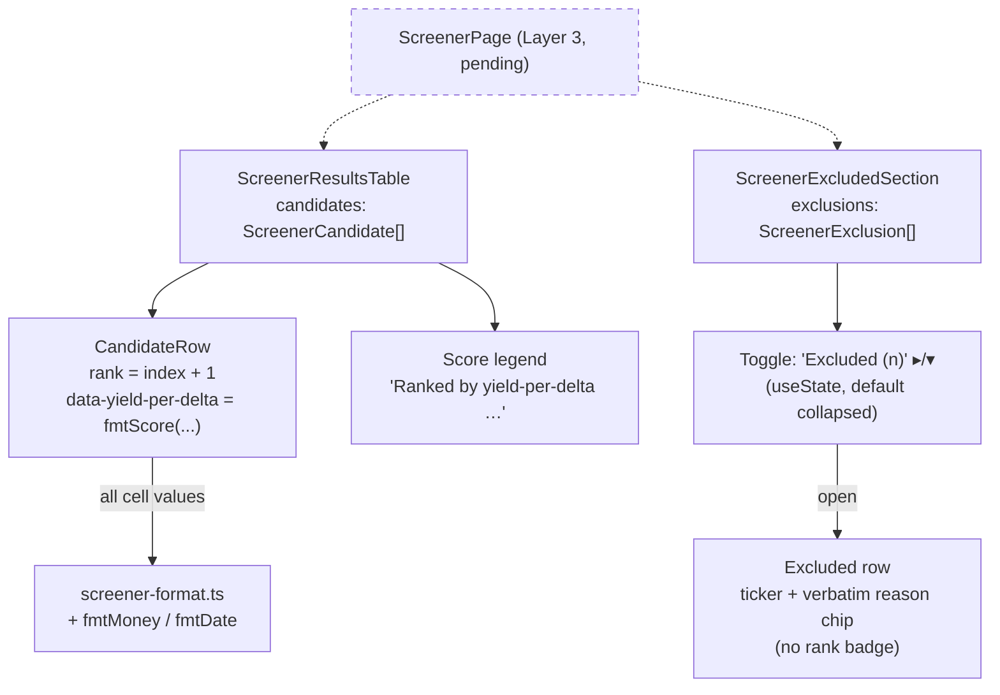

# US-66 Implementation — Display Ranked Screener Results

> Status: **Complete** — all five layers landed (foundation, table/excluded
> section, page composition, route/navigation, e2e). All six acceptance criteria
> are verified end-to-end against the real app.

## Purpose

Render US-65's scored screener candidates as a ranked results page at
`/screener`. Layer 1 delivers the pure foundation the page composes from:
display formatters, the IPC adapter + TanStack Query hook, and the
empty/unavailable state cards.

## Layer 1 Scope and Behavior

### Display formatters — `src/renderer/src/lib/screener-format.ts`

Seven pure helpers converting the IPC payload's decimal strings into the
mockup's pinned display strings:

| Helper            | Input → Output                                            | Notes                                                         |
| ----------------- | --------------------------------------------------------- | ------------------------------------------------------------- |
| `fmtYieldPercent` | `"0.0150"` → `"1.5%"`                                     | `Decimal` ×100, 2dp, trailing zeros trimmed                   |
| `fmtScore`        | `"0.5286"` → `"0.53"`                                     | fixed 2dp, zeros kept                                         |
| `fmtSpread`       | `("0.06", "2.22")` → `"$0.06 (2%)"`                       | reuses `fmtMoney` + `fmtPct` from `format.ts`                 |
| `fmtDelta`        | `"0.2800"` → `"0.28"`                                     | fixed 2dp                                                     |
| `fmtIvr`          | `{ value: '44.0', … }` → `"44 (Aug 7)"`; `null` → `"n/a"` | zeros trimmed via `Decimal`; US-67 added the observation date |
| `fmtOpenInterest` | `4200` → `"4,200"`; `null` → `"—"`                        | `toLocaleString('en-US')`                                     |
| `fmtQuoteTime`    | ISO → local `HH:mm:ss`                                    | `date-fns` `format(parseISO(...))`, no string slicing         |

All money-adjacent math goes through `decimal.js`; helpers take narrow
primitive inputs, never whole candidate objects.

### API adapter + hook — `src/renderer/src/api/screener.ts`, `src/renderer/src/hooks/`

- `getScreenerResults()` follows the watchlist adapter pattern:
  `window.api.screener.results()` → `throwMappedIpcErrors` on `ok: false` →
  typed `ScreenerResults`.
- A provider outage (`status: 'provider_unavailable'`) is **data, not an
  error** — the adapter resolves normally so the page can render the outage
  card distinctly from the error path.
- Types `ScreenerCandidate`, `ScreenerExclusion`, `ScreenerIvRank`,
  `ScreenerResults` mirror the preload `Ipc*` shapes field-for-field.
- `useScreenerResults()` wraps `useQuery` with `screenerQueryKeys.results` and
  **no `refetchInterval`** — refresh is a deliberate user action via
  `refetch()` (research ADR).

### State cards — `src/renderer/src/components/ScreenerStateCard.tsx`

One component, two tones driven by a module-scope `TONE` record (the
`MarketStatusPill` variant pattern):

- `tone="error"` — red-dim `⚠` chip, `border-wb-red/30` frame; used by the
  page as `screener-unavailable` with a "Retry refresh" action
- `tone="neutral"` — muted `⌕` chip, `border-wb-border` frame; used as
  `screener-empty`

Tones are machine-distinguishable via `data-tone`; `data-testid` is passed
through by the page. Tailwind `wb-*` tokens only.

## Layer 2 Scope and Behavior

### Ranked results table — `src/renderer/src/components/ScreenerResultsTable.tsx`

Presentational `<table>` on the `TableHeader`/`TableCell` primitives with 12
columns (`#`, `Ticker`, `Strike`, `Exp`, `DTE`, `Mark`, `Yield`, `Ann.`, `Δ`,
`IVR`, `OI`, `Spread` — the mockup's `COLS` minus `promote`, which is US-68):

- Rows render in the given array order — the renderer **never re-sorts**; rank
  is `index + 1` in a 20×20 gold chip (`bg-wb-gold-dim`/`text-wb-gold`) whose
  `title` carries the formatted score.
- Every value goes through the Layer 1 formatters (or existing
  `fmtMoney`/`fmtDate`); `ivRank: null` renders literal `n/a` muted, row still
  ranked (AC 3).
- Rows carry `data-testid="screener-row-<ticker>"` and
  `data-yield-per-delta={fmtScore(yieldPerDelta)}` for e2e assertions.
- Cell treatments are named right-aligned variants composed off a `NUMERIC`
  constant (`SECONDARY`, `MUTED`, `YIELD`, `ANNUALIZED_YIELD`); each row is a
  `CandidateRow` sub-component (the `LegHistoryTable` convention).
- A mono muted legend below the table: "Ranked by yield-per-delta — annualized
  return-if-flat ÷ delta".
- `earningsFlagged` is carried on the type but **not rendered** (US-70).

### Excluded section — `src/renderer/src/components/ScreenerExcludedSection.tsx`

Collapsible bordered surface card (local `useState`, default collapsed):

- Toggle button (`screener-excluded-toggle`) reads `Excluded (n)` with a
  `▸`/`▾` chevron; renders `null` when there are no exclusions.
- Expanded rows (`screener-excluded-row-<ticker>`) show the mono ticker beside
  the **verbatim** engine `reason` in a `bg-wb-red-dim` bordered chip — no
  rank badge anywhere (AC 4).

## Layer 3 Scope and Behavior

### Page composition — `src/renderer/src/pages/ScreenerPage.tsx`

`ScreenerPage` owns no display logic of its own: it runs `useScreenerResults()`
and `useMarketStatusDisplay()`, then routes the result to the Layer 1–2
components. It never sorts, never computes a yield, and never formats a value
outside `lib/screener-format.ts`.

**Header** (`PageHeader`) — left: the `Screener` title, a gold count `Badge`
when candidates ranked, and the `Stale snapshot` chip when the marks are stale;
right: `MarketStatusPill state={display}`. The pill is the freshness indicator
per the story's technical notes — no polling or timing indicator was invented.

**Body** — the state machine below. Two facts drive it:

- **A provider outage is not an empty result.** `status: 'provider_unavailable'`
  renders the error-tone card ("Market data unavailable" + `Retry refresh` →
  `refetch()`); a successful screen with nothing surviving the filters renders
  the neutral-tone card ("No candidates match your criteria"). The two tones are
  the visual distinction AC-5 requires, and `data-tone` makes it machine-checkable.
- **Exclusions survive the empty state.** `ScreenerExcludedSection` renders under
  _both_ `ok` branches, so a trader who screens down to zero candidates still sees
  why each ticker dropped out. It renders nothing on an outage — the screen never
  ran, so there is nothing to explain.

**Staleness** is one derived value, `staleQuoteTime`: non-null only when the
market display is `CLOSED`, ranked rows exist, and the payload carries a
`quoteTimestamp`. The header badge, the gold caption
(`Quoted 16:00:02 · after-hours option marks are unreliable …`), and the count
line's `3 candidates · quoted 16:00:02` variant all key off it, so they can
never disagree.

## Layer 4 Scope and Behavior

### Route and navigation — `src/renderer/src/App.tsx`

The page becomes reachable. Three edits, each mirroring the existing Watchlist
wiring:

- **Nav item** — `⌕ Screener` in the Trading group, directly after Watchlist,
  matching the mockup's sidebar `NavRow`. The label is the exported
  `SCREENER_PAGE_TITLE`, not a literal, so the sidebar and the page heading can
  never drift apart (same contract as `WATCHLIST_PAGE_TITLE` /
  `CALENDAR_PAGE_TITLE`).
- **Route** — `<Route path="/screener" component={ScreenerPage} />` in the
  `Switch`, under the hash-based `Router` the shell already uses.
- **Shell header title** — `/screener` mapped in `PAGE_TITLES`. Without this the
  shell strip would read `Dashboard` while the Screener page is open; the
  Calendar and Watchlist entries exist to prevent exactly that.

The refactor phase replaced the header's five-deep nested ternary with the
`PAGE_TITLES` lookup. Route paths are still stated in three places — nav item,
title map, `Switch` — which is deliberate: collapsing them needs a config-driven
`PAGES` array, and the sidebar's interleaved section headers, the `/` route's
two-value active check (`'/' || ''`), and the nav-less `/positions/:id` route
each become an exception encoded into that config. The duplication is cheaper
than the abstraction. See `plans/us-66/refactor-phase-results.md`.

## Layer 5 Scope and Behavior

### End-to-end verification — `e2e/screener-results.spec.ts`, `e2e/screener-helpers.ts`

Six tests, one per acceptance criterion, run against the packaged app. Nothing
between the IPC and the DOM is stubbed: the fake market-data provider serves OCC-keyed
put chains, the **real US-65 engine** scores and ranks them, and the assertions read
the rendered cells. That is what makes the ACs' pinned strings meaningful — `1.5%`,
`14.8%/yr`, `44`, `$0.06 (2%)` are produced by the engine, not asserted against a
fixture the test also wrote.

**The fixtures are calibrated arithmetic, not arbitrary numbers.** Period yield is
`mid / strike`, annualized is `× 365 / DTE`, and the score is `annualized / |delta|`
— so each fixture is chosen backwards from the string its AC pins:

| Fixture | mid / strike | DTE  | Yields         | Score → rank | Why these numbers                      |
| ------- | ------------ | ---- | -------------- | ------------ | -------------------------------------- |
| KO      | 0.95 / 60    | +37d | 1.58% / 15.62% | 0.71 → **1** | top of the ranking                     |
| AAPL    | 2.70 / 180   | +37d | 1.5% / 14.8%   | 0.53 → **2** | the AC's fully-pinned row              |
| MSFT    | 6.20 / 410   | +44d | 1.51% / 12.54% | 0.50 → **3** | **no IVR outcome seeded** ⇒ `n/a` cell |
| TSLA    | 3.00 / 240   | +37d | —              | excluded     | spread 0.66 = **exactly 22%** of mark  |

TSLA's spread is exact so the engine's round-up-to-2dp formatter emits the AC's
literal `spread 22% exceeds 10%`. Expirations are relative (`localDate(+37)`), never
hardcoded dates — DTE is the invariant, so the suite cannot rot.

**Seeding runs through production paths only.** Watchlist entries go through
`window.api.watchlist.add`; IV ranks go through the real `ivr-collect` job over the
US-44 fake-scraper seam. Because that collector reads its targets from open positions,
`seedIvr` first creates a throwaway active CSP per ticker — inert here, since the
screener reads only the watchlist. MSFT is deliberately left out of the seeded ranks,
which is what makes its `n/a` cell a real absence rather than an asserted stub.

**Suite-wide cleanup.** The `electron.launch({ args: [APP_PATH, '--no-sandbox'], … })`
triple had been copied into each helper module's launcher; it now lives once as
`launchElectron(env)` in `assignment-helpers.ts`, and `launchIvrApp` / `launchScreener`
delegate to it. The full 27-file e2e suite was re-run to confirm.

## Data Flow (Layer 1 foundation)

## Component Composition (Layer 2)

## Key Files

| File                                                      | Role                                                 |
| --------------------------------------------------------- | ---------------------------------------------------- |
| `src/renderer/src/lib/screener-format.ts`                 | Pure display formatters (20 unit tests)              |
| `src/renderer/src/api/screener.ts`                        | IPC adapter + renderer types (3 tests)               |
| `src/renderer/src/hooks/screenerQueryKeys.ts`             | Query key registry                                   |
| `src/renderer/src/hooks/useScreenerResults.ts`            | TanStack Query hook, deliberate-refresh only         |
| `src/renderer/src/components/ScreenerStateCard.tsx`       | Empty/unavailable state card (5 tests)               |
| `src/renderer/src/components/ScreenerResultsTable.tsx`    | Ranked candidates table + score legend (7 tests)     |
| `src/renderer/src/components/ScreenerExcludedSection.tsx` | Collapsible exclusions list (4 tests)                |
| `src/renderer/src/pages/ScreenerPage.tsx`                 | Page composition, body states, stale badge (9 tests) |
| `src/renderer/src/App.tsx`                                | Nav item, `/screener` route, shell header title      |
| `e2e/screener-helpers.ts`                                 | OCC put fixtures, launch/seed plumbing, row queries  |
| `e2e/screener-results.spec.ts`                            | Six e2e scenarios — one per acceptance criterion     |

## Verification

- `pnpm test` — 179 files, 1978 tests passing
- `pnpm test:e2e` — 27 files, 231 tests passing (includes the 6 US-66 scenarios)
- `pnpm lint` / `pnpm typecheck` / `pnpm format` — clean
- Refactor details: `plans/us-66/refactor-phase-results.md`

### AC coverage

| Acceptance criterion                               | E2E test                                                |
| -------------------------------------------------- | ------------------------------------------------------- |
| Background — market status pill reads LIVE         | asserted inside `results are ranked by yield-per-delta` |
| Results are ranked by yield-per-delta              | `results are ranked by yield-per-delta`                 |
| A row shows the metrics for its recommended strike | `a row shows the metrics for its recommended strike`    |
| IV rank unavailable is shown, not blank            | `IV rank unavailable is shown, not blank`               |
| Excluded candidates are listed with a reason       | `excluded candidates are listed with a reason`          |
| Provider outage is distinguished from no results   | `provider outage is distinguished from no results`      |
| Stale marks are flagged                            | `stale marks are flagged`                               |

Layer 4 has no unit-level Red — there is no `App.test.tsx`, so the assertion that
`/screener` reaches the page is the e2e suite's navigation step
(`goToScreener` waits on the page heading before every scenario).
