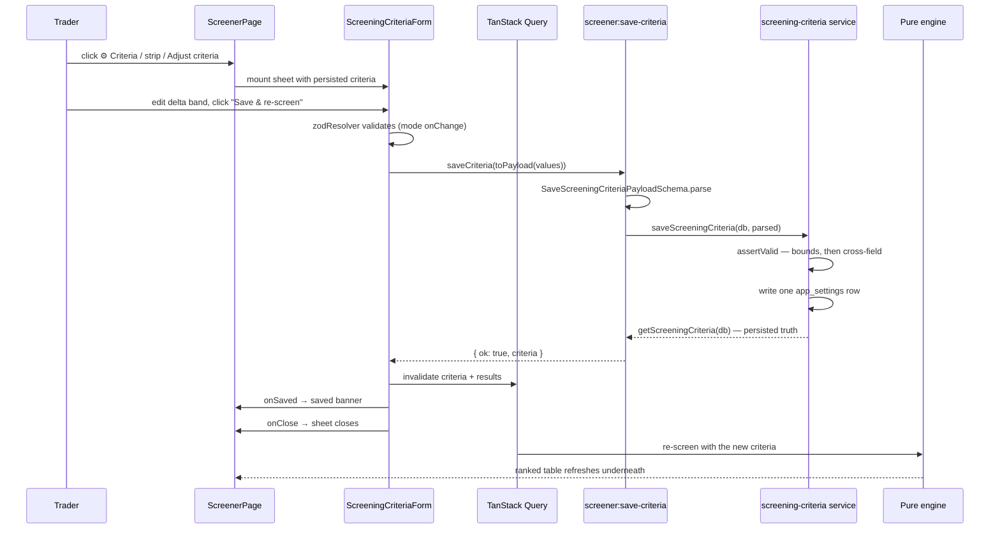
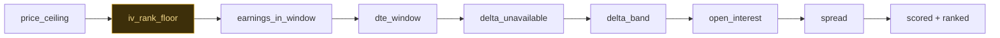
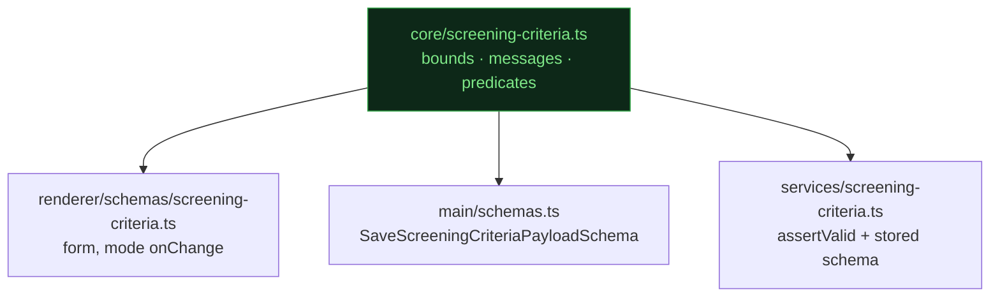

# US-67 — Configure screening criteria implementation

## Overview

This change set implements `plans/us-67/plan.md`. The screener's criteria — delta band, DTE
window, liquidity gates, price ceiling, IV-rank floor, and earnings policy — become editable
from a right-hand sheet **on the Screener page itself**, persisted in `app_settings` and read
by the scoring engine on every screen.

Before this story `screenWatchlistCandidates` always fell back to `DEFAULT_SCREENING_CRITERIA`
because nothing ever supplied `opts.criteria`, and the engine had no IV-rank floor at all. Both
gaps are closed here.

Criteria editing deliberately lives on the Screener, not in Settings. Tuning a filter is an act
of reading results — you widen a delta band _because_ the list came back empty. A nav hop to
Settings breaks that loop, so saving re-screens the table underneath instead.

## Scope delivered

**Pure core (no DB, broker, or logger imports):**

- `src/main/core/screening-criteria.ts` — new. Bounds, the nine validation messages, and the
  predicates every validation layer shares.
- `src/main/core/screener.ts` — `minIvRank` on `ScreeningCriteria`, `'iv_rank_floor'` on
  `ExclusionCode`, `ivRank` on `FilterInput`, and the new `FILTERS` entry.

**Persistence:**

- `src/main/services/screening-criteria.ts` — new. `getScreeningCriteria` / `saveScreeningCriteria`.
- `src/main/services/screener.ts` — one line: `opts.criteria ?? getScreeningCriteria(db)`.

**IPC boundary:**

- `src/main/schemas.ts` — `SaveScreeningCriteriaPayloadSchema`.
- `src/main/ipc/screener.ts` — `screener:get-criteria` and `screener:save-criteria`.
- `src/preload/index.ts`, `src/preload/index.d.ts` — `getCriteria` / `saveCriteria`.

**Renderer data access:**

- `src/renderer/src/api/screening-criteria.ts` — new adapter.
- `src/renderer/src/hooks/screenerQueryKeys.ts` — gains `criteria`.
- `src/renderer/src/hooks/useScreeningCriteria.ts` — new query + save mutation.

**UI:**

- `src/renderer/src/schemas/screening-criteria.ts` — form schema, `toFormValues` / `toPayload`.
- `src/renderer/src/components/ScreeningCriteriaSheet.tsx` — portal/overlay wrapper.
- `src/renderer/src/components/ScreeningCriteriaForm.tsx` — the RHF form.
- `src/renderer/src/components/ScreenerCriteriaStrip.tsx` — the clickable summary strip.
- `src/renderer/src/lib/screener-format.ts` — `fmtCriteriaSummary`.
- `src/renderer/src/pages/ScreenerPage.tsx` — three entry points, saved banner, empty-state copy.
- `src/renderer/src/components/ScreenerStateCard.tsx` — `actionDisabled` prop.
- `src/renderer/src/components/ui/Sheet.tsx` — `data-testid` on the scrim.

## Storage

No migration. The whole criteria document lives in one `app_settings` row keyed
`screening_criteria`, so adding a criterion never needs a schema change.

| Field                   | Type                  | Default             | Editable                         |
| ----------------------- | --------------------- | ------------------- | -------------------------------- |
| `deltaMin` / `deltaMax` | `string`              | `'0.20'` / `'0.30'` | yes                              |
| `dteMin` / `dteMax`     | `number`              | `30` / `45`         | yes                              |
| `minOpenInterest`       | `number`              | `500`               | yes                              |
| `maxSpreadPercent`      | `string`              | `'10'`              | yes                              |
| `maxSpreadAbsolute`     | `string`              | `'0.10'`            | **no** — persisted, never edited |
| `maxUnderlyingPrice`    | `string \| null`      | `null`              | yes (Off/On)                     |
| `minIvRank`             | `string \| null`      | `null`              | yes (Off/On) — **new**           |
| `earningsHandling`      | `'exclude' \| 'flag'` | `'exclude'`         | yes                              |

Both optionals default to **disabled** on purpose: a fixed dollar ceiling is a per-account
buying-power preference that would silently hide large-cap names, and a low IV-rank floor would
empty results in a low-vol regime.

## Save-and-re-screen flow

## Filter registry order

The `iv_rank_floor` entry sits **immediately after** `price_ceiling`. Order is load-bearing:
`FilterFailure.index` records how far a strike got through the funnel, and
`representativeExclusion` picks `excluded[0]` as a ticker's headline reason.

Whole-ticker disqualifiers come before per-strike ones. A **missing** IV rank never excludes a
candidate (the standing US-65 rule — `applies` requires `ctx.ivRank !== null`), and the floor is
inclusive (`lt`, not `lte`).

### IV rank travels with the day it was read

Making IV rank a hard filter changed what the trader needs to see. `IvRank` has always carried
`observedAt` — precisely so a caller could judge whether a reading is still worth acting on — but
nothing displayed it, which was fine while IV rank was a display-only ranking input.
`getLatestIvrByUnderlying` applies no recency bound and returns the newest row of any age, so once
the floor can exclude, a months-old snapshot could silently drop a candidate.

Both surfaces that show an IV rank now stamp the observation date in `MMM d` form:

| Surface                          | Before                  | After                           |
| -------------------------------- | ----------------------- | ------------------------------- |
| Screener IVR column (`fmtIvr`)   | `44`                    | `44 (Aug 7)`                    |
| `iv_rank_floor` exclusion reason | `IV rank 22.0 below 30` | `IV rank 22.0 (Aug 7) below 30` |

No staleness _threshold_ is enforced — the trader judges the age. The story defines no bound, and
inventing one would silently re-filter results. Both call sites format via `date-fns`
`format(parseISO(…), 'MMM d')` rather than slicing the timestamp, per the date-handling rule; the
date renders in the local zone, so tests derive their expectations the same way instead of
hardcoding a day.

## Validation

One source of truth. Bounds, messages, and predicates live in `src/main/core/screening-criteria.ts`
and are imported by every layer that validates — the renderer form schema, the IPC payload schema,
the persistence service, and the stored-document read schema. No layer re-types a message string.

**Cross-field rules live in the service, not in Zod.** Zod v4 restricts `ctx.addIssue({ code })`
to its own issue codes, so a `.superRefine` could only ever surface as `code: 'custom'` while the
contract pins `inverted_band`. `saveScreeningCriteria` throws
`ValidationError('deltaMax', 'inverted_band', …)` and `handleIpcCall` maps it verbatim. Per-field
bounds run first, so a band is only called inverted once both of its ends are legal.

**Predicates fail closed.** Every downstream consumer hands these values to `decimal.js`, which is
stricter than `Number` — it throws on `' 0.20'`. `parseNumeric` therefore matches strings against a
strict decimal pattern rather than trimming, establishing the invariant: _if a predicate returns
true, `new Decimal(value)` cannot throw._ Rejecting rather than normalising means nothing the trader
did not type can reach the database.

## Read path

`getScreeningCriteria` never throws and never returns a partial object:

1. Row absent → the shipped defaults.
2. `JSON.parse` throws → WARN `screening_criteria_unreadable`, defaults.
3. Parse through a Zod schema with `.default()` on **every** field, so a document written before
   `minIvRank` existed reads back with `minIvRank: null` — an added field is never a breaking change.
4. Schema mismatch → WARN, the **whole** defaults object.
5. Bands re-checked with `isAscending` — per-field defaults are applied independently, so a document
   holding one end of a band and missing the other would otherwise parse cleanly into an inverted
   band the write path would have rejected. Either failure → WARN, the whole defaults.

Falling back wholesale rather than field-by-field keeps the result internally consistent: a
half-defaulted band is not a band the trader ever chose.

## Failure states on the page

The criteria query has four states and `ScreenerPage` distinguishes all of them, because two of
them look alike if you read `isError` on its own. TanStack keeps the last successful `data` when a
_later_ fetch fails, and the app's `QueryClient` refetches on window focus — so `isError` alone
would strand a trader who alt-tabbed away and back.

| State                        | `criteria`  | `isError` | Entry points                                             | Alert |
| ---------------------------- | ----------- | --------- | -------------------------------------------------------- | ----- |
| Pending                      | `undefined` | `false`   | **enabled** — a click is honoured once the criteria land | none  |
| Never loaded                 | `undefined` | `true`    | disabled                                                 | shown |
| Stale after a failed refetch | present     | `true`    | **enabled** — the sheet still opens                      | none  |
| Success                      | present     | `false`   | enabled                                                  | none  |

The gate is therefore `criteriaUnloadable = isCriteriaError && criteria === undefined` — the one
state where there is genuinely nothing to open and nothing on the way.

A save failure has its own path: `bindFieldErrors` binds each known field error inline via
`setError`, routes anything unbindable (`__root__`, `earningsHandling`, a malformed envelope) to a
root `ErrorAlert`, and falls back to a generic message when the detail list is empty. No envelope
can produce zero feedback, and the sheet stays open so the edit is not lost.

## Notes

- **Earnings handling is persisted here, applied in US-70.** `services/screener.ts` passes
  `earningsDate: null` into the engine, so the `earnings_in_window` filter cannot fire regardless of
  the enum's value. US-67 ships the control and its persistence only.
- **Dismissal discards silently.** Cancel, the close button, and the scrim throw away unsaved edits
  with no confirmation, consistent with every existing sheet. The form mounts inside the `open` check
  so it remounts with fresh `defaultValues` — that unmount _is_ the discard mechanism.
- **Settings never gains a screening-criteria section.** It keeps broker credentials and alert
  defaults; only the editing surface for criteria moved.
