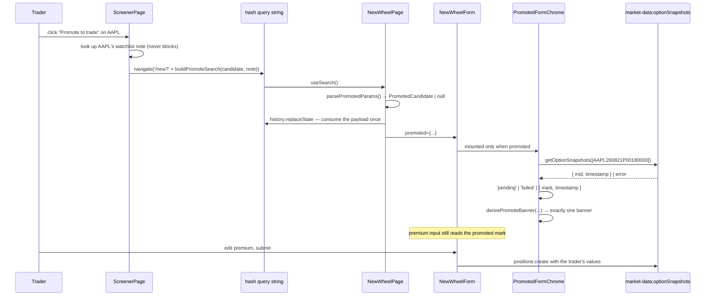
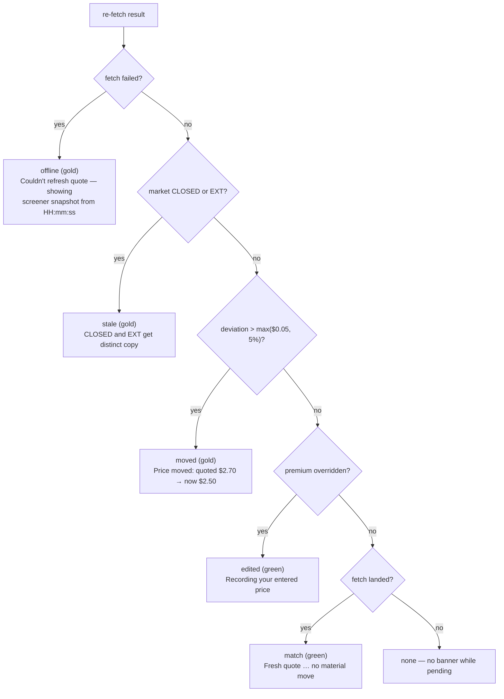

# US-68 — Promote a screener result to the new-wheel form

**Story:** `docs/epics/08-stories/US-68-promote-result-to-new-wheel.md`
**Plan:** `plans/us-68/plan.md`
**Mockup:** `mockups/us-68-promote-to-trade.mdx`

## What was built

A **Promote to trade** action on every ranked screener row. Clicking it opens the
existing US-1 new-wheel form pre-filled with the candidate's ticker, strike,
expiration, premium and `contracts: 1`, plus a `quotedAt` provenance stamp and an
optional thesis seeded from the ticker's watchlist note.

The pre-filled premium is an **editable default**, never a lock. On open, the form
re-fetches a fresh quote for that exact contract and reconciles it into a single
non-blocking banner. The re-fetch never writes into form state — the trader records
their actual fill, not the screener's snapshot — and nothing is persisted until the
trader submits the unchanged `positions:create` mutation.

**Scope note:** US-68 persists nothing new. No migration, no service change, no new
IPC surface. It is entirely renderer work stitched over four shipped seams.

## Flow

## Banner state machine

Exactly one banner, first match wins. No state ever disables submit.

`offline` outranks `stale` because it explains why no fresh time is shown. `stale`
outranks the price comparisons because a closed-market fetch "succeeds" with the
16:00 close — comparing against it would mislead.

## Key files

| Purpose                                                                         | Path                                                     |
| ------------------------------------------------------------------------------- | -------------------------------------------------------- |
| Query-string codec, moved-threshold, banner state machine + copy                | `src/renderer/src/lib/promote.ts`                        |
| Free-text input → `Decimal` guard (mid-edit values are not decided values)      | `src/renderer/src/lib/decimal-input.ts`                  |
| Local-calendar-day DTE for live form input                                      | `src/renderer/src/lib/format.ts` (`computeDteFromInput`) |
| One-shot fresh quote, degrades to `'failed'`                                    | `src/renderer/src/hooks/usePromotedQuote.ts`             |
| Banner + provenance timestamp resolution                                        | `src/renderer/src/hooks/usePromoteBanner.ts`             |
| Promoted header; owns the market-data hooks so the plain form never mounts them | `src/renderer/src/components/PromotedFormChrome.tsx`     |
| Gold "Promoted from Screener · Quoted HH:mm:ss" strip                           | `src/renderer/src/components/PromoteProvenance.tsx`      |
| Renders one banner as an `AlertBox`                                             | `src/renderer/src/components/PromotedQuoteNotice.tsx`    |
| Capital required + yield-if-flat, recomputed live                               | `src/renderer/src/components/NewWheelDerivedRow.tsx`     |
| Promoted mode (optional `promoted` prop)                                        | `src/renderer/src/components/NewWheelForm.tsx`           |
| Parses and consumes the promote payload                                         | `src/renderer/src/pages/NewWheelPage.tsx`                |
| Promote button per ranked row                                                   | `src/renderer/src/components/ScreenerResultsTable.tsx`   |
| Thesis lookup + navigation                                                      | `src/renderer/src/pages/ScreenerPage.tsx`                |
| E2E, one test per AC                                                            | `e2e/promote-to-trade.spec.ts`                           |

## Decisions worth knowing

**The payload travels on the hash query string, not global state.** This extends the
existing wouter-hash-routing-query-prefill ADR rather than introducing a store.

**It is consumed once.** wouter's hash `navigate` writes the query into the real
`location.search` and never clears it. Without an explicit consume,
the params outlive the promote and the next plain "Open Wheel" from the sidebar would
open pre-filled from a candidate nobody promoted — provenance strip, market-data
re-fetch and all. `NewWheelPage` parses into `useState` once and clears the query with
`history.replaceState` (which fires no `hashchange`, so the mount keeps what it read).
The clear is keyed off the raw `promoted` param, not the parsed result, so a
_malformed_ promote is consumed too — otherwise its `ticker=` would still pre-fill the
next plain visit, which is the same bug one branch over.

**The provenance strip and the banner deliberately show different instants.** The strip
reports the freshest mark we hold (AC: "the snapshot time updates to the fresh quote's
time"). The `offline` and `stale` banners describe the **pre-filled mark**, which is
always the screener's — so they carry `promoted.quotedAt`. Unifying them would make the
banner assert a false provenance for the value sitting in the premium field.

**Being "edited" is a property of the form, not of the banner.** The derived row's
"recomputed from your price" caption reads `isPremiumOverridden` directly. Deriving it
from `banner.kind === 'edited'` would silently drop it whenever a higher-precedence
banner (offline / stale / moved) held the single banner slot — i.e. for most of the
trading day, while the yield really had been recomputed from the trader's price.

**The promoted chrome is a component, not a branch.** `useMarketStatusDisplay` polls
broker status every 60s. Mounting it unconditionally would have added a permanent poll
to the plain US-1 form, a page that otherwise makes no market calls; scoping it inside
`PromotedFormChrome` keeps that cost on the promoted path only.

**The re-fetch never writes into form state.** No `setValue`, no `reset`. Data flows
quote → banner → JSX only. Two ACs assert the premium field still reads `2.70` after a
fresh `2.68` or `2.50` arrives.

**The moved test is `|fresh − promoted| > max($0.05, 5% of promoted)`, strict.** Both
the tick-noise floor and the relative test must be exceeded. A deviation exactly at the
threshold is silent.

**DTE is counted in local calendar days**, deliberately matching the engine's
`src/main/core/dte.ts`, _not_ the UTC arithmetic in the older `computeDte`. The UTC
basis rolls the day over at 17:00 in New York, so the promoted form would read
`36 DTE` for the screener row that just said `37` — and annualize the yield off the
wrong number.

**The fresh quote is one-shot, not a poll.** `useOptionSnapshots`'s 60s interval would
keep flipping the banner while the trader types. `gcTime: 0` ensures a second promote
of the same contract re-fetches rather than presenting the previous visit's mark as
fresh.

**Failures degrade, never block.** A rejected query, a provider outage, a symbol the
provider doesn't know, or a candidate whose OCC symbol won't build all collapse to
`'failed'` → the offline banner → a fully usable form.

## Test coverage

- 10 e2e tests in `e2e/promote-to-trade.spec.ts`: one per acceptance-criteria scenario,
  plus a regression test that a promote does not leak into the next plain visit.
  All were falsified (expected values flipped) to confirm they fail when they should.
- Unit suites for the codec, threshold, banner precedence, the hook's degrade paths,
  each chrome component, the promoted form, and both pages.
- All changed production files are at ≥95% lines and branches.
