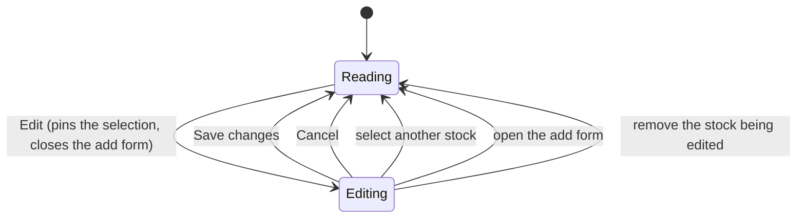

# US-69 — Edit a watchlist entry

**Story:** Linear [OPT-5](https://linear.app/optionswheel/issue/OPT-5) · **Plan:** `plans/us-69/`

## What shipped

A trader can change an existing watchlist entry's thesis and entry conditions from the
bench's stock detail panel. The ticker is fixed — renaming an entry is still remove +
re-add (US-63).

The panel gains an **Edit** button. Pressing it swaps the panel's read view for the same
form used to add a stock, pre-filled from the entry. **Save changes** writes through a new
`watchlist:update` IPC channel and invalidates the watchlist snapshot and the screener, so
the bench re-judges the stock — a stock whose only blocked gate was the one just edited
moves to _Meets criteria_ without a manual refresh. **Cancel** discards.

### Scope notes

- No migration. The `watchlist` table (`migrations/012_create_watchlist.sql`) already held
  every column this story writes; US-69 only adds a write path over them.
- `added_at` is never in the `SET` list, so an edit cannot reorder the bench.
- "The thesis seeds the promote flow" was already satisfied by US-96's Review-trade
  handoff. It is covered here as a regression guard, not as new work.

## Layers

| Layer            | File                                              | Change                                                                                      |
| ---------------- | ------------------------------------------------- | ------------------------------------------------------------------------------------------- |
| Payload schema   | `src/main/schemas.ts`                             | `WatchlistEntryFieldsSchema` extracted; one `WatchlistEntryPayloadSchema` for both channels |
| Service          | `src/main/services/watchlist.ts`                  | `updateWatchlistEntry`; `toStoredFields` shared with add                                    |
| IPC              | `src/main/ipc/watchlist.ts`                       | `watchlist:update` via `handleIpcCall`                                                      |
| Preload          | `src/preload/index.ts`, `index.d.ts`              | `watchlist.update` bridge + types                                                           |
| Renderer adapter | `src/renderer/src/api/watchlist.ts`               | `updateWatchlistEntry`, `WatchlistEntryPayload`                                             |
| Mutation hooks   | `src/renderer/src/hooks/useBenchMutation.ts`      | shared invalidation; `useUpdateWatchlistEntry` added, add/remove collapsed onto it          |
| Form schema      | `src/renderer/src/schemas/watchlist.ts`           | the AC's exact 500-character message                                                        |
| Form             | `WatchlistAddForm.tsx` → `WatchlistEntryForm.tsx` | one component, two modes                                                                    |
| Detail panel     | `src/renderer/src/components/BenchDetail.tsx`     | `onEdit` + the **Edit** button                                                              |
| Panel swap       | `src/renderer/src/components/BenchGrid.tsx`       | read view ↔ form, keyed by ticker                                                           |
| Page state       | `src/renderer/src/pages/WatchlistPage.tsx`        | `editing` state and its transitions                                                         |

### Design decisions worth keeping

**One form, two modes.** Adding and editing ask for exactly the same things, so
`WatchlistEntryForm` handles both rather than two components drifting apart. The only
differences are the ticker (an input when adding, fixed text when editing), which mutation
Save calls, and the footer's buttons. Add mode keeps every `id` and `data-testid` it had,
because `e2e/watchlist.spec.ts` drives them.

**A full replacement, not a patch.** `WatchlistEntryPayload` makes every editable field
required, so a caller cannot accidentally omit a field and leave a cleared value standing.
Removing a condition is simply that field arriving as `null`.

**Which panel content to show is derived, not stored.** `BenchGrid` renders the form when
`editing === current.ticker` and the read view otherwise. There is no second piece of state
that could disagree about which stock is being edited, so leaving a stock cannot leave a
form open over a different stock's detail.

**Editing a stock selects it.** The Edit button is reachable on the stock the bench
_defaulted_ to, which the trader never clicked, so `handleEdit` sets `selected` as well as
`editing`. Without that, a background snapshot refetch that re-sections the bench moves
`defaultSelection` to another ticker, the panel stops matching `editing`, and the open form
unmounts — discarding what was typed with nothing said.

**The price seed is never rounded.** Nothing upstream caps `ownBelowPrice` at 2dp, and a
save replaces the field outright. Seeding the input with `toFixed(2)` would let someone who
opened the form to fix a typo in the thesis silently rewrite a `170.125` trigger to
`170.13`. `seedPrice` shows 2dp only when that is lossless.

**Edit-mode ticker errors go to the form alert.** There is no ticker input in edit mode for
a `ticker`-field error to bind to, so `not_found` surfaces as the form-level `ErrorAlert`
rather than failing silently. The body is read through an optional chain, so a rejection
that never reached the `{ ok, errors }` envelope surfaces as the generic copy instead of
throwing inside the error handler.

**The saved entry is seeded into the cache before the refetch is asked for.**
`invalidateQueries` is not awaited and the panel is handed back the moment the mutation
settles, so without seeding, the trader watches their old thesis reappear for the length of
a full re-quote. `useUpdateWatchlistEntry` writes the returned record into the cached
snapshot row; only the entry, never the verdict, which is the engine's answer against fresh
market data and is left for the refetch.

**One payload shape for both channels.** `WatchlistEntryPayload` (renderer) and
`WatchlistEntryPayloadSchema` (main) serve add and update alike, so `onSubmit` builds one
literal rather than two that differed only in spelling absence as `undefined` vs `null`.
`toStoredFields` normalises `undefined`, `null` and `''` to the same stored `NULL`.

**The thesis counter measures what the resolver measures.** Both trim first, so a paste
that trims back under the bound can no longer read a red `505 / 500` beside a note that
saves fine.

**The thesis textarea dropped its `maxLength`.** Truncating at 500 silently would let a
trader believe a long thesis saved whole; the counter turns red and the resolver rejects.

## The save path

```mermaid
sequenceDiagram
    participant T as Trader
    participant P as BenchDetail / BenchGrid
    participant F as WatchlistEntryForm
    participant H as useUpdateWatchlistEntry
    participant I as watchlist:update (IPC)
    participant S as updateWatchlistEntry
    participant DB as SQLite

    T->>P: Edit
    P->>F: mount with entry (key = ticker)
    F-->>T: thesis + conditions, ticker fixed
    T->>F: change a condition, Save changes
    F->>F: zodResolver (500-char bound, value bounds)
    F->>H: mutate(full replacement payload)
    H->>I: window.api.watchlist.update
    I->>I: WatchlistEntryPayloadSchema.parse
    I->>S: updateWatchlistEntry(db, payload)
    S->>DB: UPDATE watchlist SET ... WHERE ticker = ?
    Note over S,DB: added_at untouched — the bench keeps its order
    DB-->>S: changes === 0 → ValidationError(ticker, not_found)
    S-->>I: WatchlistEntryRecord
    I-->>H: { ok: true, entry }
    H->>H: seed the saved entry into the cached snapshot row
    H->>H: invalidate watchlist, watchlist/snapshot, screener/results
    H-->>F: onSuccess
    F->>P: onSaved → editing = null
    Note over P: snapshot refetches; core/watchlist-signal re-judges;<br/>lib/bench re-sections the cards
```

## The page's editing state



## Verification

- `e2e/watchlist-edit.spec.ts` — one `it()` per acceptance scenario, ten in all, each named
  verbatim from the story. Drivers `openEdit` / `saveEdit` added to `e2e/screener-helpers.ts`.
- `e2e/watchlist.spec.ts` (11) and `e2e/watchlist-bench.spec.ts` (33) stay green, no test
  renamed.
- Unit/integration coverage is 100% lines and branches on all 13 files this story changed.
  (The scraper fix below is the 14th changed file; its own added lines are covered, but the
  file carries pre-existing uncovered error paths that predate this branch.)
- Logging: DEBUG `watchlist_update_input` before the write, INFO `watchlist_entry_updated`
  after. Nothing added under `src/main/core/`.

## Unrelated fix carried in this branch

`src/main/integrations/barchart-ivr-scraper.ts` read the app version with
`require('../../../package.json')` under `createRequire(import.meta.url)`. That depth is
right for the module's source location but not for the bundled `out/main/index.js`, so the
built main process threw at import and **every** e2e spec timed out at launch. The lookup
now walks up to the first `package.json`, which is correct from either location. This was
pre-existing on `main` and is not part of US-69.

## Known advisories, not applied

- `addWatchlistEntry` hand-assembles its return value while `updateWatchlistEntry`
  re-SELECTs through `mapRow`. Now that `SELECT_ONE_QUERY` exists, add could end the same
  way and the hand-assembled object would disappear.
- `useBenchMutation` names `watchlistQueryKeys.snapshot` although `watchlistQueryKeys.all`
  already covers it by prefix — deliberate, per its docblock, and insurance against the key
  layout changing.
- `barchart-ivr-scraper.ts` sits at 91.0% lines / 76.7% branches on pre-existing untested
  error paths (session fetch failure, HTTP 429, missing XSRF cookie). The lines this branch
  added there are covered; the shortfall predates it.

### Considered and rejected

- A review round called `handleRemove`'s `if (editing === ticker) setEditing(null)` dead,
  on the grounds that a removed ticker can never be the panel's `current`. It is not dead:
  `removeMutation.mutate` is asynchronous, so the card stays on the bench for the whole IPC
  and refetch round trip. Removing the guard leaves the edit form open over a stock already
  being deleted, and drops the `WatchlistPage.test.tsx` case that pins it.
