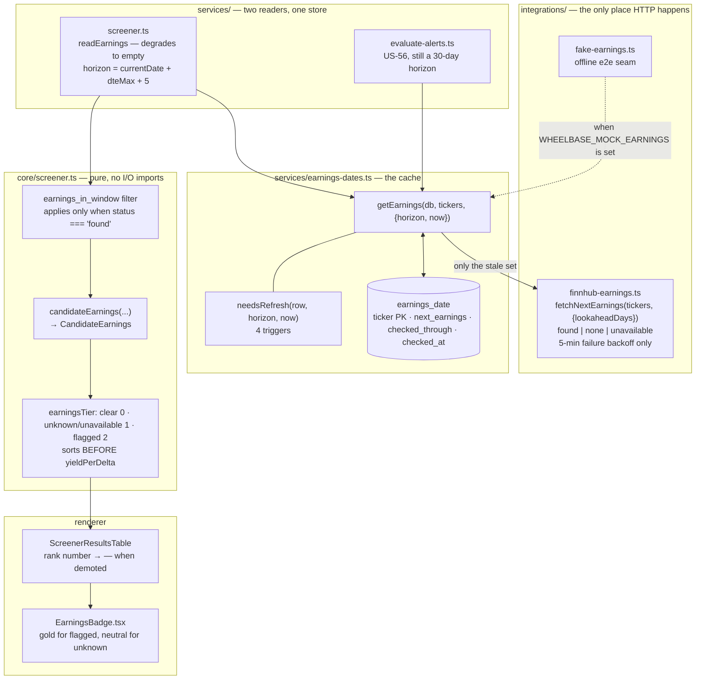
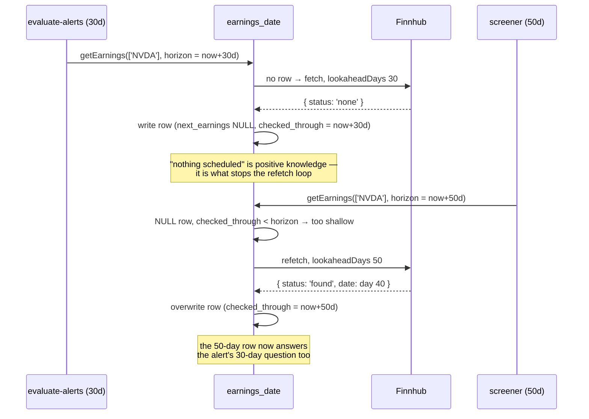
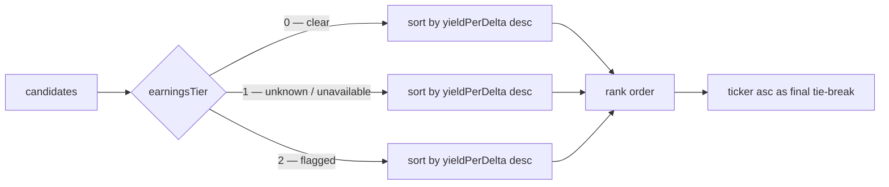

# US-70 — Warn when a candidate has earnings within the DTE window

## What shipped

The screener now knows when a candidate's earnings print lands before its contract
expires, and says so. Selling a cash-secured put into earnings is selling a binary
event: a bad print can gap the underlying 15–20% overnight, and the premium looks fat
_because_ pre-earnings IV is elevated — which means US-65's yield-per-delta rank would
actively surface these as the best candidates unless earnings is handled first.

Three behaviours, in the order a trader meets them:

1. **Exclude (default).** An earnings date on or before expiry drops the candidate with
   the reason `earnings 2026-07-31 falls on or before expiry`. A high yield never
   rescues it — this is a hard filter in the pure engine.
2. **Flag (opt-in).** The same candidate stays, carries
   `⚠ Earnings Jul 31 · 21d before expiry`, and sorts below every clean candidate
   regardless of score.
3. **Unknown is never a filter.** A calendar with no event, or one that could not be
   read at all, produces a visible caution — `? Earnings date unknown` /
   `? Earnings date unavailable` — and a demotion, never an exclusion.

That third point is the story's centre of gravity. The pre-existing feed returned
`Record<string, string>` and simply **omitted** the ticker for both a null date and a
caught error, collapsing "there is no earnings risk" with "we could not check". On a
free-tier vendor with real coverage gaps, that reads as a clean bill of health. Hard
excluding on unknown would be worse still: one expired API key would silently empty the
results table with no indication the screener was broken rather than the market.

## Scope of change beyond the screener

This was not a pure add-on. Two prerequisites in the shared Finnhub module had to land
first, and US-56's alert consumer had to move with them:

- **Lookahead was hard-coded to 30 days**, sized for US-56's ~7-day alert horizon. The
  screener's DTE window runs to 45+, so an earnings date at day 31–45 returned no event
  and rendered "unknown" — the exact silent pass this story exists to prevent.
  `lookaheadDays` is now caller-supplied.
- **The four-state result.** `fetchNextEarningsDates` → `fetchNextEarnings`, returning
  `EarningsLookup` per ticker, with an entry for **every** requested ticker. A missing
  key is no longer a valid outcome.

## Architecture

The engine owns `EarningsLookup`. That is a deliberate inversion of what the plan
sketched (which put the type in the integration): `core/` must import nothing from
`integrations/`, and the precedent already existed — `IvRank` lives in
`core/screener.ts` and `services/ivr-snapshots.ts` conforms to it. The Finnhub feed
re-exports the type so callers of the feed can still name its return shape.

## Persistence — why a new table

The feed's 12-hour in-memory success cache is **gone**, replaced by `earnings_date`.
The old cache was process-local, so a desktop app lost every answer on restart and a
cold screener run issued one HTTP request per watchlist ticker against a 60 req/min free
tier. The table also lets the two consumers share answers: a date the alert scheduler
fetched satisfies the screener's next run, and vice versa.

Only the **failure** backoff stays in memory (5 minutes). A failed fetch is not
knowledge about the ticker, so it is never written — but a rate-limited symbol still
must not be re-hammered every 60 seconds by the scheduler.

### `checked_through` is what makes one row serve two horizons

A stored `next_earnings = NULL` from a 30-day request does **not** answer the 50-day
question — there may well be an event at day 40. Recording the `to` bound the row was
built from is what lets a shallow row be reused when it carries a date and re-fetched
only when its `NULL` is too shallow for the caller. This replaced a composite
`${ticker}:${lookaheadDays}` cache key, which would have split the two consumers into
separate slots and doubled request volume.

### The four refresh triggers

A ticker is fetched only when one of these holds — everything else is served from the
table with no HTTP call:

1. no row exists, **or**
2. `next_earnings` is non-null and earlier than today — the print has happened, so the
   next one is unknown, **or**
3. `next_earnings` is null and `checked_through < horizon` — we did not look far enough
   to answer this caller, **or**
4. `checked_at` is older than 7 days — the revision backstop.

Rule 4 exists because Finnhub dates are estimates that move; a purely event-driven rule
would hold a revised date indefinitely. Seven days bounds the drift at roughly twelve
refreshes per ticker per year instead of one per run, and the exposure it leaves is
narrow: a revision only changes a verdict if it crosses the expiry boundary.

## Ranking — tier before score

`earningsTier(a) - earningsTier(b)` is prepended to the comparator, ahead of
`compareYieldPerDelta`. The story's fixture is the proof: NVDA at 0.69 with an unknown
date ranks **below** MSFT at 0.50 with a clear one. Score orders within a tier and never
across one, because pre-earnings IV inflation is exactly what lifts a risky candidate up
the score in the first place.

`unknown` and `unavailable` deliberately share tier 1 — the trader's next move is the
same for both: go look it up. Only their badge copy differs.

Demoted rows render `—` in the rank cell rather than a number, matching the mockup's
`rank: null` rows. The number would claim a standing among the clean candidates that
the tier explicitly denies; the score stays reachable through the same `title` tooltip.

## Failure isolation

Per the [alert-evaluation-failure-isolation ADR](spec/architecture/02-adrs/alert-evaluation-failure-isolation.md),
no earnings failure may suppress anything else:

| Failure                          | Degrades to                                                                       |
| -------------------------------- | --------------------------------------------------------------------------------- |
| One ticker's HTTP request throws | that ticker `unavailable`, every other ticker's real result intact                |
| The whole store read rejects     | every candidate `unavailable`, `status: 'ok'`, full ranked list, nothing excluded |
| No API key                       | every requested ticker `unavailable`, one warn per process                        |
| DB read fails inside the store   | fetch for every ticker, warn, run continues                                       |

Two mechanisms carry this and are easy to break:

- The **per-ticker `try/catch` inside the `mapWithConcurrency` callback.** The helper
  joins its workers with `Promise.all`, so a throw escaping the callback rejects the
  entire batch — it is _less_ forgiving than the bare `Promise.all` it replaced. That
  `catch` is the only thing isolating a single 429, and it also owns the backoff write
  and the classified `failureCode` log.
- **`readEarnings`'s degrade-to-empty.** A missing entry defaults to `unavailable`, never
  to "no earnings" — absence of an answer must not read as absence of risk.

`readEarnings`, `readIvRanks`, and `readUnderlyingPrices` now share a shape, and were
deliberately **not** unified behind one helper: they carry three different failure
semantics (unknown IVR is a display gap; a missing price leaves that ticker's ceiling
unevaluated; missing earnings is a per-candidate caution) that only look alike.

## Key files

| File                                                         | Change                                                                                                                                                                                   |
| ------------------------------------------------------------ | ---------------------------------------------------------------------------------------------------------------------------------------------------------------------------------------- |
| `src/main/core/screener.ts`                                  | `EarningsLookup`, `CandidateEarnings`, `candidateEarnings`, `earningsTier`; `earnings_in_window` guard now requires `status === 'found'`; `ScoredCandidate.earningsFlagged` → `earnings` |
| `src/main/integrations/finnhub-earnings.ts`                  | `fetchNextEarnings` with `lookaheadDays`; four-state result for every ticker; success cache removed, failure backoff kept                                                                |
| `src/main/integrations/fake-earnings.ts`                     | **new** — offline e2e seam, honours `lookaheadDays` like the live feed                                                                                                                   |
| `src/main/services/earnings-dates.ts`                        | **new** — read-through store, `needsRefresh`, upsert                                                                                                                                     |
| `migrations/013_create_earnings_date.sql`                    | **new** — one row per ticker, no history                                                                                                                                                 |
| `src/main/services/screener.ts`                              | `readEarnings`, `ScreenContext.earnings`; the one place DTE window → horizon date                                                                                                        |
| `src/main/services/evaluate-alerts.ts`                       | US-56 reads through the store; keeps its 30-day horizon                                                                                                                                  |
| `src/preload/index.d.ts`, `src/renderer/src/api/screener.ts` | `IpcCandidateEarnings` / `ScreenerCandidateEarnings` replace `earningsFlagged`                                                                                                           |
| `src/renderer/src/components/EarningsBadge.tsx`              | **new** — gold for `flagged`, neutral for `unknown`/`unavailable`                                                                                                                        |
| `src/renderer/src/components/ScreenerResultsTable.tsx`       | badge in the ticker cell; `—` in the rank cell when demoted                                                                                                                              |

`src/main/ipc/screener.ts` needed no change — it stays a thin `handleIpcCall` over one
service call and never names a candidate field.

## Breaking change

`earningsFlagged: boolean` is **removed**, not deprecated alongside `earnings`. It had
exactly one reader, which never rendered it, so carrying both would have left dead
surface behind.

## Out of scope

- **BMO/AMC timing and confirmed-vs-estimated flags.** Finnhub's rows carry an `hour`
  field the module strips, and the free tier exposes no confirmation flag. Judging an
  AMC print on expiration Friday as harmless is a real refinement but needs a verified
  live payload behind it.
- Ex-dividend and other corporate-event badges.
- Earnings badges on watchlist rows (US-96 — same source, different surface).
