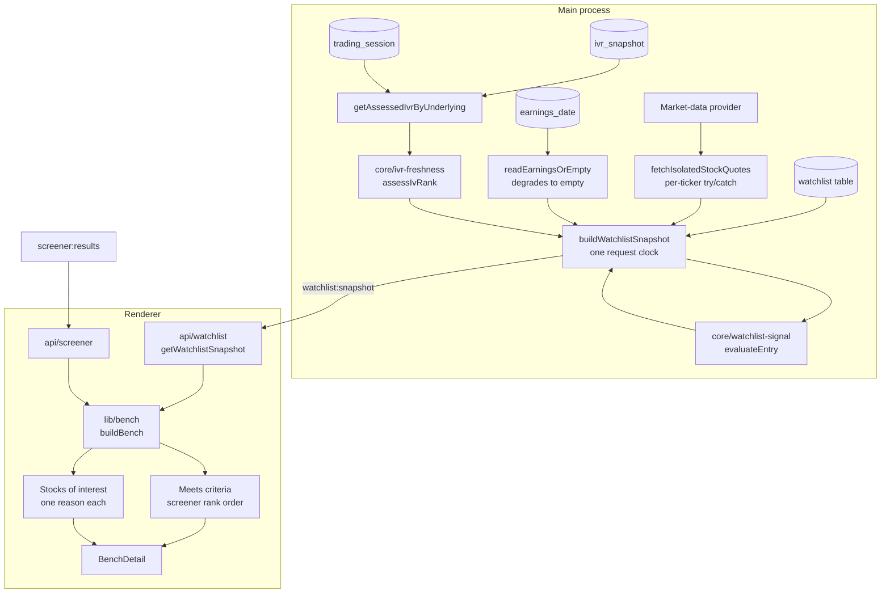
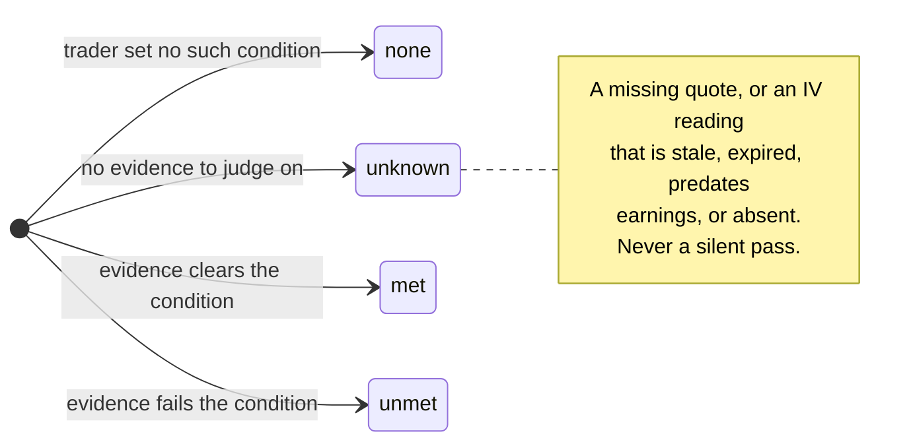

# US-96 — One live bench: the watchlist and screener on a single page

## Overview

Implements `plans/us-96/plan.md`. Epic 08 had shipped the bench in two halves: the Watchlist
page held the names and the conditions a trader was waiting for, while the Screener page
pulled chains for those names and ranked the best put per ticker. Reading the bench meant
reading two pages and doing the join in your head — _is this name ranked, and does it also
satisfy my own entry conditions?_

This change folds the two into one page at `/watchlist`. Every watchlist entry becomes a
card carrying its live price and an age-assessed IV rank, and the bench splits into **Meets
criteria** (every saved condition passes on a usable IV reading _and_ the screener found a
qualifying put) and **Stocks of interest** (everything else, each carrying the reason it is
held back). Selecting a card opens a sticky detail panel with the thesis, each condition's
verdict, the earnings date, and — for a name that meets criteria — the matching put and a
**Review trade** handoff into the pre-filled new-wheel form.

The rule that ties it together is US-98's: **an unusable reading is an unknown, and an
unknown never decides anything.** A stale, expired, or earnings-predating IV rank cannot
satisfy an `IVR ≥ N` condition, so a stale-rich reading can never promote a name into Meets
criteria.

The standalone Screener page and its nav item are retired.

## Scope delivered

**Main process**

- `src/main/core/watchlist-signal.ts` — new pure verdict engine (`evaluateEntry`,
  `reasonsFor`, `allGatesPass`, `earningsDisplay`). No I/O, so future alerting can call it.
- `src/main/core/ivr-freshness.ts` — `expired` becomes a fifth `IvRankState` carried on an
  assessed reading instead of collapsing to `null`; `IvRankAssessment` drops to two variants.
- `src/main/services/watchlist-snapshot.ts` — new `buildWatchlistSnapshot`, the read-only
  bench snapshot.
- `src/main/services/underlying-quotes.ts` — new `fetchIsolatedStockQuotes`, shared with the
  screener.
- `src/main/services/earnings-horizon.ts` — new `readEarningsOrEmpty`, shared with the
  screener; owns the lookahead buffer that both callers had duplicated.
- `src/main/ipc/watchlist.ts` — adds the `watchlist:snapshot` channel; retires the now-unused
  `watchlist:list`.
- `src/main/index.ts` — the watchlist and screener channels now share one clock.

**Renderer**

- `src/renderer/src/lib/` — `bench.ts` (the snapshot↔screener join), `day-change.ts`,
  `bench-conditions.ts`, `ivr-tooltip.ts`.
- `src/renderer/src/components/` — `BenchCard`, `BenchSection`, `BenchGrid`, `BenchDetail`,
  `BenchHeader`, `MatchingPutCard`, `ReadingNote`, `GateBadge`, `MarketDataOutage`,
  `FreshnessRing`, `ui/tooltip.tsx`.
- `src/renderer/src/pages/WatchlistPage.tsx` — rewritten as the combined page.
- `src/renderer/src/hooks/useWatchlistSnapshot.ts` and the two mutation hooks, which now
  invalidate the bench.

**Deleted**

`pages/ScreenerPage.tsx`, `components/ScreenerResultsTable.tsx`,
`components/ScreenerExcludedSection.tsx` (and their tests), `hooks/useWatchlist.ts`, the
renderer's `listWatchlist` adapter, and the `watchlist:list` channel with its preload binding.

## How a bench row is built

A stock reaches **Meets criteria** only when all three hold: every gate is `met` or `none`,
the screen actually ran, and a ranked candidate exists for that ticker.

## The gate rules

Each entry carries up to three conditions. Each yields a verdict and, when it is holding the
stock back, a trader-facing label.

Reasons are listed in precedence order **earnings → price → IV**, because an imminent print
keeps a trader out whatever the price, and a price miss outranks an IV reading.

## Notable decisions

- **`expired` is a reading, not an absence.** It reaches the renderer carrying its value and
  age so the trader sees `exp` rather than the same `n/a` a never-collected ticker shows.
  `isUsableState` is unchanged, so the screener still never scores on it.
- **Failure isolation throughout.** An unconfigured provider, a single ticker's quote, the
  earnings store, and the IVR read each degrade to "unknown" for what they feed, never to a
  failed snapshot. All five guarantees in `plans/us-96/contracts/watchlist-snapshot.md` are
  asserted at the service boundary.
- **The verdict engine is pure**, so future alerting can call it without a page being open.
- **The renderer mirrors two small rules** (`reasonsFor`, `allGatesPass`) from the engine
  because it cannot import from `src/main/`. The pair is documented on both sides. See the
  advisory below.
- **An outage does not blame the criteria.** When no screen ran, the empty Meets section says
  it is waiting for market data rather than telling the trader to loosen a delta band that
  rejected nothing.

## Verification

| Check                     | Result                                  |
| ------------------------- | --------------------------------------- |
| `pnpm test`               | 213 files, 2869 tests                   |
| `pnpm test:e2e`           | 33 files, 322 tests                     |
| Acceptance criteria       | 33 of 33, one named e2e test each       |
| Coverage on changed files | 35 of 35 at or above 95% lines/branches |
| `pnpm lint`, `typecheck`  | clean                                   |

Fixture numbers in the e2e suite are pinned through the real scoring engine in
`src/main/core/screener.test.ts` (US-66 ADR), never hand-computed.

## Known advisories, not applied

- `lib/bench.ts` mirrors `reasonsFor` / `allGatesPass` across the process boundary. Putting
  `reasons` and `gatesPass` on the IPC payload would delete the duplication outright.
- The quote fetch issues one request per ticker; the provider's signature takes an array.
  This now runs on every page load and window focus.
- Five parallel per-tier tables span four files; one exported tier descriptor would collapse
  them.
- One Radix `TooltipProvider` per cell rather than one near the root.
- `asOf` and `SnapshotQuote.timestamp` are carried end to end and never rendered.
- The add form flashes during the snapshot's first load, and `screened` is false while
  loading as well as after an outage.
- `--wb-sky-dim`, used by `AlertBox`'s `info` variant, is not a defined token (pre-existing).
