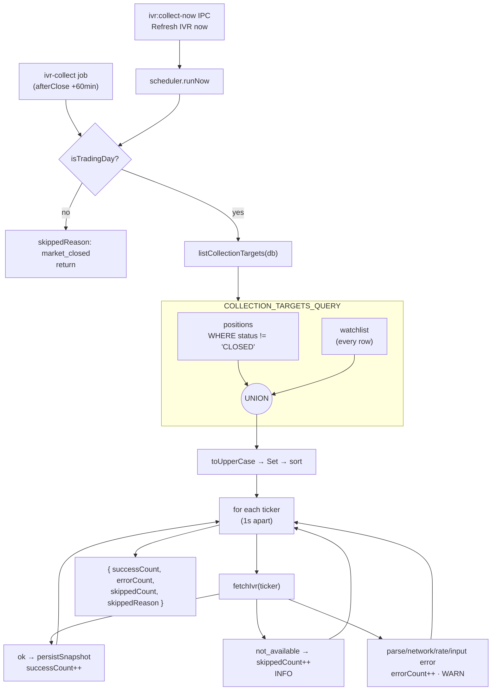

# US-97 Implementation

This document captures the verified US-97 implementation from `plans/us-97/plan.md`: widening the nightly IVR collection targets from open positions only to the **union of open positions and the watchlist**, so IV rank is populated for the bench names the screener actually ranks.

## Why

IV rank is how a premium seller decides whether selling a put on a name is worth the capital at all — a decision made _before_ a position exists. But the US-44 collector picked its targets from `positions` alone, so every watchlist-only candidate joined the ranked list with `ivRank: null`. US-65 wired the field, US-96 builds acceptance criteria on it, and US-67's IV-rank floor could never fire on a bench name because those names had no reading to compare. This story closes the collection gap.

## Scope Implemented

- **Collection targets** (`src/main/services/ivr-collector.ts`) — `ACTIVE_UNDERLYINGS_QUERY` became `COLLECTION_TARGETS_QUERY`, a `UNION` of open-position tickers and every `watchlist` row; `listActiveUnderlyings` was renamed `listCollectionTargets`. The existing `toUpperCase()` → `Set` → `localeCompare` pipeline is untouched and is what guarantees a ticker that is both held and watchlisted is fetched exactly once.
- **Little downstream changed.** `persistSnapshot`, `isTradingDay`, the `ivr-collect` scheduler registration, and the `ivr:collect-now` IPC are all target-agnostic — widening the list was the core production change. (The collector's own `sleepBetweenRequests` was removed in review hardening: the scraper's internal 1 req/s limiter is the single pacing boundary.)
- **Unit tests** (`src/main/services/ivr-collector.test.ts`) — the old `selects distinct active-position tickers only …` test was rewritten as `collects the union of open-position and watchlist tickers, distinct and sorted`, plus five new cases: closed-but-watchlisted, held-and-watchlisted (single fetch), removal (no new row, prior row kept), uncovered-ticker skip accounting, and network-error isolation across a mixed batch.
- **Manual-trigger pending state** (`src/renderer/src/pages/SettingsPage.tsx`) — the run now grows by roughly one second per watchlist name, so `Refresh IVR now` is disabled while `collectIvrNow.isPending` and reads `Refreshing IVR…`. No progress bar, no second mechanism. (Review hardening later added the scheduler-level guard too: `runNow` joins an in-flight run, so scheduled and manual runs can never overlap.)
- **Per-ticker failure isolation** (`src/main/services/ivr-collector.ts`) — the collection loop now wraps each ticker in `try/catch`, counting a thrown failure as an error with its own WARN (`IVR collection threw for ticker`, logged under the `err` key — the only key pino serializes an `Error` for). This closes a pre-existing gap against CLAUDE.md's batch-job isolation rule that this story materially widens: `fetchIVR` parses the response body outside a `try`, so a non-JSON body (interstitial, captcha, HTML error) _rejects_ rather than returning a status, and `PollingScheduler.runHandler` catches a rejected handler and returns `undefined` — so before this fix one bad ticker cost the nightly run every ticker after it, and left the manual trigger with no summary at all. Bench names are likelier to provoke exactly those odd responses than names the trader already holds.
- **E2E harness cleanup** (`e2e/screener-helpers.ts`, `e2e/ivr-helpers.ts`) — `seedIvr` no longer seeds a throwaway active CSP per ticker to trick the collector into reaching it; the tickers are already on the watchlist. `seedWatchlist` moved to `ivr-helpers.ts` (screener-helpers already imports from it, not the reverse), joined by new `removeFromWatchlist` and `seedClosedPosition` helpers, both driving production IPC only. `seedIvr` also gained `assertIvrTickersCollectible`, which fails loudly if an `ivr` key is not a fixture ticker — such a ticker is not on the watchlist, so programming an outcome for it would now persist nothing at all, silently. Six call sites in `e2e/screener-earnings.spec.ts` that were asking for such inert rows were narrowed to the tickers they actually screen.
- **Acceptance spec** (`e2e/ivr-watchlist-collection.spec.ts`) — one `it()` per acceptance criterion, nine in total. The two screener ACs assert `positions:list` is empty, so "with no position in the database at all" — the entire point of the story — is a property the tests enforce rather than a property of the current harness.

## No Migration

`watchlist` (US-63, `migrations/012_create_watchlist.sql`) and `ivr_snapshot` (US-44, `migrations/007_create_ivr_snapshot.sql`) both already existed. No schema change, no new dependency.

## Selection Logic

```sql
SELECT ticker FROM positions WHERE status != 'CLOSED'
UNION
SELECT ticker FROM watchlist
```

`UNION` (not `UNION ALL`) keeps the row set small before the in-memory `Set`; SQL de-duplicates case-sensitively, and the `toUpperCase()` that follows closes the `spy`/`SPY` gap.

| on watchlist | open position | closed position only | collected? | via       |
| ------------ | ------------- | -------------------- | ---------- | --------- |
| yes          | no            | —                    | yes        | watchlist |
| yes          | yes           | —                    | yes, once  | both arms |
| yes          | no            | yes                  | yes        | watchlist |
| no           | yes           | —                    | yes        | positions |
| no           | no            | yes                  | no         | —         |
| no           | no            | no                   | no         | —         |

## Deliberate Consequence: the IV-rank floor now bites

US-67's `iv_rank_floor` (`src/main/core/screener.ts`) only applies when `ctx.ivRank !== null`. Before this story a watchlist-only ticker always read `null`, so the floor could never exclude it. Now a bench name with a thin IVR **will** drop out of the ranked list when the floor is enabled — which is exactly what the floor was asked to do. This is covered by an acceptance criterion, not an accident.

## Flow



Per-ticker outcomes are isolated inside the loop — both _returned_ error statuses and _thrown_ fetch failures are counted there, so one bad ticker never aborts the batch. That matters more now that the batch spans speculative bench names Barchart is likelier not to cover. A `persistSnapshot` throw is deliberately NOT isolated: a failing DB write is systemic and aborts the run as a run-level failure. Pacing is delegated to the scraper's internal 1 req/s limiter; the loop adds no sleep of its own.

## Key Files

- `src/main/services/ivr-collector.ts`
- `src/main/services/ivr-collector.test.ts`
- `src/renderer/src/pages/SettingsPage.tsx`
- `src/renderer/src/pages/SettingsPage.test.tsx`
- `e2e/ivr-helpers.ts`
- `e2e/screener-helpers.ts`
- `e2e/ivr-watchlist-collection.spec.ts`
- `plans/us-97/tasks.md`

## Operational Note

Collection is sequential, paced by the scraper's internal 1 req/s rate limiter, so the after-close run grows by roughly `max(1s, latency)` per watchlist name — a 25-name watchlist turns a 5-name run into a ~30 second run. That is fine for a job firing 60 minutes after close, but it argues against letting the watchlist grow unbounded without revisiting the pacing. On quit, an `AbortSignal` stops the loop at the next ticker boundary so a long batch cannot stall shutdown.

## Out of Scope (carried forward)

- **Staleness handling** — `getLatestIvrByUnderlying` returns the newest row regardless of age, so a ticker dropped from the watchlist still reports its last known IVR with no age signal. Deciding the tolerance and UI treatment is its own story.
- No backfill: the first run after this ships produces the first snapshot for existing watchlist names.
- The `readIvRanks` doc comment in `src/main/services/screener.ts` and US-98's Out of Scope both still say IVR is "display-only and never a hard filter". Both predate US-67's floor and need a docs pass.
