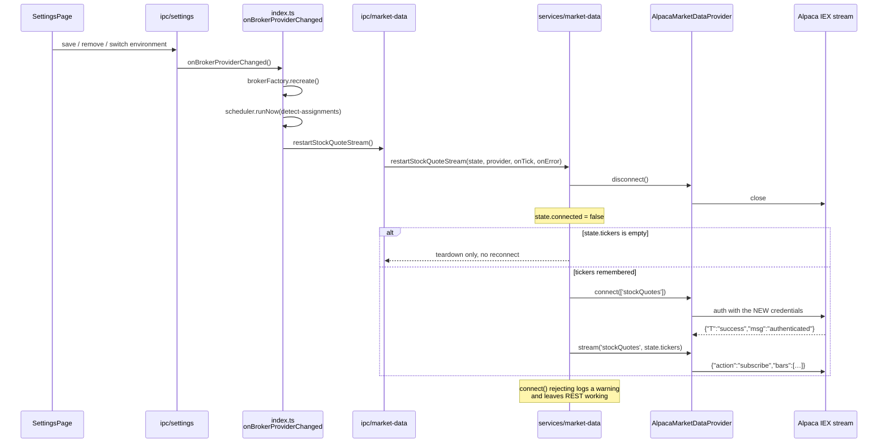
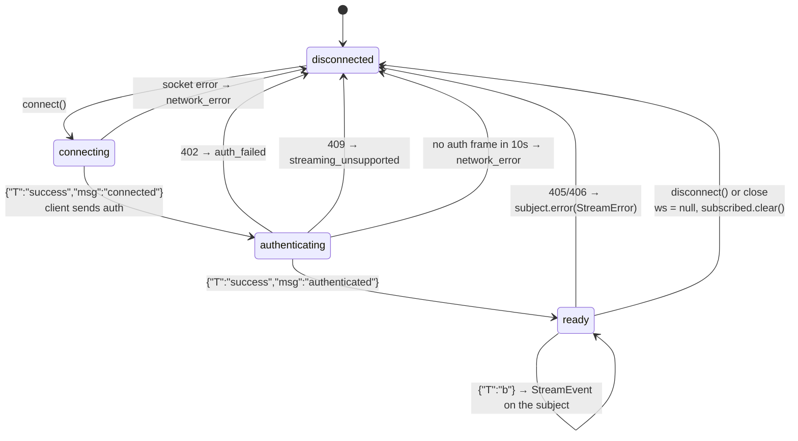
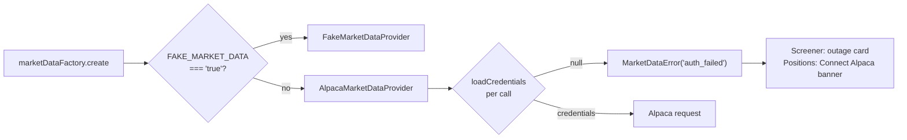

# US-99 — Alpaca as the sole market-data provider

Replaces `MassiveMarketDataProvider` with `AlpacaMarketDataProvider`, serving the whole
`MarketDataProvider` interface from Alpaca's free data plan. Massive's code, env var, settings
section, connection-test button and user-facing copy are gone: `grep -rni massive src e2e
.env.example` prints nothing.

Plan: `plans/us-99/plan.md` · Vendor contract: `plans/us-99/contracts/alpaca-market-data.md` ·
Mappings and fixtures: `plans/us-99/data-model.md`

## Why

Massive was a second vendor, a second key, and a second failure mode for data the trader's
existing Alpaca credentials can already serve. One vendor means one credential story
("Connect Alpaca") and one outage story.

## What changed

### The provider

`AlpacaMarketDataProvider` resolves credentials on **every** REST call and inside `connect()`
— it never caches them — so a credential change needs no object rebuild for the REST paths.
Four Alpaca surfaces back the one interface:

| Interface method         | Alpaca surface                                                                           |
| ------------------------ | ---------------------------------------------------------------------------------------- |
| `getStockQuotes`         | one batched `GET /v2/stocks/snapshots?symbols=…&feed=iex`                                |
| `getOptionChainSnapshot` | `GET /v1beta1/options/snapshots/{underlying}?feed=indicative`, joined with open interest |
| `getOptionSnapshot`      | `GET /v1beta1/options/snapshots?symbols={contractId}&feed=indicative`                    |
| `connect` / `stream`     | `wss://stream.data.alpaca.markets/v2/iex`, per-symbol `bars` subscriptions               |

Open interest is not on the data API at all — it comes from the **trading** API
(`/v2/options/contracts`), whose host is per-environment. That second call is wrapped in its
own `try/catch`: a contracts outage degrades every strike to `openInterest: null` and logs a
warning rather than failing the chain pull.

The file is split in two so the vendor quirks can be pinned without a socket or a fetch stub:

- `alpaca-market-data-mappers.ts` — pure. Vendor response types, URL builders, and the
  mappings onto `StockQuote` / `OptionSnapshot` / `OptionChainQuote`. No I/O.
- `alpaca-market-data.ts` — the class. HTTP, retry, websocket lifecycle, subscription state.

### Streaming and the credential-change restart

Alpaca authenticates a websocket **once**, at connect. New keys therefore require a full
teardown and reconnect — unlike REST, which picks them up on the next request. `StreamState`
gained a `tickers` field so the restart can replay the last subscription without the renderer
re-issuing `set-stock-quote-tickers`.

The websocket lifecycle, including the paths that keep REST alive when streaming is not
entitled:

`connect()` rejecting is not fatal: `subscribeToStockQuotes` catches it, logs, and returns —
REST quotes keep flowing (AC6).

### Settings and credential status

`CredentialStatus` lost `massive` / `massiveLastCheckedAt` and gained `marketData`, derived
rather than stored: `activeBrokerEnv !== 'none' ? 'configured' : 'missing'`. There is no
market-data connection test any more — the Alpaca credential cards already have one, and it
is the same key. `TestConnectionPayloadSchema` is now `z.literal('alpaca')`, so a stale
renderer sending another vendor gets a Zod error rather than a silent no-op.

The factory **never throws**. Previously an unconfigured app failed at `create()`; now it
always builds a provider and each call raises `MarketDataError('auth_failed')`, which is what
lets Positions show its "Connect Alpaca" banner and the screener its outage card instead of
crashing (AC4).

## Key files

| File                                                  | Change                                                                |
| ----------------------------------------------------- | --------------------------------------------------------------------- |
| `src/main/integrations/alpaca-market-data.ts`         | **new** — the provider: HTTP, retry, websocket, subscription state    |
| `src/main/integrations/alpaca-market-data-mappers.ts` | **new** — pure vendor↔domain mappings, URL builders, frame parsing    |
| `src/main/integrations/alpaca-credentials.ts`         | **new** — `loadAlpacaCredentialsFromEnv`, shared by both factories    |
| `src/main/integrations/alpaca-hosts.ts`               | **new** — the per-environment trading host map, shared with settings  |
| `src/shared/option-symbol.ts`                         | `parseOccSymbol` / `OccIdentity` promoted out of the fake provider    |
| `src/main/integrations/market-data-factory.ts`        | Alpaca or fake; never throws                                          |
| `src/main/services/market-data.ts`                    | `StreamState.tickers`, `restartStockQuoteStream`                      |
| `src/main/ipc/market-data.ts`                         | returns `{ restartStockQuoteStream }`; tick/error callbacks hoisted   |
| `src/main/index.ts`                                   | factory takes the active Alpaca credentials; restart on broker change |
| `src/main/services/settings.ts`                       | `CredentialStatus.marketData`; Massive fields and loader removed      |
| `src/main/services/settings-connections.ts`           | `testMassiveConnection` removed; host map hoisted                     |
| `src/renderer/src/pages/SettingsPage.tsx`             | "Market Data — Alpaca" region; no test button                         |
| `src/renderer/src/pages/PositionsListPage.tsx`        | one Alpaca auth prompt; Massive setup banner removed                  |
| `src/main/integrations/massive-*.ts`                  | **deleted**                                                           |

## Vendor quirks pinned by tests

Each of these was observed against live Alpaca on 2026-09-06 and has a test:

- Deep-OTM strikes carry `greeks: {}` — present but empty. A partial greek set is dropped
  wholesale rather than emitted half-filled, since the screener ranks on delta.
- `rho` is returned by Alpaca and never surfaced.
- Chain snapshots carry **no** strike or expiration fields; identity comes from parsing the
  OCC map key. An unparseable key is skipped with a debug log, not thrown.
- `open_interest` is a **string** when present, `null` otherwise.
- Timestamps have nanosecond precision (`…19:59:59.813790162Z`) and normalise to millisecond
  ISO. Epoch 0 means "never quoted".
- A stock snapshot with no `latestTrade` has no price to anchor bid/ask against and is
  omitted from the map rather than reported as `$0.00`.
- Every server websocket message is a JSON **array** of frames.

## Known deviation from the plan

`data-model.md`'s worked example prints `changePercent: '-2.5653'`, but its own stated rule
(`change / prevClose × 100`, `toFixed(4)`, ROUND_HALF_UP) yields `-2.5654` for the sample
values (−8.42 / 328.22 × 100 = −2.56535250…). The rule is normative and matches CLAUDE.md's
money math, so the implementation and its test follow the rule.
