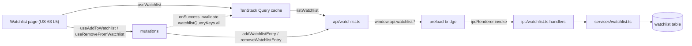

# US-63 Layer 4 — Renderer API Adapter + Query Hooks

## Feature Implemented

Layer 4 wires the renderer to the watchlist IPC surface (Layer 3) via a typed API
adapter and TanStack Query hooks. It exposes `list` / `add` / `remove` operations
to the (future, Layer 5) Watchlist page and manages cache invalidation so the list
refreshes after every mutation.

Scope: transport + server-state plumbing only. No UI (Layer 5) or e2e (Layer 6).

## Key Files

| File                                               | Purpose                                                                                                                                                                               |
| -------------------------------------------------- | ------------------------------------------------------------------------------------------------------------------------------------------------------------------------------------- |
| `src/renderer/src/api/watchlist.ts`                | Adapter over `window.api.watchlist.*`; maps `{ ok:false }` envelopes to a 400 `ApiError` via `throwMappedIpcErrors`; ticker field is already camelCase-aligned so no field remapping. |
| `src/renderer/src/hooks/watchlistQueryKeys.ts`     | `{ all: ['watchlist'] }` query-key registry.                                                                                                                                          |
| `src/renderer/src/hooks/useWatchlist.ts`           | `useQuery` list hook keyed on `watchlistQueryKeys.all`.                                                                                                                               |
| `src/renderer/src/hooks/useAddToWatchlist.ts`      | `useMutation` (add) invalidating `watchlistQueryKeys.all` on success.                                                                                                                 |
| `src/renderer/src/hooks/useRemoveFromWatchlist.ts` | `useMutation` (remove by ticker) invalidating `watchlistQueryKeys.all` on success.                                                                                                    |

Tests: `src/renderer/src/api/watchlist.test.ts`, `src/renderer/src/hooks/useAddToWatchlist.test.ts`.

## Public Interfaces

```typescript
// src/renderer/src/api/watchlist.ts
export type WatchlistEntry = {
  ticker: string
  notes: string | null
  ownBelowPrice: string | null
  ivrTrigger: number | null
  postEarningsOnly: boolean
  coreHolding: boolean
  addedAt: string
}
export type AddWatchlistPayload = {
  ticker: string
  notes?: string
  ownBelowPrice?: number | null
  ivrTrigger?: number | null
  postEarningsOnly?: boolean
  coreHolding?: boolean
}
export function listWatchlist(): Promise<WatchlistEntry[]>
export function addWatchlistEntry(payload: AddWatchlistPayload): Promise<WatchlistEntry>
export function removeWatchlistEntry(ticker: string): Promise<void>

// src/renderer/src/hooks/*
export const watchlistQueryKeys: { all: readonly ['watchlist'] }
export function useWatchlist(): UseQueryResult<WatchlistEntry[], ApiError>
export function useAddToWatchlist(): UseMutationResult<
  WatchlistEntry,
  ApiError,
  AddWatchlistPayload
>
export function useRemoveFromWatchlist(): UseMutationResult<void, ApiError, string>
```

## Data Flow



## Design Notes

- **Return-type convention:** hooks annotate with `ReturnType<typeof useMutation<...>>` /
  `ReturnType<typeof useQuery<...>>` to match the existing `useCreatePosition` /
  `usePositions` idiom rather than the plan's `UseMutationResult`/`UseQueryResult`
  suggestion — consistency with the codebase.
- **No field remapping:** unlike `positions.ts` (which maps IPC camelCase → renderer
  snake_case form fields), the watchlist error field (`ticker`) is identical on both
  sides, so the adapter calls `throwMappedIpcErrors(result.errors)` directly.
- **Refactor phase:** no changes needed — the five files already mirror established
  adapter/hook patterns 1:1; code-simplifier was intentionally not run to avoid
  diverging from convention.

## Verification

- `pnpm test` — 1778 passed (incl. 6 new)
- `pnpm lint` — clean
- `pnpm typecheck` — clean
