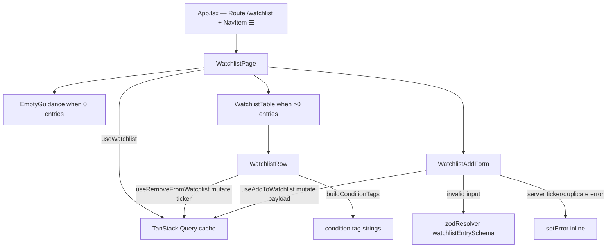

# US-63 Layer 5 — Watchlist Page (UI)

## Feature Implemented

The trader-facing Watchlist page: a route/nav entry that lists watchlist entries
newest-first with their thesis + compact condition tags, an add form that validates
symbols / normalizes to uppercase / surfaces server duplicate errors inline, a
per-row remove action, and a first-run empty state explaining the screener.

Scope: create/remove/validation/ordering + empty state (US-63). **Out of scope
here:** live Price/IVR/earnings + derived Signal columns (US-96) and editing an
entry (US-69). The add form is deliberately built so US-69 can reuse it in edit mode.

## Key Files

| File                                               | Purpose                                                                                                                                                                                                                                                                                 |
| -------------------------------------------------- | --------------------------------------------------------------------------------------------------------------------------------------------------------------------------------------------------------------------------------------------------------------------------------------- |
| `src/renderer/src/pages/WatchlistPage.tsx`         | Page container: header + count badge, loading/error states, empty guidance, add form, and the `WatchlistTable` (Ticker · Thesis(+tags) · Added · ✕).                                                                                                                                    |
| `src/renderer/src/components/WatchlistAddForm.tsx` | RHF + `zodResolver(watchlistEntrySchema)` add surface: ticker input, quick-pick condition chips (own-below `$`, high-IV `IVR ≥` with 30/50/70 presets, post-earnings, core), thesis textarea + NN/500 counter. Maps server `ticker`/duplicate errors via `setError`; resets on success. |
| `src/renderer/src/lib/watchlistConditionTags.ts`   | `buildConditionTags(entry)` — pure helper deriving the compact tag strings (`≤ $38`, `IVR ≥ 50`, `post-earnings`, `core`); reused by the page and future US-96.                                                                                                                         |
| `src/renderer/src/App.tsx`                         | Route `/watchlist`, `☰` NavItem in the Trading group, and header-title case.                                                                                                                                                                                                           |

Test: `src/renderer/src/pages/WatchlistPage.test.tsx` (12 cases).

## Component Structure

## Design Notes

- **Form always visible** (not behind an Add-trigger toggle) — simplest surface that
  satisfies every AC and lets the e2e seed tickers directly via
  `[data-testid="watchlist-add-submit"]`.
- **RHF 3-generic typing** `useForm<WatchlistFormInput, unknown, WatchlistEntryFormValues>`:
  the schema's `.default(false)` booleans make the input (form) type differ from the
  output (submitted) type; the 3-generic form types `onSubmit` with the output.
- **Reset-on-success via per-call `onSuccess`** rather than a `useEffect` — avoids the
  `react-hooks/set-state-in-effect` lint rule and keeps the hook-level cache
  invalidation intact.
- **Ticker cell double test-id**: an outer cell `watchlist-ticker-<T>` (exact lookup)
  wraps an inner span `watchlist-ticker` (ordered list assertion).
- **Styling** uses only Tailwind + `wb-*` tokens — no raw inline styles for
  color/spacing (per project convention).

## Verification

- `pnpm test` — 1790 passed (incl. 12 new)
- `pnpm lint` — clean
- `pnpm typecheck` — clean
