# US-63 Layer 6 — E2E Tests

## Feature Verified

End-to-end coverage of the watchlist create/remove/validation/ordering flow through
the real stack: renderer add form → IPC → sqlite → refetch → rendered list. One
Playwright `_electron` `it()` per acceptance scenario (11 cases; scenario 7's three
malformed-symbol examples are three distinct cases).

## Key File

`e2e/watchlist.spec.ts` — launches the built app with a fresh `WHEELBASE_DB_PATH` +
`FAKE_MARKET_DATA`/`FAKE_BROKER` (via the shared `launchApp`/`getPage`/`tmpDb`/
`cleanupDb` helpers), navigates by `location.hash = '#/watchlist'`, and seeds prior
tickers **through the add form** (never direct DB writes). A local `addTicker(page,
{ ticker, thesis?, ownBelow?, ivr? })` helper (plus `seedTicker`) removes repetition
across cases.

## AC → Test Map

```mermaid
flowchart LR
  subgraph Spec["e2e/watchlist.spec.ts"]
    T1["adds a ticker to the watchlist"]
    T2["shows a newly added ticker at the top"]
    T3["creates an entry with a thesis and entry conditions"]
    T4["creates an entry with no thesis and no conditions"]
    T5["normalizes ticker symbols to uppercase"]
    T6["rejects a duplicate ticker"]
    T7a["rejects an empty symbol"]
    T7b["rejects a numeric symbol"]
    T7c["rejects a symbol with a space"]
    T8["removes a ticker from the watchlist"]
    T9["shows guidance when the watchlist is empty"]
  end
```

## Verification

- `pnpm test:e2e` (electron-vite build + Playwright) — **11 passed**
- `pnpm lint` — clean · `pnpm typecheck` — clean
- Note: the UI (Layers 1–5) was already implemented, so the e2e cases passed on the
  first build/run — the intended behaviour for the final verification layer.
