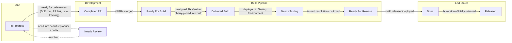
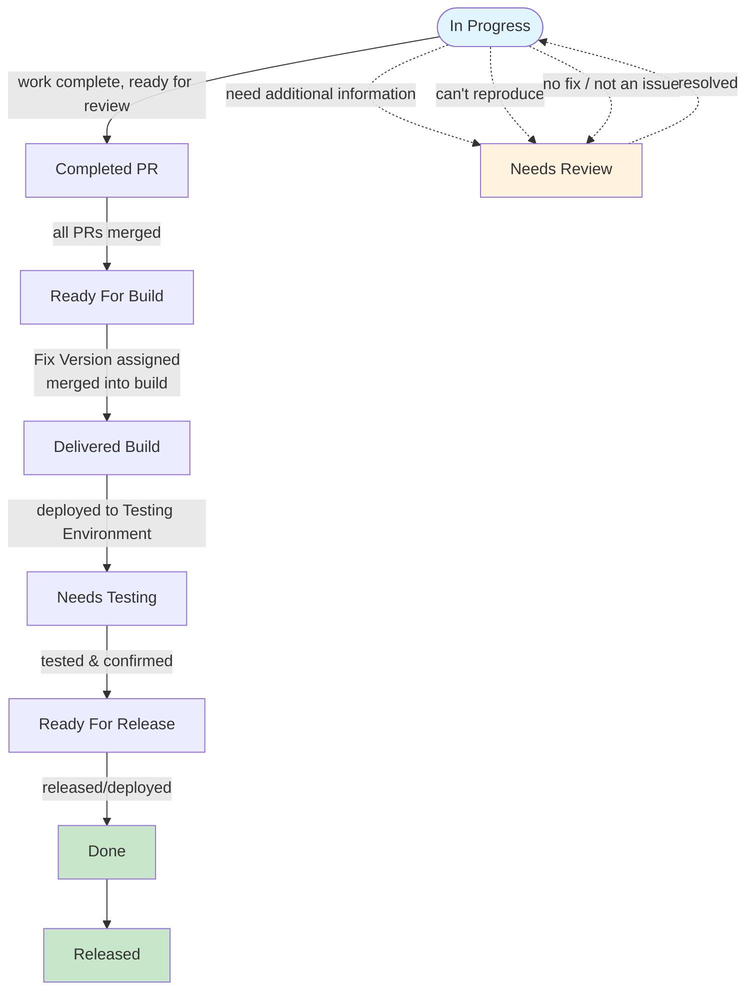

# Ticket Process (from In Progress)

Mermaid diagram of the process described in the Untitled document, starting at **In Progress**.

## Alternative: Vertical layout with scenario branches

## Status summary (from document)

| Status | Description |
|--------|-------------|
| **In Progress** | Ticket actively being worked on. Comment if blocked. |
| **Completed PR** | PR made; PR Link and Time Tracking required. |
| **Ready For Build** | PRs merged, ready for Fix Version. |
| **Delivered Build** | PRs merged/cherry-picked into a build. |
| **Needs Testing** | In a build, deployed to Testing Environment. |
| **Ready For Release** | Tested and confirmed, not yet in production. |
| **Done** | Tested and build released/deployed. |
| **Released** | Fix version officially released for customers. |
| **Needs Review** | Needs additional input (from In Progress or during QA). |
